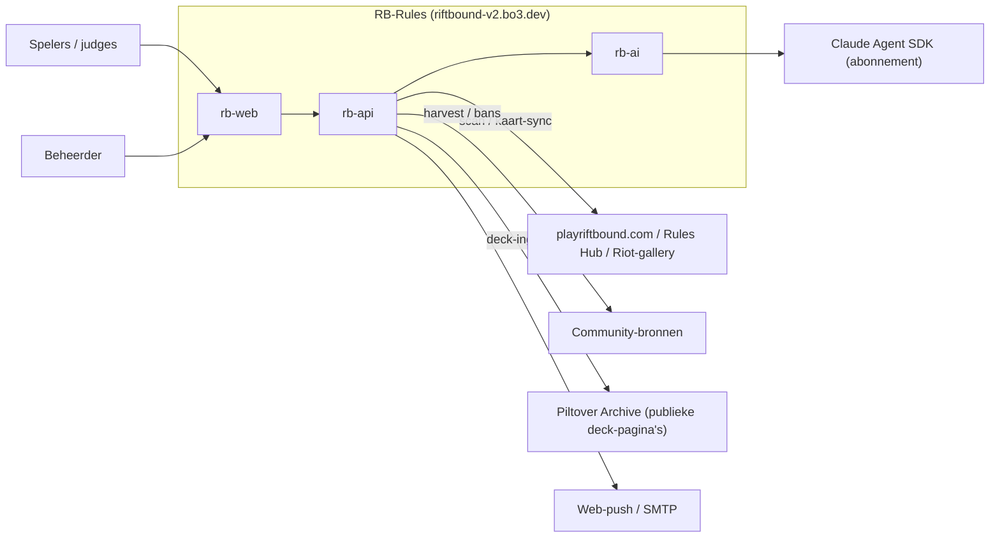
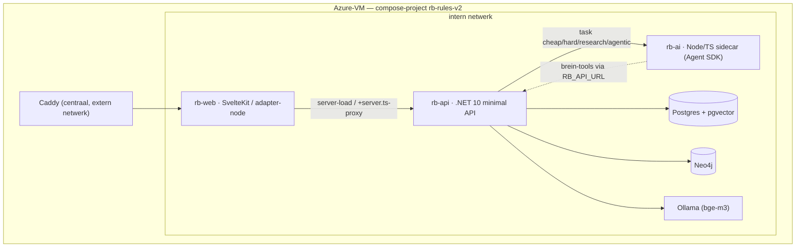
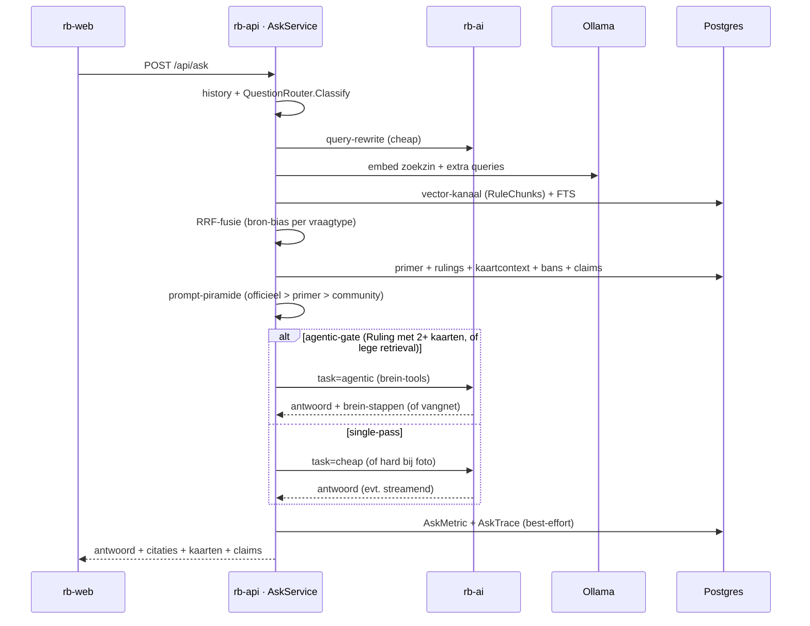
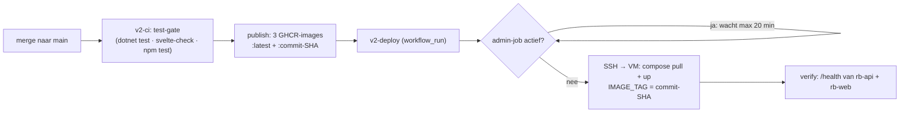

# Architectuur — RB-Rules (arc42)

Dit document beschrijft de architectuur van RB-Rules (Riftbound Rules
Companion, live op https://riftbound-v2.bo3.dev) volgens de arc42-structuur.
Het beschrijft de staat van `main` op dit moment. Elke bewering is bedoeld
verifieerbaar in de repo; waar mogelijk staat het bronbestand erbij.

Verwante ontwerpdocumenten die dieper gaan dan dit overzicht:
`docs/CONVENTIONS.md` (bindende code-conventies), `docs/KNOWLEDGE.md`
(kennislagen-visie), `docs/BRAIN.md` (brein-ontwerp), `docs/AI_AUTH.md`
(abonnement vs. API-key), `docs/DEPLOY.md`, `docs/DATAMODEL.md`,
`docs/CARD_INGEST.md` en `docs/SCRAPING.md`.

> Let op: de repo bevat naast de v2-stack (`rb-api`/`rb-web`/`rb-ai`) ook nog
> de gedeprecte Next.js-PoP in de root (`src/`, `next.config.mjs`,
> `docker-publish.yml`). Dit document beschrijft uitsluitend de v2-stack, die
> de PoP heeft vervangen.

---

## 1. Inleiding & doelen

RB-Rules is één altijd-actuele bron voor Riftbound-regels, bans, errata,
rulings en kaarten, automatisch bijgehouden uit officiële bronnen, met een
AI-vraagbaak die als toernooi-scheidsrechter antwoordt. Het einddoel
(`docs/KNOWLEDGE.md`, `docs/BRAIN.md`) is één samenhangend "brein": alle kennis
vector- én graf-gelinkt, bevraagbaar door AI-tools.

### Kerndoelen

1. **Altijd-actuele regelbron.** Officiële bronnen worden periodiek gescand;
   wijzigingen komen als voor/na-diff in de wijzigingen-feed
   (`IngestService`, `ScanScheduler`).
2. **AI-vraagbaak met bronplicht.** Elk `/ask`-antwoord is herleidbaar:
   §-citaties met ouderregels, kaartfeiten als bewijs, en een zekerheids-label
   (`AskService.cs`, prompt `BasePrompt`).
3. **Degradatie boven uitval.** Uitval van een externe dienst (Ollama, rb-ai,
   Riot, Neo4j) is een verwacht pad: het systeem degradeert netjes in plaats
   van een kale 500 te geven (`docs/CONVENTIONS.md` "Fouten zijn data").

### Kwaliteitseisen (top 5)

| Kwaliteit | Concreet | Verankerd in |
|---|---|---|
| Correctheid/traceerbaarheid | Antwoord scheidt officiële regels van community-consensus, met citaties | `AskService.cs`, `docs/KNOWLEDGE.md` |
| Beschikbaarheid/robuustheid | Elke pijplijnstap is best-effort; één haperende stap stopt de run niet | `JobCatalog.RunAllAsync`, `ScanScheduler` |
| Actualiteit | Scan per cadence, dagelijkse kaart-sync, set-release-keten | `ScanScheduler`, `SetReleaseService` |
| Herbouwbaarheid | Alle afgeleiden (embeddings, mechanics, graph) opnieuw op te bouwen uit Postgres | `docs/CONVENTIONS.md`, `GraphSyncService` |
| Kosten/latency-beheersing | AI opt-in per taak, rate-limiting op dure routes, agentic achter een gate | `rb-ai/src/ai.ts`, `Program.cs` (rate limiter), `AgenticGate` |

---

## 2. Randvoorwaarden

### Technische randvoorwaarden

- **Claude-abonnement, nooit API-key in rb-api.** Al het LLM-verkeer loopt via
  de rb-ai-sidecar op `CLAUDE_CODE_OAUTH_TOKEN` (abonnement). rb-api kent geen
  API-keys (`docs/AI_AUTH.md`, `docs/CONVENTIONS.md`, `rb-ai/src/ai.ts` regel
  16-18, compose `rb-ai`-service).
- **Lokale Ollama bge-m3, provenance heilig.** Embeddings zijn `vector(1024)`
  met HNSW-index; elke embedding bewaart de modelnaam. Een model-wissel is een
  expliciete her-embed, nooit stilzwijgend mixen van dimensies
  (`docs/CONVENTIONS.md`, `EmbeddingService`, `CardEmbeddingPipeline`).
- **Eén Azure-VM (8GB B2ms).** De hele stack draait in één compose-project met
  memory-limits per service, omdat de host-OOM-killer anders willekeurig kiest
  (`deploy/server-setup-v2/docker-compose.yml`, issue #45/#82).
- **Secrets nooit in code.** Alleen via GitHub Secrets of de VM-`.env`; compose
  weigert te starten zonder `POSTGRES_PASSWORD`/`NEO4J_PASSWORD`
  (`docker-compose.yml` `:?`-guards, `v2-deploy.yml` bootstrap-validatie).
- **Strikte laagscheiding** `Api → Infrastructure → Domain`, éénrichting
  (`docs/CONVENTIONS.md`, csproj-referenties).
- **EF-vertaalbaarheid.** Alleen bewezen naar SQL vertaalbare LINQ; geen
  `Contains(char)`, geen eigen methoden in expression trees
  (`docs/CONVENTIONS.md`).

### Organisatorische/stijl-randvoorwaarden

- Nederlandstalige UI en communicatie; Engelse speltermen onvertaald.
- Geen emoji's in de UI; status = kleur + tekst (`rb-web/src/app.css`).
- Nieuwe wensen tussendoor worden eerst een GitHub-issue.
- Nooit mergen/deployen terwijl een live admin-job draait (`v2-deploy.yml`
  job-gate).

---

## 3. Context & afbakening

### Externe systemen

| Extern systeem | Rol | Koppelvlak |
|---|---|---|
| **playriftbound.com / Rules Hub** | Officiële regel-PDF's, patch notes, errata (laag 0) | `IngestService` via `SafeExternalHttp`; bronnen in `SourceSeed.cs` |
| **Riot-kaartgallery** | Kaartenbron (JSON, set-facetten, token-kaarten) | `CardSyncService` |
| **Community-bronnen** | riftbound.gg, fanfinity, UVS Games-PDF, mobalytics (laag 1-3) | `SourceSeed.cs`, `ClaimMiningService`, `BanErrataSyncService` |
| **Piltover Archive** | Community-decks (#15, fundament meta-laag 3) | `DeckIngestService` via `SafeExternalHttp`; **alleen** de sitemap en publieke `/decks/view/{uuid}`-pagina's — hun `/api/` is robots-disallowed en wordt nooit aangeraakt; attributie + deep-link per deck |
| **Claude Agent SDK** | LLM-uitvoering op abonnement | `rb-ai` (sidecar), intern koppelvlak `/ask` |
| **Ollama (bge-m3)** | Lokale embeddings | `EmbeddingService` (compose-intern) |
| **Web-push / SMTP** | Meldingen (VAPID) en magic-link-login | `PushService`, `MailService` |
| **Gebruikers** | Spelers, judges (vragen stellen), beheerder (jobs, review) | `rb-web` UI |

### Praktijkvalkuilen bij de externe koppelvlakken

- Riot's domein is **playriftbound.com**; PDF-links zijn opake Sanity-CDN-
  hashes, dus matchen gebeurt op ankertekst ("Core Rules")
  (`docs/CONVENTIONS.md`, `HubDiscovery`, `PdfDiscovery`).
- Riftcodex/Mobalytics/community-sites blokkeren datacenter-IP's (Cloudflare);
  de Riot-gallery is de betrouwbare kaartenbron vanaf de VM. Een lege of
  gedeeltelijke community-oogst is een verwacht resultaat, geen bug
  (`docs/KNOWLEDGE.md`).
- De Rules Hub wisselt per request de volgorde van artikellinks; flip-flop-
  suppressie zit in `IngestService` (hash-historie + lege-diff-guard).
- Piltover Archive geeft **403 zonder browser-User-Agent**; de deck-data zit
  als Next.js/RSC-flight in `self.__next_f.push`-chunks (`PiltoverDeckPage`).
  Netiquette is een harde afspraak: ~1,5 s throttle, cap per run met
  hervatting via het run_log-grootboek, her-fetch alleen bij een nieuwere
  sitemap-lastmod — de ~10k-backfill loopt bewust over meerdere runs.

### Contextdiagram

---

## 4. Oplossingsstrategie

| Doel/kwaliteit | Strategische keuze | Bewijs |
|---|---|---|
| Onderhoudbaarheid | Strikte lagen `Api → Infrastructure → Domain`; endpoints dun, logica in services, pure logica in Domain | `docs/CONVENTIONS.md`, `Program.cs`, `Endpoints/*.cs` |
| Herbouwbaarheid | Postgres is source of truth; Neo4j en alle brein-afgeleiden zijn herbouwbare projecties | `docs/BRAIN.md` §2.2, `GraphSyncService` |
| Geen API-key in rb-api | Sidecar-patroon: rb-ai draait de Agent SDK op het abonnement, alleen intern bereikbaar | `rb-ai/src/server.ts`, `docs/AI_AUTH.md` |
| Kosten/latency | AI opt-in per taaktype; single-pass standaard, agentic escalatie achter een flag met vangnet | `rb-ai/src/ai.ts`, `AgenticGate`, `AskService` |
| Robuustheid | Elke stap best-effort; fouten zijn data (`run_log`, Problem-responses, null-degradatie) | `JobCatalog`, `RbAiClient`, `AskService` |
| Actualiteit | In-app scheduler i.p.v. externe crontab; set-release als event | `ScanScheduler`, `SetReleaseService` |

---

## 5. Bouwsteenzicht

### Niveau 1 — de drie containers + datastores

- **rb-web** is het enige publiek bereikbare component (achter Caddy). De
  browser praat nooit rechtstreeks met rb-api: alle data loopt via
  server-loads (`+page.server.ts`) of `+server.ts`-proxy's, met de
  `api()`-helper (`rb-web/src/lib/api.ts`, `docs/CONVENTIONS.md`).
- **rb-api** en **rb-ai** zitten uitsluitend op het interne compose-netwerk;
  rb-web zit op `internal` én `caddy` (`docker-compose.yml` `networks`).

### rb-api — belangrijkste modules

Lagen (`docs/CONVENTIONS.md`, csproj-referenties):

- **`RbRules.Domain`** — pure, unit-testbare logica zonder I/O: `BrainRef`
  (identiteitsconventie), `QuestionRouter`, `QueryRewriter`, `RrfFusion`,
  `RuleSectionParser`, `SetLegality`, `VariantGrouping`, `RiftboundIds`
  (id-parse/normalisatie, #144), `RiftcodexCardMapper` (bronvorm-adapter,
  #144), `SetCoverage` (dekking per set, #145), `ClaimMining`,
  `RelationMining`, `AgenticGate`, `SourceSeed`, `RiotCardMapper`,
  `HubDiscovery`, `PiltoverDeckPage`/`PiltoverSitemap`/`DeckCardLinker`
  (#15), `Entities.cs`. Bewuste enige uitzondering: het `Pgvector`-
  datatype op entiteiten (#44, `docs/CONVENTIONS.md`).
- **`RbRules.Infrastructure`** — services met I/O: `RbRulesDbContext` (EF Core),
  `IngestService`, `RuleChunkPipeline`, `CardSyncService`,
  `CardEmbeddingPipeline`, `EmbeddingService` (Ollama), `AskService`,
  `RbAiClient`, `GraphSyncService`/`GraphQueryService`/`BrainGraphService`
  (Neo4j), `BrainService`, `MechanicMiningService`, `ClaimMiningService`,
  `RelationMiningService`, `InteractionService`, `PrimerService`,
  `SetReleaseService`, `DeckIngestService` (#15, robots-compliant
  Piltover Archive-ingest), `KnowledgeGapsService`, `JobLedger`, `PushService`,
  `MailService`, `UserAccountService`, `PasskeyService`, en de migraties in
  `Migrations/`.
- **`RbRules.Api`** — compositie: `Program.cs` doet alleen DI-registratie,
  migratie/seed/graph-constraints bij opstart en de `MapXxxEndpoints()`-
  aanroepen. Endpoints per feature als extension-methods:
  `CardEndpoints`, `RuleEndpoints`, `KnowledgeEndpoints`, `BrainEndpoints`,
  `AskEndpoints`, `AuthEndpoints`, `FeedEndpoints`, `PushEndpoints`,
  `AdminEndpoints`. Achtergrondwerk via `JobRunner` + `JobCatalog` +
  `ScanScheduler`; contracten in `ApiContracts.cs`; admin achter
  `AdminAuthFilter`, gebruikersquota via `UserQuotaFilter`.

Belangrijke endpointgroepen (`Endpoints/*.cs`): `/api/cards*`, `/api/rules*`,
`/api/knowledge`, `/api/brain/*` (search, node, neighbors, path, evidence,
contradictions), `/api/ask` + `/api/ask/stream`, `/api/auth/*` (magic-link +
passkeys), `/api/changes|sources|bans|sets/upcoming`, `/api/push/*`,
`/api/admin/*` (o.a. vraag-traces: `/asktraces` als slanke lijst,
`/asktraces/{id}` met het volledige gesprek — antwoord + eerdere beurten,
#143).

### rb-ai — belangrijkste modules

- `src/server.ts` — minimale `node:http`-server met `/health`, `/ask` en
  `/ask/stream` (NDJSON-streaming); koppelt de client-verbinding aan een
  `AbortController` zodat een weggelopen client de Claude-call afbreekt.
- `src/ai.ts` — `askClaude` met vier taaktypes en de per-taak-modellen; de
  server-side prompt-addenda `RESEARCH_CONTRACT` en `AGENT_ADDENDUM`; de
  in-process brein-MCP-server (`createBrainMcpServer`).
- `src/brain-tools.ts` — de zes brein-tooldefinities + fetch-laag naar rb-api
  (`RB_API_URL`), met tool-call-cap.
- `src/relations.ts` — afsplitsen van relatievoorstellen uit het agent-antwoord
  (`RELATIONS_MARKER`).
- `src/validate.ts` — request-validatie (onbekende taak valt terug op `cheap`).

### rb-web — belangrijkste modules

Paginastructuur (`rb-web/src/routes/`): `/` (wijzigingen-feed), `/rules`
(+ `/rules/[code]`), `/primer`, `/ask` (+ `/ask/stream`), `/cards`
(+ `/cards/[id]` + `explain`), `/graph` ("Brein"-verkenner), `/account`
(+ passkey/verify), `/admin` (+ `/admin/status`, `/admin/overview/[kind]`).
Navigatie in `+layout.svelte`.

Gedeelde `$lib`: `api.ts` (server-side proxy), `AnswerView.svelte`,
`RuleWidget.svelte`, `CardWidget.svelte`, `RbText.svelte`, `markdown.ts` +
`rbtokens.ts` (sanitize + icoon-injectie vóór `{@html}`), `answerFormat.ts`,
`passkeys.ts`, `quota.ts`, `ranges.ts` (compacte reeksweergave, #145). Ontwerptokens in `app.css` (`var(--accent)` etc.).

### Datastores

- **Postgres + pgvector** — source of truth. Getypeerde `vector(1024)` met
  HNSW; snake_case; EF-migraties bij opstart (`RbRulesDbContext`, `Migrations/`,
  `Program.cs`).
- **Neo4j** — herbouwbare projectie van de kennislagen; getypeerde relaties,
  batched UNWIND, dictionaries-only params (`GraphSyncService`, `GraphSchema`).
- **Ollama** — lokale embedding-service (bge-m3).

---

## 6. Runtimezicht

### 6.1 De /ask-flow (single-pass, met agentic escalatie)

`AskService.AskCoreAsync` is één retrieval-pass + één afrondende LLM-call, met
een optionele agentic escalatie:

Kernpunten (`AskService.cs`):

1. **Query-rewrite** (#66): één cheap-call normaliseert de vraag, levert
   zoekqueries en lexicale termen. Uitval = verwacht pad → rauwe vraag.
2. **Multi-channel retrieval**: vector (pgvector per query), full-text
   (Postgres FTS), gefuseerd met **RRF** (`RrfFusion`, Domain) plus bron-bias
   per vraagtype; daarnaast primer (top-3 approved), geverifieerde rulings,
   kaartcontext (naam/mechaniek/lexicaal/semantisch), banlijst en
   community-claims (`ClaimRetrieval.TakeFor`, afstandsplafond).
3. **Prompt-piramide**: blokken staan in vaste volgorde officieel > primer >
   community, elk expliciet gelabeld (`docs/KNOWLEDGE.md`).
4. **Streaming** (#31): citaties/claims/vraagtype gaan vooraf via `onMeta`; het
   antwoord komt woord-voor-woord via NDJSON (`/api/ask/stream` →
   `RbAiClient.AskStreamAsync`).
5. **Agentic escalatie** (#107, `docs/BRAIN.md` §2.4): pas ná de retrieval
   beslist `AgenticGate.ShouldEscalate` of de vraag mag door-redeneren over het
   brein (flag `ASK_AGENTIC` = off/auto/force). Faalt de agent → **vangnet**:
   de klassieke single-pass draait alsnog. De agent kan ontdekte verbanden als
   relatievoorstel achterlaten (#120, `AgenticRelationService`).
6. **Degradatie** (#100): valt de embedding uit (Ollama weg / model niet
   gepulld), dan vervallen alle vector-kanalen en draait de vraag door op FTS +
   naam/mechaniek/lexicaal — nooit een kale 500. Valt rb-ai uit, dan geeft
   `RbAiClient` null en toont `AskService` `UnavailableAnswer`.

### 6.2 De scan-pipeline

`IngestService.ScanAsync`: per bron fetch → boilerplate-strip → hash → diff →
AI-classify → store + `run_log`, met flip-flop-suppressie en een
naclassificatie-ronde (#58) voor changes die eerder zonder classificatie zijn
opgeslagen. De `ScanScheduler` (BackgroundService) draait elk uur een scan van
de bronnen die aan de beurt zijn (cadence), stuurt web-push bij high-severity,
her-indexeert regels en bans bij nieuwe/gewijzigde documenten, checkt de
set-release-keten, en draait dagelijks kaart-sync + embeddings, nachtelijk
claims- en relatie-mining en wekelijks de bronnen-scout.

### 6.3 De graph-sync

`GraphSyncService.SyncAsync` projecteert Postgres naar Neo4j binnen **één
transactie** (rollback bij fout — geen half leeggeruimde graph). Het schrijft
`Card`/`Set`/`Domain`/`Tag`/`Mechanic` + facet-relaties, en sinds #104 de
kennislagen: `RuleSection` (+`PART_OF`), `Concept` (+`EXPLAINS`), `Claim`
(+`ABOUT`/`SUPPORTED_BY`, alleen accepted/unreviewed), `Source`, `Erratum`
(+`SUPERSEDES`), `Change` (+`AFFECTS`), plus de dynamische
`RELATES_TO {kind, trust, explanation, status}`-relaties via de reviewpoort
(`RelationProjection`). Elke knoop draagt een `ref`-property volgens de
`BrainRef`-conventie. Wees-opruiming verwijdert kaarten/facetten die geen
canonieke printing meer zijn (#57).

---

## 7. Deploymentzicht

Keten (`.github/workflows/v2-ci.yml`, `v2-deploy.yml`,
`deploy/server-setup-v2/docker-compose.yml`):

1. **Test-gate.** De `test`-job draait `dotnet test`, `svelte-check` + `npm
   test` + `npm run build` (rb-web) en `typecheck` + `test` (rb-ai). De
   publish-job hangt hieraan (`needs: test`) — geen ongeteste images.
2. **Publish met SHA-pinning.** Per service wordt een image gepusht met
   `:latest` én `:<commit-SHA>`. De publish-job serialiseert via een
   concurrency-group per service (#45, #86).
3. **Deploy via SSH.** `v2-deploy.yml` triggert op de voltooide CI
   (`workflow_run`) en pint de `head_sha` van die publish als `IMAGE_TAG`
   (geëxporteerd op het SSH-commando — de VM-`.env` blijft stateless).
   Serialisatie via concurrency-group `v2-deploy` (#82).
4. **Admin-job-gate.** Vlak vóór `compose up` pollt de deploy de admin-status op
   de VM en wacht tot ~20 min zolang er een job draait — een deploy herstart
   rb-api en zou een lopende job afbreken (#95). Fail-safe: is rb-api
   onbereikbaar (crash-loop), dan wordt de gate met een notice overgeslagen
   zodat een fix-forward kan landen.
5. **Verify.** Na `up` wacht de deploy tot rb-api (`/health`) én rb-web echt
   antwoorden (retry ~3 min), anders faalt de run zichtbaar met `ps` + logs.

Topologie op de VM (`docker-compose.yml`): centrale **Caddy** (extern netwerk)
reverse-proxyt `riftbound-v2.bo3.dev` naar rb-web; alle services hebben
memory-limits, healthchecks en log-rotatie (10m×3). **Watchtower staat
expliciet uit** op de v2-services (`com.centurylinklabs.watchtower.enable:
false`) zodat er één updatemechanisme is (#45). Datavolumes als `/mnt/data`-
binds voor Postgres, Neo4j en Ollama (het Ollama-mount-herstel is #101).

Migraties draaien bij opstart met korte retry (Program.cs) — na een VM-reboot
kan rb-api eerder starten dan Postgres klaar is.

---

## 8. Dwarsdoorsnijdende concepten

- **Kennislagen & trust** (`docs/KNOWLEDGE.md`). De kennispiramide (officieel >
  geverifieerde rulings > primer > community-claims met corroboratie/trust >
  meta) wordt in élk koppelvlak expliciet gelabeld; het antwoordformat scheidt
  "Regelbasis" van "Community-consensus" (`AskService.BasePrompt`,
  `ClaimRetrieval`).
- **Het brein & BrainRef** (`docs/BRAIN.md`). Eén tekstuele identiteit
  (`card:…`, `section:sourceId/code`, `claim:…`) over pgvector, Neo4j én
  API-contracten (`BrainRef.cs`). De brein-API (`/api/brain/*`) biedt zes
  koppelvlakken; rb-ai's agentic taak bevraagt ze als MCP-tools.
- **Degradatiepaden** — AI-uitval is een verwacht pad: `RbAiClient` geeft null,
  de aanroeper degradeert (`docs/CONVENTIONS.md`, `AskService`, `RbAiClient`).
  Neo4j-uitval maakt `neighbors`/`path` een nette Problem-response terwijl de
  Postgres-koppelvlakken blijven werken (`BrainEndpoints`).
- **EF-vertaalbaarheid** — alleen bewezen vertaalbare LINQ; naam-matching en
  lexicale filters in SQL, afstand-caps bewust in-memory (`AskService`
  `CardsNamedIn`/`CardContextAsync`, `docs/CONVENTIONS.md`).
- **Migratie-discipline** — migraties zijn heilig: elk schemaverschil via
  `dotnet ef migrations add`, nooit handmatig muteren; een migratie wordt tot de
  echte delta gestript (de les van PR #91; zie ook `DesignTimeFactory`,
  `Migrations/`).
- **Prompts zijn code** — systeem-prompts staan als const bij de service met
  expliciete structuur-eisen; server-side addenda (`RESEARCH_CONTRACT`,
  `AGENT_ADDENDUM`) zijn niet door de aanroeper te omzeilen
  (`AskService.BasePrompt`, `QuestionRouter.StructureFor`, `rb-ai/src/ai.ts`).
- **Sanitize vóór `{@html}`** — tekst wordt ge-escaped vóór markdown-parse/
  icoon-injectie; link-URL's zijn gewhitelist (`rb-web/src/lib/markdown.ts`,
  `rbtokens.ts`, `docs/CONVENTIONS.md`).
- **Observability** — elke achtergrond-actie logt naar `run_log`; `AskMetric`
  meet echte antwoordduur, `AskTrace` legt per vraag de meegedane lagen +
  brein-stappen vast; JobRunner toont live voortgang (`docs/CONVENTIONS.md`,
  `AdminEndpoints`).
- **Rate-limiting & quota** (#42) — policies `llm` (per client-IP of
  sessietoken), `auth` en `webauthn` in `Program.cs`; per-account-dagquota via
  `UserQuotaFilter`.
- **Best-effort achtergrondwerk** — `JobCatalog` registreert jobs als één
  switch-vrije catalogus; `RunAllAsync` ("Alles bijwerken") draait elke stap
  best-effort in volgorde.

---

## 9. Architectuurbeslissingen (ADR's)

Kort, in ADR-stijl. De issue-historie is de belangrijkste bron.

### ADR-1 — AI via een interne sidecar op het abonnement
**Context.** rb-api mag geen per-token API-key dragen (`docs/AI_AUTH.md`).
**Besluit.** Een aparte, alleen-intern bereikbare rb-ai-container draait de
Claude Agent SDK op `CLAUDE_CODE_OAUTH_TOKEN`; rb-api praat er via HTTP mee.
**Gevolg.** LLM-uitval = null-degradatie in `RbAiClient`; AI nooit publiek
exposed. `rb-ai/src/server.ts`, compose.

### ADR-2 — Postgres source of truth, Neo4j als herbouwbare projectie
**Context.** Pad-/buurvragen worden in SQL onhandig; er was tot #104 geen
lees-consument van Neo4j (`docs/BRAIN.md` §1.3).
**Besluit.** Postgres blijft de waarheid; Neo4j en alle brein-afgeleiden zijn
projecties, altijd volledig herbouwbaar in één transactie.
**Gevolg.** Drift wordt gemeten (kennis-gaten-rapport), niet vermeden;
Neo4j-uitval is degradeerbaar. `GraphSyncService`, `KnowledgeGapsService`.

### ADR-3 — Strikte lagen Api → Infrastructure → Domain
**Besluit.** Domain is puur en unit-testbaar; Infrastructure doet I/O; Api is
alleen compositie + dunne endpoints. **Gevolg.** Nieuwe vraagtypes/jobs/bronnen
zijn uitbreidpunten (switch/lijst), geen herschrijvingen. `docs/CONVENTIONS.md`.

### ADR-4 — Deploys pinnen op commit-SHA (#86, #45)
**Context.** Twee parallelle publishes kunnen `:latest` in de verkeerde
volgorde zetten (PR #83 miste daardoor tijdelijk productie).
**Besluit.** Publish pusht `:latest` én `:<SHA>`; de deploy pint de `head_sha`
van zijn triggerende publish. **Gevolg.** Deploys hangen niet meer van
`:latest`-timing af. `v2-ci.yml`, `v2-deploy.yml`.

### ADR-5 — Deploys serialiseren en verifiëren (#82, #45)
**Besluit.** Concurrency-group `v2-deploy` (cancel-in-progress: false) +
verplichte healthcheck-verify na `compose up`. **Gevolg.** Geen racende runs met
containernaam-conflicten; een deploy die niets verifieert bestaat niet.

### ADR-6 — Admin-job-gate vóór `compose up` (#95, #45)
**Besluit.** De deploy pollt de admin-status en wacht tot ~20 min op een lopende
job. **Gevolg.** Een deploy breekt nooit stilletjes een lopende admin-job af;
fail-safe overslaan bij onbereikbare rb-api zodat fix-forward kan landen.

### ADR-7 — Eén updatemechanisme, Watchtower uit (#45)
**Besluit.** Push-to-deploy is leidend; Watchtower-labels op de v2-services
staan op `false`. **Gevolg.** `pull`/`up` racet niet met een Watchtower-update.
Restrisico: de Watchtower-daemon draait op de VM nog wél (zie §11).

### ADR-8 — Migratie-discipline: strippen tot de echte delta (PR #91)
**Context.** Een te brede/handmatig aangepaste migratie brak een productie-
deploy. **Besluit.** Migraties via `dotnet ef migrations add`, gestript tot de
werkelijke schemadelta; snapshot nooit hand-patchen. **Gevolg.** Voorspelbare
opstart-migraties. `docs/CONVENTIONS.md`, `Migrations/`.

### ADR-9 — Data-volumes op de datadisk expliciet gemount (#101, #82)
**Context.** Een compose-recreate wiste het gepullde bge-m3-model doordat de
Ollama-bind-mount per ongeluk was weggevallen; elke embedding faalde.
**Besluit.** `/mnt/data/…`-binds voor Postgres, Neo4j én Ollama expliciet in
compose. **Gevolg.** Recreates houden data en model. `docker-compose.yml`.

### ADR-10 — Agentic ask achter een gate met vangnet (#106/#107)
**Besluit.** Single-pass is de norm; agentic escaleert alleen bij een
kwalificerende vraag achter flag `ASK_AGENTIC`, met een klassieke single-pass
als vangnet en meting per pad. **Gevolg.** Kosten/latency onder controle,
nooit een slechter antwoord. `AgenticGate`, `AskService`, `rb-ai/src/ai.ts`.

---

## 10. Kwaliteitsscenario's

Concreet en toetsbaar. "Verwacht" = het gedrag dat de code garandeert.

| # | Scenario (trigger) | Verwacht gedrag | Verankerd in |
|---|---|---|---|
| Q1 | Ollama down tijdens `/ask` | Vector-kanalen vervallen, degradeert naar FTS + naam/mechaniek/lexicaal; nooit een 500; trace toont "embedding-uitval" | `AskService` (#100), `AskServiceDegradationTests` |
| Q2 | rb-ai onbereikbaar | `RbAiClient` geeft null; `/ask` toont `UnavailableAnswer`, Ok=false; scan/classify slaan de LLM-stap over | `RbAiClient`, `IngestService` |
| Q3 | Neo4j down | `/api/brain/neighbors` en `/path` geven een nette Problem-response; `search`/`node`/`evidence`/`contradictions` blijven werken | `BrainEndpoints`, `docs/BRAIN.md` §2.3 |
| Q4 | Admin-job draait tijdens een merge | De deploy wacht met `compose up` tot de job klaar is (of tot ~20 min) | `v2-deploy.yml` (#95) |
| Q5 | Twee snelle merges achter elkaar | Publishes/deploys serialiseren; elke deploy pint zijn eigen SHA en verifieert zichzelf | `v2-ci.yml`, `v2-deploy.yml` (#82/#86) |
| Q6 | Interactievraag met 2+ kaartnamen (flag `auto`) | `AgenticGate` escaleert naar het brein; faalt de agent, dan levert het vangnet het single-pass-antwoord | `AgenticGate`, `AskService` (#107) |
| Q7 | Community-bron blokkeert datacenter-IP | Lege/gedeeltelijke oogst is een verwacht resultaat, gelogd in `run_log`, geen job-fout | `docs/KNOWLEDGE.md`, `SourceScoutService` |
| Q8 | Community-claim spreekt officiële § tegen | Claim wordt niet als kennis gepresenteerd; officieel wint altijd; weerlegde claims alleen via `contradictions`, gelabeld | `AskService.BasePrompt`, `GraphSyncService` (scope) |
| Q9 | VM-reboot, Postgres nog niet klaar | rb-api retriet de migratie kort en begrensd; anders faalt de start hard en vangt de deploy-verify het | `Program.cs`, `docker-compose.yml` healthcheck |
| Q10 | Regressie in domeinlogica | Elke productie-bug krijgt eerst een regressietest; CI is de poort (test-gate vóór publish) | `docs/CONVENTIONS.md`, `RbRules.Tests/`, `v2-ci.yml` |

---

## 11. Risico's & technische schuld

- **Dubbel deploymechanisme (rest-risico, #45).** Watchtower-labels staan uit op
  de v2-services, maar de Watchtower-daemon draait op de VM nog wél. Zolang de
  labels correct staan is er één effectief mechanisme; #45 (ops-hardening)
  staat nog open.
- **Gedeprecte PoP in de repo-root.** De oude Next.js-PoP (`src/`,
  `docker-publish.yml`) is nog aanwezig maar vervangen; verwarringsrisico bij
  navigatie/CI. Alleen `docker-publish.yml` is nog handmatig triggerbaar.
- **Lege kennislaag 2 in productie (#92/#93).** Claims-extractie faalde stil
  (#93) en documenten werden te vroeg als gemined gemarkeerd (#92); de
  claims-reviewqueue kan daardoor leeg blijven. Het brein werkt zonder claims,
  maar de claim-knopen blijven leeg tot dit is opgelost (`docs/BRAIN.md` §1.5).
- **Neo4j is jong als lees-consument.** Pas sinds #104/#105 wordt de graph
  gelezen (brein-API); drift tussen Postgres en Neo4j wordt gemeten, niet
  vermeden (`KnowledgeGapsService`).
- **Openstaande architectuurrakende issues.** O.a. #122 (periodieke
  zelfverrijking in de scheduler), #121 (echte token-metering), #124/#125
  (reviewqueue-/misvattingen-laag), #127 (publieke databank), #15 (decks/
  meta-laag, gedeprioriteerd). Er zijn PR's onderweg; de exacte stand staat in
  #55 (masterplan) en #60 (handoff).
- **Kosten/latency van agentic.** Een geëscaleerde vraag kan van ~10s naar
  30-90s gaan; gemitigeerd door de gate, maxTurns/tool-cap/harde timeout en
  Sonnet i.p.v. Opus, maar meten vóór verbreden blijft nodig (`docs/BRAIN.md`
  §4).

---

## 12. Begrippenlijst

| Term | Betekenis |
|---|---|
| Riftbound | League of Legends TCG waar deze companion over gaat |
| Rules Hub | Officiële regelpagina op playriftbound.com; bron van Core/Tournament Rules-PDF's |
| Core / Tournament Rules | De twee normatieve regel-PDF's (laag 0) |
| Ban / Erratum | Verboden kaart / officiële tekstcorrectie op een kaart |
| Ruling | Scheidsrechter-oordeel; geverifieerde rulings zijn gezaghebbend (laag 0b) |
| Primer | Gegenereerde spelbegrip-concepten (laag 1), review door beheerder |
| Claim | Geparafraseerde community-bewering met corroboratie en trust (laag 2) |
| Kennispiramide | Voorrangsvolgorde officieel > rulings > primer > community > meta |
| BrainRef | Canonieke tekstuele identiteit (`card:…`, `section:…`) over pgvector + Neo4j + API |
| Brein / brein-API | Unified vector+graph-kennismodel + de zes koppelvlakken `/api/brain/*` |
| Agentic ask | Meer-beurten AI-pad dat zelf het brein bevraagt via MCP-tools |
| RRF | Reciprocal Rank Fusion; fuseert vector- en full-text-ranglijsten |
| bge-m3 | Meertalig embeddingmodel (1024-dim) dat lokaal via Ollama draait |
| Canonieke printing | De naamloze basis-printing van een kaart; alt-arts zijn varianten (#57) |
| Set-release-keten | Geautomatiseerde keten die bij een nieuwe set alle afgeleiden bijwerkt |
| Cadence | Scan-interval per bron |
| Sidecar | rb-ai: de interne AI-container op het Claude-abonnement |

---

## Onderhoud (het anker van dit document)

Dit document is levende documentatie. Elke PR die een van onderstaande
wijzigingen raakt, **werkt dit document in dezelfde PR bij** — net als de
`docs/CONVENTIONS.md`-regel dat conventiewijzigingen via PR gaan.

| Soort wijziging | Werk bij |
|---|---|
| Nieuw endpoint of endpointgroep | §5 (bouwsteen: modules/endpointgroepen) en §6 (runtime, als er een nieuwe flow bij komt) |
| Nieuwe datastore of externe dependency | §3 (context/externe systemen), §5 (datastores) en §7 (deployment/compose) |
| Nieuw taaktype of AI-koppelvlak in rb-ai | §5 (rb-ai-modules), §6 (runtime) en zo nodig §2 (randvoorwaarden) |
| Nieuwe conventie of dwarsdoorsnijdend patroon | §8 (dwarsdoorsnijdende concepten) |
| Deploy-/CI-/compose-wijziging | §7 (deployment) en zo nodig §11 (risico's) |
| Belangrijke architectuurkeuze (met issue/PR) | §9 als nieuwe ADR, met verwijzing naar de issue/PR |
| Nieuw kwaliteitsscenario of degradatiepad | §10 (kwaliteitsscenario's) |
| Nieuwe Riftbound-/projectterm | §12 (begrippenlijst) |

Bij twijfel: voeg liever één regel toe dan het document te laten verouderen.
Een wijziging die geen enkel hoofdstuk raakt, is zeldzaam — controleer dan
minstens of §11 (risico's/schuld) nog klopt.
