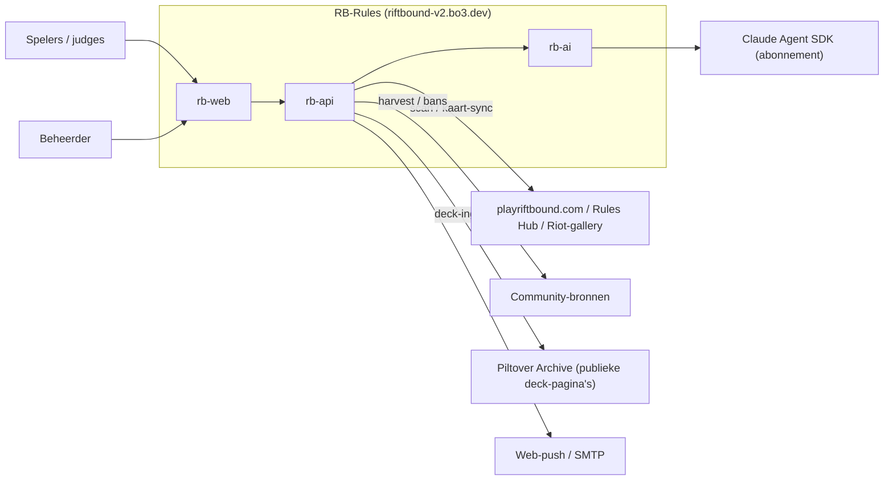
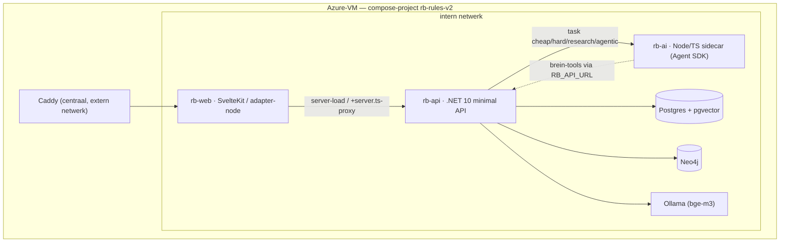
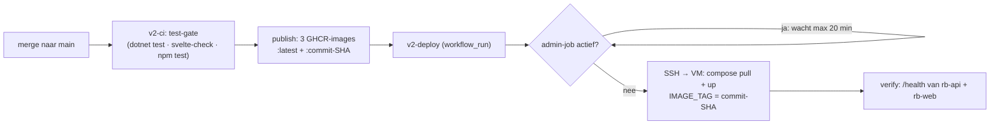

# Architectuur — RB-Rules (arc42)

Dit document beschrijft de architectuur van RB-Rules (Riftbound Rules
Companion, live op https://riftbound-v2.bo3.dev) volgens de arc42-structuur.
Het beschrijft de staat van `main` op dit moment. Elke bewering is bedoeld
verifieerbaar in de repo; waar mogelijk staat het bronbestand erbij.

Verwante ontwerpdocumenten die dieper gaan dan dit overzicht:
`docs/CONVENTIONS.md` (bindende code-conventies), `docs/KNOWLEDGE.md`
(kennislagen-visie), `docs/BRAIN.md` (brein-ontwerp), `docs/AI_AUTH.md`
(abonnement vs. API-key), `docs/DEPLOY.md`, `docs/DATAMODEL.md`,
`docs/CARD_INGEST.md` en `docs/SCRAPING.md`.

> Let op: de repo bevat naast de v2-stack (`rb-api`/`rb-web`/`rb-ai`) ook nog
> de gedeprecte Next.js-PoP in de root (`src/`, `next.config.mjs`,
> `docker-publish.yml`). Dit document beschrijft uitsluitend de v2-stack, die
> de PoP heeft vervangen.

---

## 1. Inleiding & doelen

RB-Rules is één altijd-actuele bron voor Riftbound-regels, bans, errata,
rulings en kaarten, automatisch bijgehouden uit officiële bronnen, met een
AI-vraagbaak die als toernooi-scheidsrechter antwoordt. Het einddoel
(`docs/KNOWLEDGE.md`, `docs/BRAIN.md`) is één samenhangend "brein": alle kennis
vector- én graf-gelinkt, bevraagbaar door AI-tools.

### Kerndoelen

1. **Altijd-actuele regelbron.** Officiële bronnen worden periodiek gescand;
   wijzigingen komen als voor/na-diff in de wijzigingen-feed
   (`IngestService`, `ScanScheduler`).
2. **AI-vraagbaak met bronplicht.** Elk `/ask`-antwoord is herleidbaar:
   §-citaties met ouderregels, kaartfeiten als bewijs, en een zekerheids-label
   (`AskService.cs`, prompt `BasePrompt`).
3. **Degradatie boven uitval.** Uitval van een externe dienst (Ollama, rb-ai,
   Riot, Neo4j) is een verwacht pad: het systeem degradeert netjes in plaats
   van een kale 500 te geven (`docs/CONVENTIONS.md` "Fouten zijn data").

### Kwaliteitseisen (top 5)

| Kwaliteit | Concreet | Verankerd in |
|---|---|---|
| Correctheid/traceerbaarheid | Antwoord scheidt officiële regels van community-consensus, met citaties | `AskService.cs`, `docs/KNOWLEDGE.md` |
| Beschikbaarheid/robuustheid | Elke pijplijnstap is best-effort; één haperende stap stopt de run niet | `JobCatalog.RunAllAsync`, `ScanScheduler` |
| Actualiteit | Scan per cadence, dagelijkse kaart-sync, set-release-keten | `ScanScheduler`, `SetReleaseService` |
| Herbouwbaarheid | Alle afgeleiden (embeddings, mechanics, graph) opnieuw op te bouwen uit Postgres | `docs/CONVENTIONS.md`, `GraphSyncService` |
| Kosten/latency-beheersing | AI opt-in per taak, rate-limiting op dure routes, agentic achter een gate | `rb-ai/src/ai.ts`, `Program.cs` (rate limiter), `AgenticGate` |

---

## 2. Randvoorwaarden

### Technische randvoorwaarden

- **Claude-abonnement, nooit API-key in rb-api.** Al het LLM-verkeer loopt via
  de rb-ai-sidecar op `CLAUDE_CODE_OAUTH_TOKEN` (abonnement). rb-api kent geen
  API-keys (`docs/AI_AUTH.md`, `docs/CONVENTIONS.md`, `rb-ai/src/ai.ts` regel
  16-18, compose `rb-ai`-service).
- **Lokale Ollama bge-m3, provenance heilig.** Embeddings zijn `vector(1024)`
  met HNSW-index; elke embedding bewaart de modelnaam. Een model-wissel is een
  expliciete her-embed, nooit stilzwijgend mixen van dimensies
  (`docs/CONVENTIONS.md`, `EmbeddingService`, `CardEmbeddingPipeline`).
- **Eén Azure-VM (8GB B2ms).** De hele stack draait in één compose-project met
  memory-limits per service, omdat de host-OOM-killer anders willekeurig kiest
  (`deploy/server-setup-v2/docker-compose.yml`, issue #45/#82).
- **Secrets nooit in code.** Alleen via GitHub Secrets of de VM-`.env`; compose
  weigert te starten zonder `POSTGRES_PASSWORD`/`NEO4J_PASSWORD`
  (`docker-compose.yml` `:?`-guards, `v2-deploy.yml` bootstrap-validatie).
- **Strikte laagscheiding** `Api → Infrastructure → Domain`, éénrichting
  (`docs/CONVENTIONS.md`, csproj-referenties).
- **EF-vertaalbaarheid.** Alleen bewezen naar SQL vertaalbare LINQ; geen
  `Contains(char)`, geen eigen methoden in expression trees
  (`docs/CONVENTIONS.md`).

### Organisatorische/stijl-randvoorwaarden

- Nederlandstalige UI en communicatie; Engelse speltermen onvertaald.
- Geen emoji's in de UI; status = kleur + tekst (`rb-web/src/app.css`).
- Nieuwe wensen tussendoor worden eerst een GitHub-issue.
- Nooit mergen/deployen terwijl een live admin-job draait (`v2-deploy.yml`
  job-gate).

---

## 3. Context & afbakening

### Externe systemen

| Extern systeem | Rol | Koppelvlak |
|---|---|---|
| **playriftbound.com / Rules Hub** | Officiële regel-PDF's, patch notes, errata (laag 0) | `IngestService` via `SafeExternalHttp`; bronnen in `SourceSeed.cs` |
| **playriftbound.com/en-us/news/…** (bron-feeds, #167) | Index-pagina's die periodiek nieuwe artikel-URL's opleveren — ontdekt bronnen, ís er geen | `FeedCrawlService` (`RiotNewsFeed`-parser) via `SafeExternalHttp`; feeds in `SourceFeedSeed.cs` |
| **Riot-kaartgallery** | Leidende kaartenbron (JSON, set-facetten, token-kaarten); de riftcodex-API vult daarna alleen aan — extra kaarten en set-metadata, bestaande kaarten blijven onaangeraakt (#150) | `CardSyncService` |
| **Community-bronnen** | riftbound.gg, fanfinity, UVS Games-PDF, mobalytics (laag 1-3) | `SourceSeed.cs`, `ClaimMiningService`, `BanErrataSyncService` |
| **Piltover Archive** | Community-decks (#15, fundament meta-laag 3) | `DeckIngestService` via `SafeExternalHttp`; **alleen** de sitemap en publieke `/decks/view/{uuid}`-pagina's — hun `/api/` is robots-disallowed en wordt nooit aangeraakt; attributie + deep-link per deck |
| **Claude Agent SDK** | LLM-uitvoering op abonnement | `rb-ai` (sidecar), intern koppelvlak `/ask` |
| **Ollama (bge-m3)** | Lokale embeddings | `EmbeddingService` (compose-intern) |
| **Web-push / SMTP** | Meldingen (VAPID) en magic-link-login | `PushService`, `MailService` |
| **Gebruikers** | Spelers, judges (vragen stellen), beheerder (jobs, review) | `rb-web` UI |

### Praktijkvalkuilen bij de externe koppelvlakken

- Riot's domein is **playriftbound.com**; PDF-links zijn opake Sanity-CDN-
  hashes, dus matchen gebeurt op ankertekst ("Core Rules")
  (`docs/CONVENTIONS.md`, `HubDiscovery`, `PdfDiscovery`).
- Riftcodex-site/Mobalytics/community-sites blokkeren datacenter-IP's
  (Cloudflare); de riftcodex-API werkt wél vanaf de VM, maar is sinds #150
  uitdrukkelijk aanvullend — de Riot-gallery is de leidende kaartenbron
  (riftcodex-eerst conserveerde eerder naamschade). Een lege of gedeeltelijke
  community-oogst is een verwacht resultaat, geen bug (`docs/KNOWLEDGE.md`);
  riftcodex-uitval in auto-modus is een run_log-info, geen jobfout.
- De Rules Hub wisselt per request de volgorde van artikellinks; flip-flop-
  suppressie zit in `IngestService` (hash-historie + lege-diff-guard).
- Piltover Archive geeft **403 zonder browser-User-Agent**; de deck-data zit
  als Next.js/RSC-flight in `self.__next_f.push`-chunks (`PiltoverDeckPage`).
  Netiquette is een harde afspraak: ~1,5 s throttle, cap per run met
  hervatting via het run_log-grootboek, her-fetch alleen bij een nieuwere
  sitemap-lastmod — de ~10k-backfill loopt bewust over meerdere runs.
- Bron-feeds (#167): de rules-and-releases-, algemene nieuws- en Rules-Hub-
  index delen dezelfde React-kaartcomponent
  (`data-testid="articlefeaturedcard-component"`) — één `RiotNewsFeed`-parser
  dekt alle drie. Ook de "smalle" rules-and-releases-feed toont af en toe een
  announcements-/organizedplay-artikel tussendoor (vandaar CategoryFilter op
  élke feed, niet alleen de brede hub); sommige artikel-URL's missen het
  categorie-segment (`/en-us/news/<slug>` i.p.v. `/en-us/news/<categorie>/
  <slug>`) en een enkele kaart linkt extern (bv. YouTube) — de parser sluit
  die uit op host in plaats van op categorie. AutoApprove auto-enablet een
  artikel alléén als feed én artikel op een officieel Riot-domein staan
  (`OfficialDomains`) — anders reviewqueue, ook met AutoApprove aan; zo maakt
  een typo/look-alike nooit onbeheerd trust-1 official bronnen aan
  (`FeedCrawlService`, endpoint-guard + crawl-guard, defense-in-depth net als
  `UrlGuard`).

### Contextdiagram



---

## 4. Oplossingsstrategie

| Doel/kwaliteit | Strategische keuze | Bewijs |
|---|---|---|
| Onderhoudbaarheid | Strikte lagen `Api → Infrastructure → Domain`; endpoints dun, logica in services, pure logica in Domain | `docs/CONVENTIONS.md`, `Program.cs`, `Endpoints/*.cs` |
| Herbouwbaarheid | Postgres is source of truth; Neo4j en alle brein-afgeleiden zijn herbouwbare projecties | `docs/BRAIN.md` §2.2, `GraphSyncService` |
| Geen API-key in rb-api | Sidecar-patroon: rb-ai draait de Agent SDK op het abonnement, alleen intern bereikbaar | `rb-ai/src/server.ts`, `docs/AI_AUTH.md` |
| Kosten/latency | AI opt-in per taaktype; single-pass standaard, agentic escalatie achter een flag met vangnet | `rb-ai/src/ai.ts`, `AgenticGate`, `AskService` |
| Robuustheid | Elke stap best-effort; fouten zijn data (`run_log`, Problem-responses, null-degradatie) | `JobCatalog`, `RbAiClient`, `AskService` |
| Actualiteit | In-app scheduler i.p.v. externe crontab; set-release als event | `ScanScheduler`, `SetReleaseService` |

---

## 5. Bouwsteenzicht

### Niveau 1 — de drie containers + datastores



- **rb-web** is het enige publiek bereikbare component (achter Caddy). De
  browser praat nooit rechtstreeks met rb-api: alle data loopt via
  server-loads (`+page.server.ts`) of `+server.ts`-proxy's, met de
  `api()`-helper (`rb-web/src/lib/api.ts`, `docs/CONVENTIONS.md`).
- **rb-api** en **rb-ai** zitten uitsluitend op het interne compose-netwerk;
  rb-web zit op `internal` én `caddy` (`docker-compose.yml` `networks`).

### rb-api — belangrijkste modules

Lagen (`docs/CONVENTIONS.md`, csproj-referenties):

- **`RbRules.Domain`** — pure, unit-testbare logica zonder I/O: `BrainRef`
  (identiteitsconventie), `QuestionRouter`, `QueryRewriter`, `RrfFusion`,
  `RuleSectionParser`, `SetLegality`, `VariantGrouping`, `RiftboundIds`
  (id-parse/normalisatie, #144), `RiftcodexCardMapper` (bronvorm-adapter,
  #144), `SetCoverage` (dekking per set, #145), `ClaimMining`,
  `RelationMining`, `AgenticGate`, `SourceSeed`, `SourceFeedSeed` (#167),
  `RiotCardMapper`, `HubDiscovery`, `RiotNewsFeed` (bron-feed-parser, #167),
  `OfficialDomains` (Riot-domein-allowlist voor de feed-AutoApprove-gate, #167),
  `PiltoverDeckPage`/`PiltoverSitemap`/`DeckCardLinker`
  (#15), `IpHashing` (HMAC-SHA256 IP-hash voor de ask-geschiedenis, #157),
  `BenchmarkPrompt` (gecommitteerde-keuze-prompt + deterministische
  letter-parser, #158), `BenchmarkSeed` (judge-vragenset, idempotent net als
  `SourceSeed`), `SourceDossierCompleteness` (#171, pure statusfunctie —
  scan/vervolgstap-uitkomst + opbrengst → volledig/onvolledig/leeg/nooit
  gescand, gedeeld door de dossier-service en het kennis-gaten-rapport),
  `DeckLegality` (#15 fase 3 spoor A: puur op platte kaartfeiten — legaal /
  illegaal-met-reden (nog niet legale set of geband) / onvolledig bij
  niet-gekoppelde kaarten of een set zonder bekende releasedatum),
  `ClarificationMining` (#177: `ClarificationSources.IsMatch`, naam-/URL-
  heuristiek die een FAQ-/clarificatie-bron herkent — geen migratie, en
  `ClarificationMiner`, prompt+parser voor de concept-extractie, zelfde
  patroon als `ClaimMining`), `Entities.cs`. Bewuste enige uitzondering: het
  `Pgvector`-datatype op entiteiten (#44, `docs/CONVENTIONS.md`).
- **`RbRules.Infrastructure`** — services met I/O: `RbRulesDbContext` (EF Core),
  `IngestService`, `FeedCrawlService` (#167, bron-feed-crawl — eerste stap
  van `IngestService.ScanAsync`; sinds #175 ook herkomst-adoptie — een
  herontdekt artikel dat al een `Source` zonder `FeedId` is, krijgt die
  `FeedId` zonder curatie te raken — en `MergeNearDuplicateSourcesAsync`,
  een near-duplicaat-samenvoeging vooraf in elke run die bronnen in
  afwijkende URL-vorm samenvoegt met referentie-omhangen, #144-patroon),
  `RuleChunkPipeline`, `CardSyncService`,
  `CardEmbeddingPipeline`, `EmbeddingService` (Ollama), `AskService`,
  `AskHistoryService` (eigen ask-geschiedenis op user_id/ip_hash, #157),
  `RbAiClient`, `GraphSyncService`/`GraphQueryService`/`BrainGraphService`
  (Neo4j), `BrainService`, `MechanicMiningService`, `ClaimMiningService`,
  `ClarificationMiningService` (#177, job "clarify" — concept-extractie uit
  officiële FAQ-/clarificatie-artikelen naar direct-verified `Correction`s met
  eigen gefocuste embedding en onderwerp-anker; dedupliceert per concept op
  (bron, Scope, Ref) + embedding-nabijheid — een parafrase bij een her-mine
  werkt de bestaande ruling bij i.p.v. te stapelen, zelfde poort-patroon als
  `ClaimMiningService`; backfilt bestaande bronnen vanzelf, geen tijdvenster op
  de bronselectie),
  `RelationMiningService`, `InteractionService`, `PrimerService`,
  `SetReleaseService`, `DeckIngestService` (#15, robots-compliant
  Piltover Archive-ingest), `BenchmarkService` (judge-benchmark-job, draait
  op `AskService` met `AskOptions.Benchmark = true`, #158; sinds #174 ook
  `RunSweepAsync` — dezelfde vragenset door elk model uit `AI_BENCHMARK_MODELS`
  (of een verstandige default), elk 2×, met `Model`/`RunIndex`/`SweepId` op
  `BenchmarkRun` als groepering — de gedeelde kern `RunOneAsync` draait één
  volledige vragenset-doorloop en wordt door zowel `RunAsync` als
  `RunSweepAsync` aangeroepen),
  `KnowledgeGapsService` (kennis-gaten-rapport; sinds #171 ook het
  bron-verwerkingssignaal, zelfde `SourceDossierCompleteness`-statusfunctie
  als de dossier-service), `SourceDossierService` (#171, spiegelbeeld van
  `CardDetailService.DossierAsync`/#127: herkomst via `FeedId`, opbrengst
  via `SourceId` — Document/RuleChunk/Change — en genormaliseerde `SourceUrl`
  — BanEntry/Erratum/Correction — plus claims via de `ClaimSource`-FK, en
  verwerkingsstatus uit `run_log`), `ReviewNoteService` (#124, beheerder-
  notitie → geverifieerde ruling), `ChatRulingService` (#166, in-chat-ruling →
  verified/pending naar autoriteit), `DeckBrowserService` (#15 fase 3 spoor A:
  read-only projectie boven op de Piltover Archive-decks — lijst/facetten/
  paginering + de per-deck `DeckLegality`-uitkomst; laadt set-releasedatums en
  gebande canonieke kaarten per format één keer per aanroep, net als
  `CardEndpoints`' set-legaliteitslookup), `JobLedger`, `PushService`,
  `MailService`, `UserAccountService`, `PasskeyService`, en de migraties in
  `Migrations/`.
- **`RbRules.Api`** — compositie: `Program.cs` doet alleen DI-registratie,
  migratie/seed/graph-constraints bij opstart en de `MapXxxEndpoints()`-
  aanroepen. Endpoints per feature als extension-methods:
  `CardEndpoints`, `DeckEndpoints`, `RuleEndpoints`, `KnowledgeEndpoints`,
  `BrainEndpoints`, `AskEndpoints`, `AuthEndpoints`, `FeedEndpoints`,
  `PushEndpoints`, `AdminEndpoints`. Achtergrondwerk via `JobRunner` +
  `JobCatalog` + `ScanScheduler`; contracten in `ApiContracts.cs`; admin
  achter `AdminAuthFilter`, gebruikersquota via `UserQuotaFilter`.

Belangrijke endpointgroepen (`Endpoints/*.cs`): `/api/cards*`, `/api/decks*`
(#15 fase 3 spoor A: lijst/facetten/detail, read-only), `/api/rules*`,
`/api/knowledge`, `/api/brain/*` (search, node, neighbors, path, evidence,
contradictions), `/api/ask` + `/api/ask/stream` + `/api/ask/history` (eigen
ask-geschiedenis op user_id/ip_hash, geen id-parameter, #157) +
`/api/ask/ruling` (in-chat ruling vastleggen, autoriteit bepaalt verified vs
pending, #166), `/api/auth/*`
(magic-link + passkeys), `/api/changes|sources|bans|sets/upcoming`,
`/api/push/*`, `/api/admin/*` (o.a. vraag-traces: `/asktraces` als slanke
lijst, `/asktraces/{id}` met het volledige gesprek — antwoord + eerdere
beurten, #143; bron-dossier: `/sources/{id}/dossier`, #171).

### rb-ai — belangrijkste modules

- `src/server.ts` — minimale `node:http`-server met `/health` (incl.
  capaciteits- en pooltellers), `/ask`, `/ask/stream` (NDJSON-streaming) en
  `/prewarm` (#154, altijd direct 202); koppelt de client-verbinding aan een
  `AbortController` zodat een weggelopen client de Claude-call afbreekt, en
  vertaalt de capaciteitsgrens (#155) naar een 429 met machine-leesbare code.
- `src/ai.ts` — `askClaude` met vier taaktypes en de per-taak-modellen; één
  optiebron `buildQueryOptions` voor koud én warm (contract-getest tegen
  drift); de server-side prompt-addenda `RESEARCH_CONTRACT` en
  `AGENT_ADDENDUM`; de in-process brein-MCP-server (`createBrainMcpServer`).
- `src/warmpool.ts` — signaal-gedreven warme-sessie-pool (#154): houdt na een
  `/prewarm`-signaal maximaal één voorverwarmde cheap-SDK-sessie klaar
  (subprocess boot alvast, API-call pas bij de vraag; één sessie = één call,
  nooit hergebruik over vragen heen), met TTL, dode-sessie-degradatie naar
  koud en kill-switch `AI_WARM_POOL=0`.
- `src/concurrency.ts` — globale semaphore op gelijktijdige SDK-sessies
  (#155): `AI_MAX_CONCURRENCY` (default 3), agentic weegt 2, korte wachtrij
  (30 s) en daarna een nette 429 die rb-api als bestaand degradatiepad ziet.
- `src/brain-tools.ts` — de zes brein-tooldefinities + fetch-laag naar rb-api
  (`RB_API_URL`), met tool-call-cap.
- `src/relations.ts` — afsplitsen van relatievoorstellen uit het agent-antwoord
  (`RELATIONS_MARKER`).
- `src/validate.ts` — request-validatie (onbekende taak valt terug op `cheap`).

### rb-web — belangrijkste modules

Paginastructuur (`rb-web/src/routes/`): `/` (wijzigingen-feed), `/rules`
(+ `/rules/[code]`), `/primer`, `/ask` (+ `/ask/stream`), `/cards`
(+ `/cards/[id]` + `explain`), `/decks` (+ `/decks/[id]`, #15 fase 3 spoor A:
browser + legaliteitsbadge, detail met decklijst per sectie en deep-link naar
Piltover Archive — read-only, geen editor), `/graph` ("Brein"-verkenner),
`/account` (+ passkey/verify), `/admin` (+ `/admin/status`,
`/admin/overview/[kind]`). Navigatie in `+layout.svelte`.

Gedeelde `$lib`: `api.ts` (server-side proxy), `AnswerView.svelte`,
`RuleWidget.svelte`, `CardWidget.svelte`, `RbText.svelte`, `markdown.ts` +
`rbtokens.ts` (sanitize + icoon-injectie vóór `{@html}`), `answerFormat.ts`,
`passkeys.ts`, `quota.ts`, `ranges.ts` (compacte reeksweergave, #145). Ontwerptokens in `app.css` (`var(--accent)` etc.).

### Datastores

- **Postgres + pgvector** — source of truth. Getypeerde `vector(1024)` met
  HNSW; snake_case; EF-migraties bij opstart (`RbRulesDbContext`, `Migrations/`,
  `Program.cs`).
- **Neo4j** — herbouwbare projectie van de kennislagen; getypeerde relaties,
  batched UNWIND, dictionaries-only params (`GraphSyncService`, `GraphSchema`).
- **Ollama** — lokale embedding-service (bge-m3).

---

## 6. Runtimezicht

### 6.1 De /ask-flow (parallelle retrieval, met agentic escalatie)

`AskService.AskCoreAsync` is één retrieval-fase + één afrondende LLM-call, met
een optionele agentic escalatie. Sinds #152 is de retrieval-fase geen
seriële ketting meer maar overlappende kanalen op vaste slots — zelfde input
geeft byte-voor-byte dezelfde prompt, ongeacht de volgorde waarin de kanalen
concurrent landen:

```mermaid
sequenceDiagram
    participant W as rb-web
    participant A as rb-api · AskService
    participant AI as rb-ai
    participant O as Ollama
    participant DB as Postgres
    W->>A: POST /api/ask
    A->>A: history + rewrite-cache-lookup (LRU, #152)
    par rewrite overlapt met de rewrite-onafhankelijke kanalen
        A->>AI: query-rewrite (cheap, overgeslagen bij cache-hit)
    and
        A->>O: embed de rúwe vraag
        A->>DB: naam-match + FTS (ruwe tekst) + banlijst — elk op eigen DbContext (IDbContextFactory)
    end
    A->>A: QuestionRouter.Classify
    A->>O: batch-embed resterende zoekqueries (alleen wat nog ontbreekt)
    par onafhankelijke lees-kanalen, elk op een eigen context
        A->>DB: vector-kanaal (RuleChunks, per query)
        A->>DB: FTS-her-run (alleen als de rewrite iets wezenlijks veranderde)
        A->>DB: primer + rulings + kaartcontext + claims + misvattingen
    end
    A->>A: alle kanaalslots innen; RRF-fusie (bron-bias per vraagtype)
    A->>A: prompt-piramide (officieel > primer > community)
    alt agentic-escalatie (gate: Ruling met 2+ kaarten / lege retrieval — of gebruiker: Grondig binnen dagtegoed)
        A->>AI: task=agentic (brein-tools)
        AI-->>A: antwoord + brein-stappen (of vangnet)
    else single-pass (ook bij gebruikerskeuze Snel)
        A->>AI: task=cheap (of hard bij foto)
        AI-->>A: antwoord (evt. streamend)
    end
    A->>DB: AskMetric + AskTrace (incl. PhaseTimings + kanaal-uitval-markers, best-effort)
    A-->>W: antwoord + citaties + kaarten + claims
```

Kernpunten (`AskService.cs`):

1. **Query-rewrite met overlap en cache** (#66, #152): de rewrite-call start
   als taak tegelijk met het embedden van de ruwe vraag en de
   rewrite-onafhankelijke kanalen (naam-match, FTS op de ruwe tekst,
   banlijst) — de volledige rewrite-latentie valt zo van het kritieke pad.
   Een kleine procesbrede **LRU-cache** (`RewriteCache`, sleutel = de
   genormaliseerde vraag) slaat de rewrite-call helemaal over bij een
   herhaalde/gelijksoortige vraag; een null-uitkomst (uitval/onzin-output)
   wordt nooit gecacht. Uitval blijft het bestaande pad → rauwe vraag.
2. **Parallelle retrieval-kanalen** (#152): de onafhankelijke lees-kanalen
   (vector per query, FTS, primer, rulings, kaartcontext, banlijst, claims,
   misvattingen) draaien concurrent, elk op een eigen `RbRulesDbContext` uit
   `IDbContextFactory` (een DbContext is niet thread-safe). Zonder factory
   (unit-tests op EF InMemory) draaien dezelfde kanalen sequentieel op de
   scoped context — functioneel identiek, alleen niet concurrent. Elk kanaal
   levert aan een vast slot; faalt één kanaal, dan is het resultaat een leeg
   kanaal plus een marker in `AskTrace.Sections` (`kanaal-uitval: ...`) —
   nooit een 500, en de overige kanalen zijn onaangeraakt.
3. **Multi-channel retrieval**: vector (pgvector per query), full-text
   (Postgres FTS), gefuseerd met **RRF** (`RrfFusion`, Domain) plus bron-bias
   per vraagtype; daarnaast primer (top-3 approved), geverifieerde rulings,
   kaartcontext (naam/mechaniek/lexicaal/semantisch), banlijst en
   community-claims (`ClaimRetrieval.TakeFor`, afstandsplafond).
4. **Prompt-piramide**: blokken staan in vaste volgorde officieel > primer >
   community, elk expliciet gelabeld (`docs/KNOWLEDGE.md`).
5. **Per-fase-instrumentatie** (#152): wandkloktijd van rewrite/embed/
   retrieval/AI als compacte JSON op `AskTrace.PhaseTimings` (`AskPhases`,
   Domain) — zichtbaar in de beheer-trace-uitklap en als gemiddelde
   fase-verdeling op `/api/ask/stats`. De fasen overlappen (parallelle
   pipeline), dus de som is bewust niet gelijk aan de totale duur.
6. **Streaming** (#31): citaties/claims/vraagtype gaan vooraf via `onMeta`; het
   antwoord komt woord-voor-woord via NDJSON (`/api/ask/stream` →
   `RbAiClient.AskStreamAsync`).
7. **Agentic escalatie** (#107, `docs/BRAIN.md` §2.4): pas ná de retrieval
   beslist `AgenticGate.Decide` of de vraag mag door-redeneren over het
   brein (flag `ASK_AGENTIC` = off/auto/force). Faalt de agent → **vangnet**:
   de klassieke single-pass draait alsnog. De agent kan ontdekte verbanden als
   relatievoorstel achterlaten (#120, `AgenticRelationService`).
   De **aanpak-keuze** (#153) voedt dezelfde beslissing: een ingelogde vrager
   kiest per vraag Auto (gate beslist), Snel (nooit escaleren) of Grondig
   (agent forceren). Server-authoritatief: het `approach`-request-veld wordt
   alleen gehonoreerd voor een geauthenticeerde gebruiker
   (`RequestUserContext`), de flag blijft de meester (off ⇒ Grondig bestaat
   niet), foto's blijven op het vision-pad en Grondig kost een eigen
   dagquotum (`AppUser.DailyAgenticQuota`; teller = metric-rijen met
   `EscalatedBy = "user"`). Niet-gehonoreerde keuzes vallen terug op Auto met
   een reden in de respons-metadata (`Approach`/`ApproachReason`) — de UI
   toont daarop de "quota op — automatisch beantwoord"-melding; op het
   streamingpad reist de terugmelding al in het meta-frame mee.
8. **Degradatie** (#100): valt de embedding uit (Ollama weg / model niet
   gepulld), dan vervallen alle vector-kanalen en draait de vraag door op FTS +
   naam/mechaniek/lexicaal — nooit een kale 500. Valt rb-ai uit, dan geeft
   `RbAiClient` null en toont `AskService` `UnavailableAnswer`.

### 6.2 De scan-pipeline

`IngestService.ScanAsync`: per bron fetch → boilerplate-strip → hash → diff →
AI-classify → store + `run_log`, met flip-flop-suppressie en een
naclassificatie-ronde (#58) voor changes die eerder zonder classificatie zijn
opgeslagen. De `ScanScheduler` (BackgroundService) draait elk uur een scan van
de bronnen die aan de beurt zijn (cadence), stuurt web-push bij high-severity,
her-indexeert regels en bans bij nieuwe/gewijzigde documenten, checkt de
set-release-keten, en draait dagelijks kaart-sync + embeddings, nachtelijk
claims- en relatie-mining, wekelijks de bronnen-scout en elke 3 uur de
Piltover-decks-verversing (#15 fase 3, spoor C: hergebruikt de bestaande
"decks"-job/`DeckIngestService` ongewijzigd via hetzelfde
`TryStartPeriodicJobAsync`-patroon als relaties/scout — de ~10k-deck-backfill
loopt zo binnen enkele dagen leeg via het run_log-grootboek, waarna hetzelfde
venster alleen nog nieuwe/gewijzigde decks ophaalt).

### 6.3 De graph-sync

`GraphSyncService.SyncAsync` projecteert Postgres naar Neo4j binnen **één
transactie** (rollback bij fout — geen half leeggeruimde graph). Het schrijft
`Card`/`Set`/`Domain`/`Tag`/`Mechanic` + facet-relaties, en sinds #104 de
kennislagen: `RuleSection` (+`PART_OF`), `Concept` (+`EXPLAINS`), `Claim`
(+`ABOUT`/`SUPPORTED_BY`, alleen accepted/unreviewed), `Source`, `Erratum`
(+`SUPERSEDES`), `Change` (+`AFFECTS`), plus de dynamische
`RELATES_TO {kind, trust, explanation, status}`-relaties via de reviewpoort
(`RelationProjection`). Elke knoop draagt een `ref`-property volgens de
`BrainRef`-conventie. Wees-opruiming verwijdert kaarten/facetten die geen
canonieke printing meer zijn (#57).

---

## 7. Deploymentzicht



Keten (`.github/workflows/v2-ci.yml`, `v2-deploy.yml`,
`deploy/server-setup-v2/docker-compose.yml`):

1. **Test-gate.** De `test`-job draait `dotnet test`, `svelte-check` + `npm
   test` + `npm run build` (rb-web) en `typecheck` + `test` (rb-ai). De
   publish-job hangt hieraan (`needs: test`) — geen ongeteste images.
2. **Publish met SHA-pinning.** Per service wordt een image gepusht met
   `:latest` én `:<commit-SHA>`. De publish-job serialiseert via een
   concurrency-group per service (#45, #86).
3. **Deploy via SSH.** `v2-deploy.yml` triggert op de voltooide CI
   (`workflow_run`) en pint de `head_sha` van die publish als `IMAGE_TAG`
   (geëxporteerd op het SSH-commando — de VM-`.env` blijft stateless).
   Serialisatie via concurrency-group `v2-deploy` (#82).
4. **Admin-job-gate.** Vlak vóór `compose up` pollt de deploy de admin-status op
   de VM en wacht tot ~20 min zolang er een job draait — een deploy herstart
   rb-api en zou een lopende job afbreken (#95). Fail-safe: is rb-api
   onbereikbaar (crash-loop), dan wordt de gate met een notice overgeslagen
   zodat een fix-forward kan landen.
5. **Verify.** Na `up` wacht de deploy tot rb-api (`/health`) én rb-web echt
   antwoorden (retry ~3 min), anders faalt de run zichtbaar met `ps` + logs.

Topologie op de VM (`docker-compose.yml`): centrale **Caddy** (extern netwerk)
reverse-proxyt `riftbound-v2.bo3.dev` naar rb-web; alle services hebben
memory-limits, healthchecks en log-rotatie (10m×3). **Watchtower staat
expliciet uit** op de v2-services (`com.centurylinklabs.watchtower.enable:
false`) zodat er één updatemechanisme is (#45). Datavolumes als `/mnt/data`-
binds voor Postgres, Neo4j en Ollama (het Ollama-mount-herstel is #101).

Migraties draaien bij opstart met korte retry (Program.cs) — na een VM-reboot
kan rb-api eerder starten dan Postgres klaar is.

---

## 8. Dwarsdoorsnijdende concepten

- **Kennislagen & trust** (`docs/KNOWLEDGE.md`). De kennispiramide (officieel >
  geverifieerde rulings > primer > community-claims met corroboratie/trust >
  meta) wordt in élk koppelvlak expliciet gelabeld; het antwoordformat scheidt
  "Regelbasis" van "Community-consensus" (`AskService.BasePrompt`,
  `ClaimRetrieval`).
- **Temporele precedentie** (#168) — een tweede, orthogonale precedentie-as
  naast trust: `Precedence.Compare<TDate>` (Domain, generiek over
  `DateTimeOffset`/`DateOnly`) vergelijkt twee (TrustTier, datum)-sleutels —
  TrustTier blijft primair, een ontbrekende datum sorteert als oudste (nooit
  geraden), bij gelijke tier wint de nieuwste datum. Datums komen uit
  bestaande bronnen zonder gokken: `Source.PublishedAt` uit de bron-feed-
  artikeldatum (`FeedCrawlService`, alleen het AutoApprove-pad), `Source.
  UpdatedAt` bij een échte content-wijziging (`IngestService.ScanOneAsync`,
  zelfde detectiemoment-aanname als `Change.DetectedAt`), en `Erratum.
  EffectiveFrom` afgeleid van de errata-bron (`UpdatedAt ?? PublishedAt`,
  `BanErrataSyncService`). Drie toepassingen, alle bovenop bestaande
  ordening/fusie gehangen — geen nieuw retrieval-kanaal: (1)
  `CardDetailService.ErrataForCardAsync` kiest de NU-geldende errata-tekst
  op volledige precedentie-sortering, met `DetectedAt` als laatste tie-break
  zolang `EffectiveFrom` nog niet overal bekend is; (2) `AskService` past
  `Precedence.ReorderTiedByTier` toe op de al RRF-gefuseerde citatie-lijst —
  een stabiele tie-breaker die alleen binnen een aaneengesloten reeks van
  gelijke TrustTier herschikt op recency, de fusie-/relevantierangorde zelf
  blijft ongemoeid (bewust minimale AskCoreAsync-voetafdruk); `Citation`
  draagt `PublishedAt`/`UpdatedAt` voor de "geldig sinds"/"laatst
  bijgewerkt"-weergave; (3) `AdminOverviewService.ErrataAsync` berekent per
  kaart met errata uit meerdere bronnen een supersede-kandidaat
  (`SupersededByErratumId`) — puur gelezen/berekend, geen eigen status-kolom,
  geen automatische verwijdering; het beheer toont het als signaal.
- **Wie mag de antwoord-beïnvloedende laag schrijven** (#166) — een
  `Correction` met `Status = verified` telt direct mee in `/ask` (self-learning
  override-kanaal) en `/rulings`; wie dat rechtstreeks mag zetten is
  server-authoritatief, nooit uit de request-body. `ChatRulingService`
  (in-chat-rulings vanuit `/ask`, `POST /api/ask/ruling`) en `ReviewNoteService`
  (#124, beheerder-notitie → ruling) zijn de twee schrijfpaden achter een
  échte beheerder: `AdminAuthFilter.IsAdmin` (echte `ADMIN_PASSWORD`-check,
  X-Admin-Key) geeft direct `verified` + embed; een ingelogde gebruiker
  (`RequestUserContext.User`, via `UserQuotaFilter`/X-User-Token) krijgt altijd
  `unverified` (pending) — nooit geëmbed, nooit direct zichtbaar in
  `/ask`/`/rulings`, tot een beheerder het bestaande verify-pad
  (`admin/corrections/{id}/verify`) gebruikt. Anoniem wordt afgewezen (401)
  vóórdat de service wordt aangeroepen. Een bronverwijzing (`Correction.
  SourceRef` — URL door `UrlGuard`, of vrije citatie) is verplicht: een ruling
  zonder herkomst wordt geweigerd. Sinds #177 is er een derde, niet-menselijke
  schrijfroute: `ClarificationMiningService` zet `verified` zonder
  beheerdersactie, maar alléén voor concepten uit een bron die het
  bronnenregister zelf al als `TrustTier == 1` classificeert — de poort
  verschuift dus naar "wie mag een bron trust 1 maken" (een bestaande
  beheerdersbeslissing, `SourceScoutService`/feed-`AutoApprove`/handmatig
  toevoegen), niet naar een nieuwe uitzondering op de anti-vergiftigingsgrens.
  Hetzelfde patroon als `BanErrataSyncService` (bans/errata uit trust-1
  bronnen, ook zonder reviewstap).
- **Concept-uitgelijnd chunken vs vaste-lengte-chunken slaat de vector plat**
  (#177) — de Core Rules-PDF wordt per §-sectie geknipt (`RuleChunkPipeline`):
  elk chunk is al één concept, dus de embedding erover is scherp. Een
  HTML-artikel zonder zo'n structuur (een FAQ/clarificatie-pagina) valt terug
  op de generieke lengte-chunker in `IngestService`/`RuleChunkPipeline` —
  vaste-lengte-slabs die toevallig meerdere, ongerelateerde
  verduidelijkingen mengen. Eén embedding over zo'n slab is het gemiddelde
  van alle concepten erin: een gerichte vraag over één ervan ("Legion =
  finalize") verdunt tegen de andere en haalt het chunk niet meer boven de
  relevantiedrempel. **Fijner knippen lost dit niet op** (je krijgt dan
  willekeurige, niet-concept-uitgelijnde grenzen in plaats van te brede) — de
  juiste fix is concept-extractie: rb-ai destilleert de discrete
  verduidelijkingen zelf (`ClarificationMiner`/`ClarificationMiningService`)
  en elk item krijgt zijn eigen, gefocuste embedding, net als een §-chunk dat
  al vanzelf heeft. De vaste-lengte-chunks van het artikel blijven daarnaast
  gewoon bestaan (volledigheid, page-context) maar dragen de retrieval niet
  meer alleen.
- **Het brein & BrainRef** (`docs/BRAIN.md`). Eén tekstuele identiteit
  (`card:…`, `section:sourceId/code`, `claim:…`) over pgvector, Neo4j én
  API-contracten (`BrainRef.cs`). De brein-API (`/api/brain/*`) biedt zes
  koppelvlakken; rb-ai's agentic taak bevraagt ze als MCP-tools.
- **Degradatiepaden** — AI-uitval is een verwacht pad: `RbAiClient` geeft null,
  de aanroeper degradeert (`docs/CONVENTIONS.md`, `AskService`, `RbAiClient`).
  Neo4j-uitval maakt `neighbors`/`path` een nette Problem-response terwijl de
  Postgres-koppelvlakken blijven werken (`BrainEndpoints`).
- **EF-vertaalbaarheid** — alleen bewezen vertaalbare LINQ; naam-matching en
  lexicale filters in SQL, afstand-caps bewust in-memory (`AskService`
  `CardsNamedIn`/`CardContextAsync`, `docs/CONVENTIONS.md`).
- **Migratie-discipline** — migraties zijn heilig: elk schemaverschil via
  `dotnet ef migrations add`, nooit handmatig muteren; een migratie wordt tot de
  echte delta gestript (de les van PR #91; zie ook `DesignTimeFactory`,
  `Migrations/`).
- **Prompts zijn code** — systeem-prompts staan als const bij de service met
  expliciete structuur-eisen; server-side addenda (`RESEARCH_CONTRACT`,
  `AGENT_ADDENDUM`) zijn niet door de aanroeper te omzeilen
  (`AskService.BasePrompt`, `QuestionRouter.StructureFor`, `rb-ai/src/ai.ts`).
- **Sanitize vóór `{@html}`** — tekst wordt ge-escaped vóór markdown-parse/
  icoon-injectie; link-URL's zijn gewhitelist (`rb-web/src/lib/markdown.ts`,
  `rbtokens.ts`, `docs/CONVENTIONS.md`).
- **Observability** — elke achtergrond-actie logt naar `run_log`; `AskMetric`
  meet echte antwoordduur, `AskTrace` legt per vraag de meegedane lagen +
  brein-stappen vast; JobRunner toont live voortgang (`docs/CONVENTIONS.md`,
  `AdminEndpoints`).
- **Rate-limiting & quota** (#42) — policies `llm` (per client-IP of
  sessietoken), `auth`, `webauthn` en `prewarm` in `Program.cs`;
  per-account-dagquota via `UserQuotaFilter`. Het dure agent-pad heeft een
  eigen rem (#153): zelf geforceerde Grondig-vragen tellen tegen
  `DailyAgenticQuota` (default 5/dag, per account instelbaar in het beheer);
  gate-escalaties tellen niet mee. Het kostenoverzicht splitst het
  agentic-pad op wie escaleerde ("agentic (gate)" vs "agentic (gebruiker)",
  `AdminOverviewService.UsersAsync`).
- **Capaciteit & latency van de AI-keten** (#154/#155) — de beschermings-
  stapel is gelaagd: per-IP/token-rate-limit (`llm`) → dagquota per account
  (`UserQuotaFilter`) → globale sessie-cap in rb-ai (`AI_MAX_CONCURRENCY`,
  default 3; agentic weegt 2; wachtrij max 30 s, daarna 429 → bestaand
  degradatiepad in `RbAiClient`) → de VM zelf (8 GB; een idle SDK-subprocess
  kost orde-grootte honderden MB's RSS — exacte cijfers volgen uit productie-
  metingen, niet uit deze PR). Latency: de /ask-paginalaad stuurt een
  fire-and-forget prewarm-signaal (rb-web load → `/api/ask/prewarm` →
  rb-ai `/prewarm`) waarop de warme pool één cheap-sessie voorboot; de
  query-rewrite-call (statisch systeemprompt) claimt die en haalt zo de
  SDK-subprocess-boot van het kritieke pad — lokaal geverifieerd (zonder
  geldige token) dat `query()` met streaming input het CLI-subprocess start
  en idle laat wachten totdat de eerste user-message binnenkomt, zonder dat
  er vóór dat moment een model-call plaatsvindt; de exacte boot-duur (orde
  seconden) en of idle echt 0 tokens kost, bevestigt zich pas met de
  fase-instrumentatie van #152 (aiMs) op de productie-VM — dit issue bewijst
  zich met cijfers of gaat terug (issue #154). De sessie-opties liggen bij de
  SDK vast op `query()`-moment, dus warm werkt alleen bij byte-gelijke opties
  — de antwoord-call (systeemprompt per vraagtype) blijft koud. Warm bestaat
  alleen rond activiteit (TTL 10 min, signaal-gedreven).
- **Privacy-concept: IP-hashing i.p.v. rauw IP** (#157) — waar rb-api "zelfde
  IP" moet herkennen (anonieme ask-geschiedenis) bewaart het nooit het
  client-IP zelf: `UserQuotaFilter` stempelt op élk request (ook zonder
  sessietoken) een HMAC-SHA256-hash (`IpHashing.Hash`, secret uit
  `ASK_IP_HASH_SECRET`) op `RequestUserContext.IpHash`, met exact hetzelfde
  IP-patroon als de rate-limiter (`X-Client-Ip`-header ?? `RemoteIpAddress`).
  `AskService` stempelt die hash op `AskTrace.IpHash` naast `UserId`;
  `AskHistoryService` leest de eigen historie op `user_id` (ingelogd) of
  `ip_hash` (anoniem) — nooit op een aanroeper-gestuurde id. Ontbreekt het
  secret, dan blijft `IpHash` overal null: stille degradatie, nooit een
  crash.
- **Best-effort achtergrondwerk** — `JobCatalog` registreert jobs als één
  switch-vrije catalogus; `RunAllAsync` ("Alles bijwerken") draait elke stap
  best-effort in volgorde.
- **Benchmark voedt de kennisbank niet** (#158) — de judge-benchmark draait
  exact dezelfde retrieval/prompt/agentic-gate als een normale vraag, via
  `AskService.AskOptions { Benchmark = true }`: één vlag door de
  ask-aanroep die élk leer-/meetneveneffect onderdrukt — geen
  `ask_trace`/`ask_metric`-rij (dus buiten de duurstatistiek en het
  kennis-gaten-rapport, die op die tabellen leunen) en geen agentic-
  relatie-terugkoppeling (#120). Claims en geverifieerde rulings worden door
  `AskCoreAsync` sowieso alleen gelézen, nooit geschreven, dus die blijven
  toch al buiten schot. `BenchmarkService` boekt zijn eigen
  `benchmark_run`/`benchmark_result`-rijen, strikt gescheiden van de
  kennisbank-tabellen; bewezen met een servicetest die 0 rijen in
  ask_trace/ask_metric/relations verwacht (`AskServiceBenchmarkIsolationTests`).
- **Model-sweep-override reist mee, isolatie blijft hard** (#174) —
  `AskOptions.Model` (alleen zinvol samen met `Benchmark = true`) reist via
  `RbAiClient` als optioneel `model`-veld in de `/ask`-payload naar rb-ai, dat
  het als expliciete modeloverride aan de SDK-`query()` meegeeft
  (`buildQueryOptions({..., model})` in `ai.ts`) — zonder override blijft
  rb-ai's eigen `MODEL[task]` (cheap/hard/research/agentic) gelden. De
  override slaat de warme-sessiepool (#154) bewust over: die pool is altijd
  op `MODEL.cheap` voorverwarmd, dus een claim zou de override stilzwijgend
  negeren. Een onbekend model crasht niets: AskService/RbAiClient degraderen
  een rb-ai-fout al naar `RbAiClient.UnavailableAnswer` zonder exception —
  die vraag komt gewoon als onscoorbaar resultaat de sweep in, de rest draait
  door. De isolatietest (`AskServiceBenchmarkIsolationTests`) blijft ongewijzigd
  van toepassing: `Model` verandert niets aan welke tabellen wel/niet
  geschreven worden, alleen welk model het antwoord genereert.

---

## 9. Architectuurbeslissingen (ADR's)

Kort, in ADR-stijl. De issue-historie is de belangrijkste bron.

### ADR-1 — AI via een interne sidecar op het abonnement
**Context.** rb-api mag geen per-token API-key dragen (`docs/AI_AUTH.md`).
**Besluit.** Een aparte, alleen-intern bereikbare rb-ai-container draait de
Claude Agent SDK op `CLAUDE_CODE_OAUTH_TOKEN`; rb-api praat er via HTTP mee.
**Gevolg.** LLM-uitval = null-degradatie in `RbAiClient`; AI nooit publiek
exposed. `rb-ai/src/server.ts`, compose.

### ADR-2 — Postgres source of truth, Neo4j als herbouwbare projectie
**Context.** Pad-/buurvragen worden in SQL onhandig; er was tot #104 geen
lees-consument van Neo4j (`docs/BRAIN.md` §1.3).
**Besluit.** Postgres blijft de waarheid; Neo4j en alle brein-afgeleiden zijn
projecties, altijd volledig herbouwbaar in één transactie.
**Gevolg.** Drift wordt gemeten (kennis-gaten-rapport), niet vermeden;
Neo4j-uitval is degradeerbaar. `GraphSyncService`, `KnowledgeGapsService`.

### ADR-3 — Strikte lagen Api → Infrastructure → Domain
**Besluit.** Domain is puur en unit-testbaar; Infrastructure doet I/O; Api is
alleen compositie + dunne endpoints. **Gevolg.** Nieuwe vraagtypes/jobs/bronnen
zijn uitbreidpunten (switch/lijst), geen herschrijvingen. `docs/CONVENTIONS.md`.

### ADR-4 — Deploys pinnen op commit-SHA (#86, #45)
**Context.** Twee parallelle publishes kunnen `:latest` in de verkeerde
volgorde zetten (PR #83 miste daardoor tijdelijk productie).
**Besluit.** Publish pusht `:latest` én `:<SHA>`; de deploy pint de `head_sha`
van zijn triggerende publish. **Gevolg.** Deploys hangen niet meer van
`:latest`-timing af. `v2-ci.yml`, `v2-deploy.yml`.

### ADR-5 — Deploys serialiseren en verifiëren (#82, #45)
**Besluit.** Concurrency-group `v2-deploy` (cancel-in-progress: false) +
verplichte healthcheck-verify na `compose up`. **Gevolg.** Geen racende runs met
containernaam-conflicten; een deploy die niets verifieert bestaat niet.

### ADR-6 — Admin-job-gate vóór `compose up` (#95, #45)
**Besluit.** De deploy pollt de admin-status en wacht tot ~20 min op een lopende
job. **Gevolg.** Een deploy breekt nooit stilletjes een lopende admin-job af;
fail-safe overslaan bij onbereikbare rb-api zodat fix-forward kan landen.

### ADR-7 — Eén updatemechanisme, Watchtower uit (#45)
**Besluit.** Push-to-deploy is leidend; Watchtower-labels op de v2-services
staan op `false`. **Gevolg.** `pull`/`up` racet niet met een Watchtower-update.
Restrisico: de Watchtower-daemon draait op de VM nog wél (zie §11).

### ADR-8 — Migratie-discipline: strippen tot de echte delta (PR #91)
**Context.** Een te brede/handmatig aangepaste migratie brak een productie-
deploy. **Besluit.** Migraties via `dotnet ef migrations add`, gestript tot de
werkelijke schemadelta; snapshot nooit hand-patchen. **Gevolg.** Voorspelbare
opstart-migraties. `docs/CONVENTIONS.md`, `Migrations/`.

### ADR-9 — Data-volumes op de datadisk expliciet gemount (#101, #82)
**Context.** Een compose-recreate wiste het gepullde bge-m3-model doordat de
Ollama-bind-mount per ongeluk was weggevallen; elke embedding faalde.
**Besluit.** `/mnt/data/…`-binds voor Postgres, Neo4j én Ollama expliciet in
compose. **Gevolg.** Recreates houden data en model. `docker-compose.yml`.

### ADR-10 — Agentic ask achter een gate met vangnet (#106/#107)
**Besluit.** Single-pass is de norm; agentic escaleert alleen bij een
kwalificerende vraag achter flag `ASK_AGENTIC`, met een klassieke single-pass
als vangnet en meting per pad. **Gevolg.** Kosten/latency onder controle,
nooit een slechter antwoord. `AgenticGate`, `AskService`, `rb-ai/src/ai.ts`.

---

## 10. Kwaliteitsscenario's

Concreet en toetsbaar. "Verwacht" = het gedrag dat de code garandeert.

| # | Scenario (trigger) | Verwacht gedrag | Verankerd in |
|---|---|---|---|
| Q1 | Ollama down tijdens `/ask` | Vector-kanalen vervallen, degradeert naar FTS + naam/mechaniek/lexicaal; nooit een 500; trace toont "embedding-uitval" | `AskService` (#100), `AskServiceDegradationTests` |
| Q2 | rb-ai onbereikbaar | `RbAiClient` geeft null; `/ask` toont `UnavailableAnswer`, Ok=false; scan/classify slaan de LLM-stap over | `RbAiClient`, `IngestService` |
| Q3 | Neo4j down | `/api/brain/neighbors` en `/path` geven een nette Problem-response; `search`/`node`/`evidence`/`contradictions` blijven werken | `BrainEndpoints`, `docs/BRAIN.md` §2.3 |
| Q4 | Admin-job draait tijdens een merge | De deploy wacht met `compose up` tot de job klaar is (of tot ~20 min) | `v2-deploy.yml` (#95) |
| Q5 | Twee snelle merges achter elkaar | Publishes/deploys serialiseren; elke deploy pint zijn eigen SHA en verifieert zichzelf | `v2-ci.yml`, `v2-deploy.yml` (#82/#86) |
| Q6 | Interactievraag met 2+ kaartnamen (flag `auto`) | `AgenticGate` escaleert naar het brein; faalt de agent, dan levert het vangnet het single-pass-antwoord | `AgenticGate`, `AskService` (#107) |
| Q7 | Community-bron blokkeert datacenter-IP | Lege/gedeeltelijke oogst is een verwacht resultaat, gelogd in `run_log`, geen job-fout | `docs/KNOWLEDGE.md`, `SourceScoutService` |
| Q8 | Community-claim spreekt officiële § tegen | Claim wordt niet als kennis gepresenteerd; officieel wint altijd; weerlegde claims alleen via `contradictions`, gelabeld | `AskService.BasePrompt`, `GraphSyncService` (scope) |
| Q9 | VM-reboot, Postgres nog niet klaar | rb-api retriet de migratie kort en begrensd; anders faalt de start hard en vangt de deploy-verify het | `Program.cs`, `docker-compose.yml` healthcheck |
| Q10 | Regressie in domeinlogica | Elke productie-bug krijgt eerst een regressietest; CI is de poort (test-gate vóór publish) | `docs/CONVENTIONS.md`, `RbRules.Tests/`, `v2-ci.yml` |
| Q11 | Eén parallel retrieval-kanaal van `/ask` gooit (bv. de misvattingen-query faalt) | Dat kanaal levert leeg + een marker in de trace (`kanaal-uitval: ...`); de overige kanalen en het antwoord blijven ongemoeid, nooit een 500. Sequentieel (zonder factory) vs. parallel (met factory) leveren byte-voor-byte dezelfde prompt | `AskService` (#152), `AskServiceParallelRetrievalTests` |

---

## 11. Risico's & technische schuld

- **Dubbel deploymechanisme (rest-risico, #45).** Watchtower-labels staan uit op
  de v2-services, maar de Watchtower-daemon draait op de VM nog wél. Zolang de
  labels correct staan is er één effectief mechanisme; #45 (ops-hardening)
  staat nog open.
- **Gedeprecte PoP in de repo-root.** De oude Next.js-PoP (`src/`,
  `docker-publish.yml`) is nog aanwezig maar vervangen; verwarringsrisico bij
  navigatie/CI. Alleen `docker-publish.yml` is nog handmatig triggerbaar.
- **Lege kennislaag 2 in productie (#92/#93).** Claims-extractie faalde stil
  (#93) en documenten werden te vroeg als gemined gemarkeerd (#92); de
  claims-reviewqueue kan daardoor leeg blijven. Het brein werkt zonder claims,
  maar de claim-knopen blijven leeg tot dit is opgelost (`docs/BRAIN.md` §1.5).
- **Neo4j is jong als lees-consument.** Pas sinds #104/#105 wordt de graph
  gelezen (brein-API); drift tussen Postgres en Neo4j wordt gemeten, niet
  vermeden (`KnowledgeGapsService`).
- **Openstaande architectuurrakende issues.** O.a. #122 (periodieke
  zelfverrijking in de scheduler), #121 (echte token-metering), #124/#125
  (reviewqueue-/misvattingen-laag), #127 (publieke databank), #15 (decks:
  deck-browser + legaliteit live, "populair in N%"/scheduler-tick/meta-laag
  in `/ask` nog in golf 1/2). Er zijn PR's onderweg; de exacte stand staat in
  #55 (masterplan) en #60 (handoff).
- **Kosten/latency van agentic.** Een geëscaleerde vraag kan van ~10s naar
  30-90s gaan; gemitigeerd door de gate, maxTurns/tool-cap/harde timeout en
  Sonnet i.p.v. Opus, maar meten vóór verbreden blijft nodig (`docs/BRAIN.md`
  §4).

---

## 12. Begrippenlijst

| Term | Betekenis |
|---|---|
| Riftbound | League of Legends TCG waar deze companion over gaat |
| Rules Hub | Officiële regelpagina op playriftbound.com; bron van Core/Tournament Rules-PDF's |
| Core / Tournament Rules | De twee normatieve regel-PDF's (laag 0) |
| Ban / Erratum | Verboden kaart / officiële tekstcorrectie op een kaart |
| Ruling | Scheidsrechter-oordeel; geverifieerde rulings zijn gezaghebbend (laag 0b) |
| Primer | Gegenereerde spelbegrip-concepten (laag 1), review door beheerder |
| Claim | Geparafraseerde community-bewering met corroboratie en trust (laag 2) |
| Kennispiramide | Voorrangsvolgorde officieel > rulings > primer > community > meta |
| BrainRef | Canonieke tekstuele identiteit (`card:…`, `section:…`) over pgvector + Neo4j + API |
| Brein / brein-API | Unified vector+graph-kennismodel + de zes koppelvlakken `/api/brain/*` |
| Agentic ask | Meer-beurten AI-pad dat zelf het brein bevraagt via MCP-tools |
| RRF | Reciprocal Rank Fusion; fuseert vector- en full-text-ranglijsten |
| bge-m3 | Meertalig embeddingmodel (1024-dim) dat lokaal via Ollama draait |
| Canonieke printing | De naamloze basis-printing van een kaart; alt-arts zijn varianten (#57) |
| Set-release-keten | Geautomatiseerde keten die bij een nieuwe set alle afgeleiden bijwerkt |
| Cadence | Scan-interval per bron |
| Sidecar | rb-ai: de interne AI-container op het Claude-abonnement |

---

## Onderhoud (het anker van dit document)

Dit document is levende documentatie. Elke PR die een van onderstaande
wijzigingen raakt, **werkt dit document in dezelfde PR bij** — net als de
`docs/CONVENTIONS.md`-regel dat conventiewijzigingen via PR gaan.

| Soort wijziging | Werk bij |
|---|---|
| Nieuw endpoint of endpointgroep | §5 (bouwsteen: modules/endpointgroepen) en §6 (runtime, als er een nieuwe flow bij komt) |
| Nieuwe datastore of externe dependency | §3 (context/externe systemen), §5 (datastores) en §7 (deployment/compose) |
| Nieuw taaktype of AI-koppelvlak in rb-ai | §5 (rb-ai-modules), §6 (runtime) en zo nodig §2 (randvoorwaarden) |
| Nieuwe conventie of dwarsdoorsnijdend patroon | §8 (dwarsdoorsnijdende concepten) |
| Deploy-/CI-/compose-wijziging | §7 (deployment) en zo nodig §11 (risico's) |
| Belangrijke architectuurkeuze (met issue/PR) | §9 als nieuwe ADR, met verwijzing naar de issue/PR |
| Nieuw kwaliteitsscenario of degradatiepad | §10 (kwaliteitsscenario's) |
| Nieuwe Riftbound-/projectterm | §12 (begrippenlijst) |

Bij twijfel: voeg liever één regel toe dan het document te laten verouderen.
Een wijziging die geen enkel hoofdstuk raakt, is zeldzaam — controleer dan
minstens of §11 (risico's/schuld) nog klopt.
