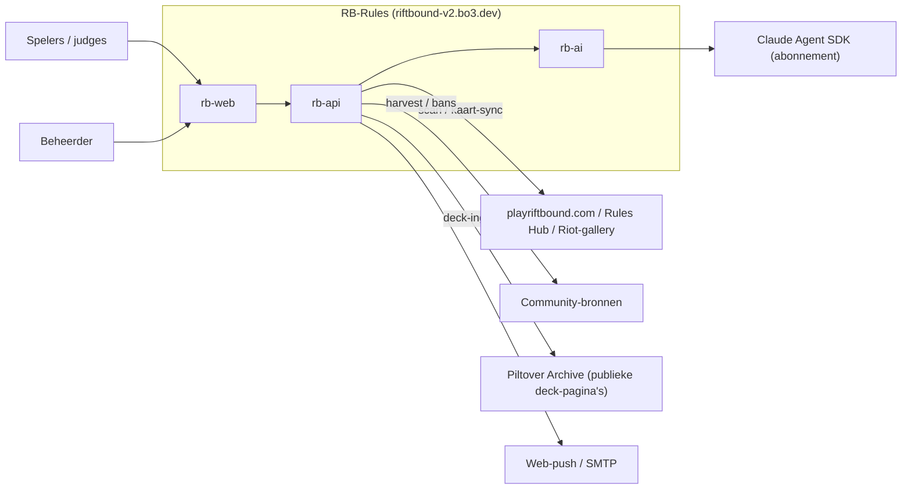
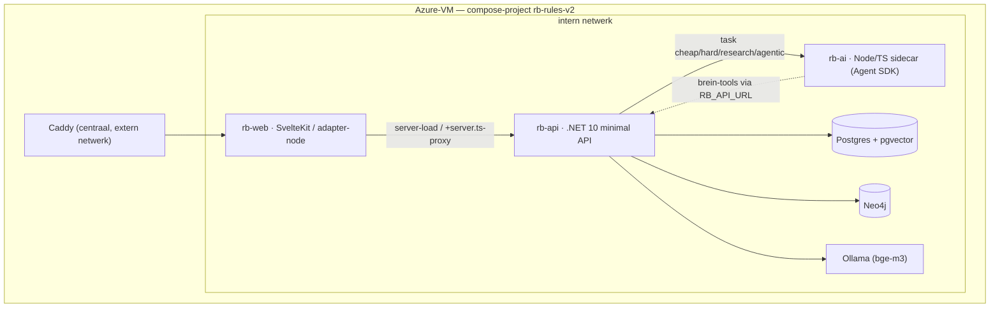
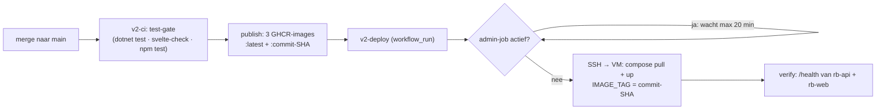

# Architectuur — RB-Rules (arc42)

Dit document beschrijft de architectuur van RB-Rules (Riftbound Rules
Companion, live op https://riftbound-v2.bo3.dev) volgens de arc42-structuur.
Het beschrijft de staat van `main` op dit moment. Elke bewering is bedoeld
verifieerbaar in de repo; waar mogelijk staat het bronbestand erbij.

Verwante ontwerpdocumenten die dieper gaan dan dit overzicht:
`docs/CONVENTIONS.md` (bindende code-conventies), `docs/KNOWLEDGE.md`
(kennislagen-visie), `docs/BRAIN.md` (brein-ontwerp), `docs/AI_AUTH.md`
(abonnement vs. API-key), `docs/DEPLOY.md`, `docs/DATAMODEL.md`,
`docs/CARD_INGEST.md` en `docs/SCRAPING.md`.

> Let op: de repo bevat naast de v2-stack (`rb-api`/`rb-web`/`rb-ai`) ook nog
> de gedeprecte Next.js-PoP in de root (`src/`, `next.config.mjs`,
> `docker-publish.yml`). Dit document beschrijft uitsluitend de v2-stack, die
> de PoP heeft vervangen.

---

## 1. Inleiding & doelen

RB-Rules is één altijd-actuele bron voor Riftbound-regels, bans, errata,
rulings en kaarten, automatisch bijgehouden uit officiële bronnen, met een
AI-vraagbaak die als toernooi-scheidsrechter antwoordt. Het einddoel
(`docs/KNOWLEDGE.md`, `docs/BRAIN.md`) is één samenhangend "brein": alle kennis
vector- én graf-gelinkt, bevraagbaar door AI-tools.

### Kerndoelen

1. **Altijd-actuele regelbron.** Officiële bronnen worden periodiek gescand;
   wijzigingen komen als voor/na-diff in de wijzigingen-feed
   (`IngestService`, `ScanScheduler`).
2. **AI-vraagbaak met bronplicht.** Elk `/ask`-antwoord is herleidbaar:
   §-citaties met ouderregels, kaartfeiten als bewijs, en een zekerheids-label
   (`AskService.cs`, prompt `BasePrompt`).
3. **Degradatie boven uitval.** Uitval van een externe dienst (Ollama, rb-ai,
   Riot, Neo4j) is een verwacht pad: het systeem degradeert netjes in plaats
   van een kale 500 te geven (`docs/CONVENTIONS.md` "Fouten zijn data").

### Kwaliteitseisen (top 5)

| Kwaliteit | Concreet | Verankerd in |
|---|---|---|
| Correctheid/traceerbaarheid | Antwoord scheidt officiële regels van community-consensus, met citaties | `AskService.cs`, `docs/KNOWLEDGE.md` |
| Beschikbaarheid/robuustheid | Elke pijplijnstap is best-effort; één haperende stap stopt de run niet | `PathDefinition.ContinueOnError` (#258), `ScanScheduler` |
| Actualiteit | Scan per cadence, dagelijkse kaart-sync, set-release-keten | `ScanScheduler`, `SetReleaseService` |
| Herbouwbaarheid | Alle afgeleiden (embeddings, mechanics, graph) opnieuw op te bouwen uit Postgres | `docs/CONVENTIONS.md`, `GraphSyncService` |
| Kosten/latency-beheersing | AI opt-in per taak, rate-limiting op dure routes, agentic achter een gate | `rb-ai/src/ai.ts`, `Program.cs` (rate limiter), `AgenticGate` |

---

## 2. Randvoorwaarden

### Technische randvoorwaarden

- **Claude-abonnement, nooit API-key in rb-api.** Al het LLM-verkeer loopt via
  de rb-ai-sidecar op `CLAUDE_CODE_OAUTH_TOKEN` (abonnement). rb-api kent geen
  API-keys (`docs/AI_AUTH.md`, `docs/CONVENTIONS.md`, `rb-ai/src/ai.ts` regel
  16-18, compose `rb-ai`-service).
- **Lokale Ollama bge-m3, provenance heilig.** Embeddings zijn `vector(1024)`
  met HNSW-index; elke embedding bewaart de modelnaam. Een model-wissel is een
  expliciete her-embed, nooit stilzwijgend mixen van dimensies
  (`docs/CONVENTIONS.md`, `EmbeddingService`, `CardEmbeddingPipeline`).
- **Eén Azure-VM (8GB B2ms).** De hele stack draait in één compose-project met
  memory-limits per service, omdat de host-OOM-killer anders willekeurig kiest
  (`deploy/server-setup-v2/docker-compose.yml`, issue #45/#82).
- **Secrets nooit in code.** Alleen via GitHub Secrets of de VM-`.env`; compose
  weigert te starten zonder `POSTGRES_PASSWORD`/`NEO4J_PASSWORD`
  (`docker-compose.yml` `:?`-guards, `v2-deploy.yml` bootstrap-validatie).
- **Strikte laagscheiding** `Api → Infrastructure → Domain`, éénrichting
  (`docs/CONVENTIONS.md`, csproj-referenties).
- **EF-vertaalbaarheid.** Alleen bewezen naar SQL vertaalbare LINQ; geen
  `Contains(char)`, geen eigen methoden in expression trees
  (`docs/CONVENTIONS.md`).

### Organisatorische/stijl-randvoorwaarden

- Nederlandstalige UI en communicatie; Engelse speltermen onvertaald.
- Geen emoji's in de UI; status = kleur + tekst (`rb-web/src/app.css`).
- Nieuwe wensen tussendoor worden eerst een GitHub-issue.
- Nooit mergen/deployen terwijl een live admin-job draait (`v2-deploy.yml`
  job-gate).

---

## 3. Context & afbakening

### Externe systemen

| Extern systeem | Rol | Koppelvlak |
|---|---|---|
| **playriftbound.com / Rules Hub** | Officiële regel-PDF's, patch notes, errata (laag 0) | `IngestService` via `SafeExternalHttp`; bronnen in `SourceSeed.cs` |
| **playriftbound.com/en-us/news/…** (bron-feeds, #167) | Index-pagina's die periodiek nieuwe artikel-URL's opleveren — ontdekt bronnen, ís er geen | `FeedCrawlService` (`RiotNewsFeed`-parser) via `SafeExternalHttp`; feeds in `SourceFeedSeed.cs` |
| **Riot-kaartgallery** | Leidende kaartenbron (JSON, set-facetten, token-kaarten, en sinds #270 de presentatievelden: afmetingen/`orientation`, kleuren, `accessibilityText`, illustrator, `mightBonus`, `effect`, `flags`, `publicCode`); de riftcodex-API vult daarna alleen lege velden en ontbrekende kaarten aan (#150/#270) | `CardSyncService`, `CardMerge` |
| **Riot-glyph-CDN** | Officiële icoon-SVG's voor de `:rb_…:`-tokens in kaartteksten (`assetcdn.rgpub.io/…/riot-glyphs/rb/latest/`). **Niet** live bevraagd: de 22 glyphs zijn gevendord in `rb-web/static/glyphs/` (#257, ADR-16) | `scripts/fetch-glyphs.sh`, `$lib/rbtokens.ts` |
| **Community-bronnen** | riftbound.gg, fanfinity, UVS Games-PDF, mobalytics (laag 1-3) | `SourceSeed.cs`, `ClaimMiningService`, `BanErrataSyncService` |
| **Piltover Archive** | Community-decks (#15, fundament meta-laag 3) | `DeckIngestService` via `SafeExternalHttp`; **alleen** de sitemap en publieke `/decks/view/{uuid}`-pagina's — hun `/api/` is robots-disallowed en wordt nooit aangeraakt; attributie + deep-link per deck |
| **Claude Agent SDK** | LLM-uitvoering op abonnement | `rb-ai` (sidecar), intern koppelvlak `/ask` |
| **Ollama (bge-m3)** | Lokale embeddings | `EmbeddingService` (compose-intern) |
| **Web-push / SMTP** | Meldingen (VAPID) en magic-link-login | `PushService`, `MailService` |
| **Gebruikers** | Spelers, judges (vragen stellen), beheerder (jobs, review) | `rb-web` UI |

### Praktijkvalkuilen bij de externe koppelvlakken

- Riot's domein is **playriftbound.com**; PDF-links zijn opake Sanity-CDN-
  hashes, dus matchen gebeurt op ankertekst ("Core Rules")
  (`docs/CONVENTIONS.md`, `HubDiscovery`, `PdfDiscovery`).
- Riftcodex-site/Mobalytics/community-sites blokkeren datacenter-IP's
  (Cloudflare); de riftcodex-API werkt wél vanaf de VM, maar is sinds #150
  uitdrukkelijk aanvullend — de Riot-gallery is de leidende kaartenbron
  (riftcodex-eerst conserveerde eerder naamschade). Een lege of gedeeltelijke
  community-oogst is een verwacht resultaat, geen bug (`docs/KNOWLEDGE.md`);
  riftcodex-uitval in auto-modus is een run_log-info, geen jobfout.
- De Rules Hub wisselt per request de volgorde van artikellinks; flip-flop-
  suppressie zit in `IngestService` (hash-historie + lege-diff-guard).
- Piltover Archive geeft **403 zonder browser-User-Agent**; de deck-data zit
  als Next.js/RSC-flight in `self.__next_f.push`-chunks (`PiltoverDeckPage`).
  Netiquette is een harde afspraak: ~1,5 s throttle, cap per run met
  hervatting via het run_log-grootboek, her-fetch alleen bij een nieuwere
  sitemap-lastmod — de ~10k-backfill loopt bewust over meerdere runs.
- Bron-feeds (#167): de rules-and-releases-, algemene nieuws- en Rules-Hub-
  index delen dezelfde React-kaartcomponent
  (`data-testid="articlefeaturedcard-component"`) — één `RiotNewsFeed`-parser
  dekt alle drie. Ook de "smalle" rules-and-releases-feed toont af en toe een
  announcements-/organizedplay-artikel tussendoor (vandaar CategoryFilter op
  élke feed, niet alleen de brede hub); sommige artikel-URL's missen het
  categorie-segment (`/en-us/news/<slug>` i.p.v. `/en-us/news/<categorie>/
  <slug>`) en een enkele kaart linkt extern (bv. YouTube) — de parser sluit
  die uit op host in plaats van op categorie. AutoApprove auto-enablet een
  artikel alléén als feed én artikel op een officieel Riot-domein staan
  (`OfficialDomains`) — anders reviewqueue, ook met AutoApprove aan; zo maakt
  een typo/look-alike nooit onbeheerd trust-1 official bronnen aan
  (`FeedCrawlService`, endpoint-guard + crawl-guard, defense-in-depth net als
  `UrlGuard`).

### Contextdiagram



---

## 4. Oplossingsstrategie

| Doel/kwaliteit | Strategische keuze | Bewijs |
|---|---|---|
| Onderhoudbaarheid | Strikte lagen `Api → Infrastructure → Domain`; endpoints dun, logica in services, pure logica in Domain | `docs/CONVENTIONS.md`, `Program.cs`, `Endpoints/*.cs` |
| Herbouwbaarheid | Postgres is source of truth; Neo4j en alle brein-afgeleiden zijn herbouwbare projecties | `docs/BRAIN.md` §2.2, `GraphSyncService` |
| Geen API-key in rb-api | Sidecar-patroon: rb-ai draait de Agent SDK op het abonnement, alleen intern bereikbaar | `rb-ai/src/server.ts`, `docs/AI_AUTH.md` |
| Kosten/latency | AI opt-in per taaktype; single-pass standaard, agentic escalatie achter een flag met vangnet | `rb-ai/src/ai.ts`, `AgenticGate`, `AskService` |
| Robuustheid | Elke stap best-effort; fouten zijn data (`run_log`, Problem-responses, null-degradatie) | `JobCatalog`, `RbAiClient`, `AskService` |
| Actualiteit | In-app scheduler i.p.v. externe crontab; set-release als event | `ScanScheduler`, `SetReleaseService` |

---

## 5. Bouwsteenzicht

### Niveau 1 — de drie containers + datastores



- **rb-web** is het enige publiek bereikbare component (achter Caddy). De
  browser praat nooit rechtstreeks met rb-api: alle data loopt via
  server-loads (`+page.server.ts`) of `+server.ts`-proxy's, met de
  `api()`-helper (`rb-web/src/lib/api.ts`, `docs/CONVENTIONS.md`).
- **rb-api** en **rb-ai** zitten uitsluitend op het interne compose-netwerk;
  rb-web zit op `internal` én `caddy` (`docker-compose.yml` `networks`).

### rb-api — belangrijkste modules

Lagen (`docs/CONVENTIONS.md`, csproj-referenties):

- **`RbRules.Domain`** — pure, unit-testbare logica zonder I/O: `BrainRef`
  (identiteitsconventie), `QuestionRouter`, `QueryRewriter`, `RrfFusion`,
  `RuleSectionParser`, `SetLegality`, `VariantGrouping`, `RiftboundIds`
  (id-parse/normalisatie, #144), `RiftcodexCardMapper` (bronvorm-adapter,
  #144), `CardPresentation` (#270 — lokale terugval voor de presentatievelden:
  afmetingen uit de Sanity-URL, zelf samengestelde alt-tekst, hexkleur-
  validatie), `CardMerge` (#270 — de voorrangsregel van de kaart-upsert op
  één plek, zie ADR-15), `PrimerTranslation` + `PrimerDraft` (#266, ADR-19 —
  het speltermen-glossarium dat zowel de vertaalprompt vult als de lek-controle
  achteraf voedt, plus het ene schrijfpad dat de Engelse body en de Nederlandse
  weergave altijd samen vervangt en terugzet naar draft),
  `SetCoverage` (dekking per set, #145), `ClaimMining`,
  `RelationMining`, `RelationTriage` (prompt + tolerante parser voor de
  relatie-triage, #199 v1), `AgenticGate`, `SourceSeed`, `SourceFeedSeed` (#167),
  `RiotCardMapper`, `HubDiscovery`, `RiotNewsFeed` (bron-feed-parser, #167),
  `OfficialDomains` (Riot-domein-allowlist voor de feed-AutoApprove-gate, #167),
  `PiltoverDeckPage`/`PiltoverSitemap`/`DeckCardLinker`
  (#15), `IpHashing` (HMAC-SHA256 IP-hash voor de ask-geschiedenis, #157),
  `BenchmarkPrompt` (gecommitteerde-keuze-prompt + deterministische
  letter-parser, #158), `BenchmarkSeed` (judge-vragenset, idempotent net als
  `SourceSeed`), `SourceDossierCompleteness` (#171, pure statusfunctie —
  scan/vervolgstap-uitkomst + opbrengst → volledig/onvolledig/leeg/nooit
  gescand, gedeeld door de dossier-service en het kennis-gaten-rapport),
  `DeckLegality` (#15 fase 3 spoor A: puur op platte kaartfeiten — legaal /
  illegaal-met-reden (nog niet legale set of geband) / onvolledig bij
  niet-gekoppelde kaarten of een set zonder bekende releasedatum),
  `SourceContentKind` (#188 increment 2: bron-type-classificatie — "faq" |
  "patch-notes" | "other" — als LLM-BESLISSING i.p.v. een keyword-heuristiek;
  `SystemPrompt` (Engels, #187-lijn; "faq" beperkt tot Q&A-/clarificatie-
  ARTIKELEN — rulebooks/how-to-play-gidsen zijn expliciet "other", en
  gemengd/onzeker is sinds de #188-review neutraal "other" i.p.v. de oude
  #185-tie-break "patch-notes wint")/`BuildPrompt`/`Parse` (objectvorm-guard,
  zelfde patroon als `ClarificationInformativeness.ParseOperative`),
  `HeuristicKind` (het oude `ClarificationSources`-predicaat, nu het
  deterministische vangnet bij AI-uitval/onbruikbaar antwoord — dáár wint
  patch-notes bij een dubbel-keyword-naam nog wel, conservatief),
  `Resolve` (de ene plek die consumers gebruiken: gepersisteerde
  `Source.ContentKind` als die er is, anders de heuristiek — transitioneel
  gedrag tot een bron opnieuw gescand is sinds deze increment) en
  `TryApplyOverride` (beheerder-override via het source-PATCH-pad: geldige
  kind ⇒ herkomst "admin", definitief; leeg ⇒ wissen/herclassificeren);
  geclassificeerd bij de scan van een trust-1-bron
  (`IngestService.ClassifyContentKindAsync`, gepersisteerd op `Source.
  ContentKind`/`ContentKindSource`, met een run_log-regel wanneer het
  LLM-oordeel afwijkt van de heuristiek), gelezen door
  `ClarificationMiningService` (bronselectie/retractie) en `IngestService`
  (de templated Change)),
  `ClarificationMining` (#177: `ClarificationSources`, de naam-/URL-heuristiek
  die vóór #188 increment 2 de primaire bron-type-classificatie was — nu het
  vangnet achter `SourceContentKind`; `IsMatch`/`IsPatchNotesSignal` blijven
  ongewijzigd als de twee losse substring-predicaten waar `SourceContentKind.
  HeuristicKind` op leunt; `ClarificationMiner`, prompt+parser voor de
  concept-extractie (output in het Engels, #186) — levert sinds #188 ook een
  `operative`-veld per item (het LLM-oordeel: stelt dit item de échte
  regel/definitie/interactie, of kondigt het slechts een wijziging aan?);
  `ClarificationGrounding`, de citaat-in-brontekst-check;
  `ClarificationInformativeness.IsMetaOnly`, de derde poort-toets die een
  kale aankondigingszin zonder regelinhoud weert — sinds #188 niet meer de
  primaire informativiteitsbeslisser (die is het `operative`-LLM-oordeel
  hierboven) maar het deterministische vangnet wanneer dat oordeel ontbreekt
  of uitvalt; `ClarificationInformativeness.JudgeSystemPrompt`/`ParseOperative`
  (#188), de lichte her-toets-prompt die `CorrectionReevaluationService`
  gebruikt om opgeslagen tekst (zonder verse extractie) alsnog te
  classificeren; `ReviewNoteAnchor` (#184), een pure regex-parser die een
  anker-correctie uit een beheerder-opmerking haalt (bv. "mechanic:Recall");
  en sinds #188 increment 3 `ClarificationMiner.GetSystemPrompt`/
  `BuildVocabularyBlock` (het echte anker-vocabulaire — mechaniek-namen +
  primer-concepten — letterlijk in de extractieprompt op `{VOCABULARY}`, zodat
  de LLM een bestaand anker KIEST i.p.v. een vrije-vorm-onderwerp te verzinnen
  dat toch niet resolvet — issue #199: 117/133 pending items faalden hierop)
  en `ClarificationAnchorRepair` (Engelse herstel-pas-prompt — één bestaand
  pending item + citaat + het oorspronkelijke onherkende onderwerp als
  context, anker-KEUZE uit hetzelfde vocabulaire, "none" expliciet een
  eersteklas antwoord; `ParseAnchorChoice` geeft sinds de adversariële
  review een drieledige `AnchorChoice` terug — `Choice`/`None`/`Unusable`,
  zodat de aanroeper een DEFINITIEVE "geen anker past" (terminaal) kan
  onderscheiden van flaky output (transiënt), zelfde objectvorm-guard-patroon
  als `ClarificationInformativeness.ParseOperative`; en `HasLexicalSupport`,
  de deterministische lexicale-steun-poort vóór auto-promotie: de ankerterm
  — volledig voor mechanic/card/section, minstens één significant token
  (≥4 tekens) van key of titel voor een concept — moet aantoonbaar in
  verduidelijking + citaat + oorspronkelijk onderwerp voorkomen, anders is
  een resolvend-maar-verkeerd anker een onzichtbare one-way door naar
  verified) — puur en getest,
  zelfde patroon als `ClaimMining`), `Entities.cs`. Bewuste enige uitzondering:
  het `Pgvector`-datatype op entiteiten (#44, `docs/CONVENTIONS.md`).
- **`RbRules.Domain/Ontology` — ontologie-schema v0 (brein-fundament, nog niet
  bedraad).** Eerste fundament-brok van het Poracle-brein (brein-epic, §2 van de
  geïntegreerde brein-architectuur): een losstaande, pure Domain-module zonder
  DB, migratie of koppeling aan bestaande services/flows. `OntologyTypes`/
  `OntologySchema` leggen de klassenhiërarchie (`EntityType`, multi-label,
  SUBCLASS_OF transitief + acyclisch), de kern-relaties (`RelationType` met
  domain/range, kardinaliteit en logische eigenschappen — transitief/symmetrisch/
  functioneel/acyclisch, plus de reïficatie-dwang voor de gekwalificeerde
  relaties COUNTERS/MODIFIES/GRANTS/REQUIRES) en de disjointness-assen
  (Keyword ⟂ Mechanic ⟂ Status, Spell ⟂ Object) vast als één onveranderlijk,
  machine-leesbaar register — bewust de ÉNE schema-bron waaruit later
  prompt-enums, de parser-poort en Neo4j-constraints gegenereerd worden (dus
  geen losse constanten elders). `OntologyValidationService` is de bijbehorende
  pure, deterministische poort: hij valideert een kandidaat-triple
  `(subjectType, relationType, objectType[, context])` op domain/range mét
  subclass-overerving, kardinaliteit, disjointness en de reïficatie-vlag, en
  geeft een gestructureerd resultaat (geldig + reden + schendingen) terug —
  bedoeld als schema-gate náást het LLM-oordeel, niet in plaats daarvan.
  Modelleer-keuze t.o.v. de kale ASCII-boom in §2.1: `Card` hangt niet onder
  `Object` maar de object-kaarttypes erven van beide (multi-parent), zodat
  `Spell ⟂ Object` vervulbaar blijft. Nog geen endpoint, EF-migratie of
  Neo4j-write — puur, volledig unit-getest (`OntologySchemaTests`).
  **Namen volgen de projectie, niet andersom (#274).** Het register is de ÉNE
  schema-bron, dus het moet de relaties benoemen die er in Neo4j écht staan:
  `HAS_MECHANIC` (Card→`Mechanic`) en `HAS_DOMAIN` (Card→`Domain`), niet de
  eerdere `HAS_KEYWORD`/`IN_DOMAIN`. Twee namen voor één relatie maakten het
  schema onvalideerbaar (het beschreef niet wat er stond), lieten een weiger-reden
  een niet-bestaand relatietype noemen en maakten de reasoner inert: de uit de
  ontologie gegenereerde Cypher matchte edges en knooplabels die niemand schrijft.
  `GraphSyncService` leidt zijn MERGE-clausules daarom uit het register af
  (`MechanicMergeClause`/`DomainMergeClause`) in plaats van uit losse literals, en
  `OntologyProjectionAlignmentTests` pint schema, projectie, `BrainQuery.EdgeTypes`
  en de gegenereerde reasoner-Cypher op elkaar vast — de vier lopen niet meer stil
  uiteen. `Keyword` blijft een klasse (HAS_ROLE-filler, `ERRATA_OF`-range,
  canoniek entiteit-kind) en `INVOKES` de fijnere, vandaag niet-geprojecteerde brug
  Keyword→Mechanic; de gedrukte magnitude rijdt als edge-parameter mee. De
  hernoeming is structuurbrekend en bumpte `OntologyBaseline` naar **2.0.0**
  (major) — zonder datamigratie: de graaf droeg deze namen al en afgeleide edges
  zijn per definitie herbouwbaar (job `graph` → `reason`).
- **`RbRules.Domain/Provenance.cs` + `ProvenanceAuditService` — provenance-
  ruggengraat (fase 0a, #233).** Versla faalmodus #4 (ontbrekende provenance)
  als schema-invariant, niet als discipline. Twee nieuwe entiteiten (Postgres,
  bron van waarheid): `MiningRun` (PROV-O-*Activity* — welk model/prompt-versie/
  vocab-snapshot leidde feiten af; vult het gat tussen het te-grove `RunLog` en
  de losse feiten) en `Assertion` (gereïficeerd feit-met-herkomst: `Subject` =
  BrainRef van het feit, `WAS_GENERATED_BY`→`MiningRun`, `DERIVED_FROM`=BrainRef
  van de bron, plus model/prompt/embedding-stempel en lichte valid-time — bewust
  géén volledige bitemporaliteit). Het **dubbele write-guard**: de pure
  `AssertionProvenanceGuard` (Domain) + een `RbRulesDbContext.SaveChanges`-poort
  die 'm afdwingt (een Assertion zonder zowel `WAS_GENERATED_BY` als
  `DERIVED_FROM` faalt hard), náást de Neo4j-uniciteitsconstraint (een
  relatie-existentie-constraint is Enterprise-only, dus de garantie leeft in
  Postgres + de deterministische projectie). `EmbeddingProvenance` levert de
  content-hash (SHA-256 van de geëmbede tekst) op elke embedding-rij; de dim is
  structureel 1024 (getypte vector-kolom). `ProvenanceAudit`/`ProvenanceAuditService`
  zijn de **Ring-A-gate** (€0, geen LLM): tel afgeleide feiten zonder Assertion
  en embeddings zonder herkomst, gesplitst in "nieuw" (ná de cutoff — moet 0
  zijn) en "legacy" (geïnventariseerd voor backfill). Puur/EF-vertaalbaar getest
  (`ProvenanceBackboneTests`).
- **`RbRules.Domain/EntityResolution.cs` + `CanonicalEntities.cs` +
  `CanonicalDrift.cs` + `EntityResolutionService` — canonieke entiteiten &
  entity-resolution (fase 1, #225).** Versla faalmodus #1 (duplicatie) en #2
  (synoniem-proliferatie). Drie nieuwe entiteiten (Postgres = SoT, additief
  bovenop `Card.Mechanics[]` — bestaande strings blijven ongemoeid):
  `CanonicalEntity` (één rij per mechanic/keyword/concept — kind uit de
  Concept-tak van de ontologie — met `CanonicalLabel`, het `AltLabels`-
  alias-lexicon, `Definition`+embedding, `Status` candidate/canonical/merged,
  `MergedIntoId`-tombstone en `CreatedByRunId`-0a-provenance), `MergeDecision`
  (expliciete merge-beslissing als first-class knoop: bron/doel, `DecidedBy`
  auto|admin, `Memo` met signaal-uitslag en — cruciaal voor het herstelpad —
  `MovedAltLabels` zodat `Unconsolidate` exact díe labels terugtrekt) en
  `MergeCandidate` (voorgesteld paar → reviewqueue; telt als duplicatie-schuld).
  De **pure** bouwstenen (`EntityResolution.cs`, IO-loos, volledig unit-getest):
  `AliasNormalizer` (case/whitespace/underscore/koppelteken-collapse — het
  canonicalisatie-oppervlak), `Magnitude` (splitst de trailing integer af zodat
  `Assault 2`/`Assault 3` de FAMILIE `Assault` delen met de magnitude als
  parameter — kritiek Risico 2a: nooit weggestript tot aparte entiteit),
  `Trigrams` (Jaccard-similarity, spiegelt `pg_trgm` zodat de gate exact de
  productie-beslissing meet), `EntityResolutionClassifier` (drietraps-signalen
  blocking→trigram→embedding-cosine: 3/3 = auto-merge-kandidaat, 2/3 = review,
  minder = geen match — NOOIT auto-merge op alleen embedding), `EntityResolutionGate`
  (auto-merge standaard UIT — mag pas schrijven ná een gemeten ER-gouden-set-
  precisie ≥ 0,95 ÉN labels ≥ 4 tekens; kritiek Risico 2b) en
  `EntityResolutionGoldSet` (gelabelde merge/niet-merge-paren + precisie-meting,
  patroon eval-scaffold #235). De **service** hangt de IO eromheen: `ResolveAsync`/
  `ResolveOrRegisterAsync` (resolve tegen `CanonicalLabel ∪ AltLabels` VÓÓR
  kandidaat-creatie — stopt synoniem-proliferatie over sets heen),
  `RegisterExistingMechanicsAsync` (additieve, niet-destructieve backfill uit
  `Card.Mechanics`/geaccepteerde `MechanicKeyword`s), `ScanForMergeCandidatesAsync`
  (blocking in-memory bij fase-1-cardinaliteit, gate-consistent; `pg_trgm`+GIN
  staan als schaal-pad in de migratie), `MergeAsync`/`UnconsolidateAsync`
  (tombstone + Decision-memo + omkeerbaar herstelpad — rode draad #236) en
  `DriftSnapshotAsync` (`CanonicalDriftSnapshot`: node-count per kind, singletons,
  duplicatie-schuld — queryable voor inzicht #236). EF-migratie
  `CanonicalEntities225`; getest in `EntityResolutionTests`.
- **`RbRules.Domain/ReifiedInteractions.cs` + `InteractionPromotionGate.cs` +
  `InteractionProjection.cs` + `InteractionExtraction.cs` +
  `InteractionPromotionService` — reïficatie & gekwalificeerde relaties (fase 2,
  #226).** Versla faalmodus #3 (structuurverlies): een kale
  `(:Card)-[:COUNTERS]->(:Card)`-edge is verboden, elk COUNTERS/MODIFIES/GRANTS/
  REQUIRES-feit leeft als gereïficeerde **`Interaction`** (Postgres = SoT) met
  rollen agent/patient (BrainRefs naar Card/Keyword), een `Kind` uit de
  reïficatie-verplichte ontologie-relaties, een optionele `GovernedByRef` naar de
  RuleSection en een `Status` ∈ {candidate, verified, promoted, rejected,
  **model_hypothesized_unruled**}. Condities (window/status/cost) zijn losse,
  individueel weerlegbare **`InteractionCondition`**-knopen met expliciete
  `SubjectRole` i.p.v. platgeslagen in proza. De **reïficatie-vorm-poort**
  (`OntologyValidationService.ValidateReifiedInteraction`, fase 0b) dwingt de rol-
  range en de kale-edge-dwang af. De **promotie-poort**
  (`InteractionPromotionGate`, puur) is deterministisch: `schema ∧ (lexicaal ∨
  consensus≥N) ∧ verdict` → promoted; anders reviewqueue met een `StatusReason`
  die zégt welke poort faalde. Twee bindende bijzonderheden: (a) een levende
  **`RejectionTombstone`** (op de `agent|patient|kind`-dedupe-sleutel) blokkeert
  stil-heropenen — herstel is een expliciete beheerdersactie
  (`LiftTombstonesAsync`); (b) cold-start (kritiek Risico 1) — een emergente
  card×card-hypothese zonder lexicale/consensus-steun wordt NIET verworpen maar
  getierd als `model_hypothesized_unruled` (eigen trust-label, micro-reviewqueue),
  nooit stil weggegooid. Elke acceptatie legt een `Assertion` (0a-provenance,
  subject `interaction:{id}`) én een **`InteractionDecision`**-memo vast (rode
  draad #236 — niets levert onzichtbare state). `InteractionProjection` bouwt de
  gedenormaliseerde `RELATES_TO`-qualifier-cache (window/actor_status/cost_delta/
  tier) — herbouwbaar uit de reïficatie, nooit de bron; bij ≥2 condities per as of
  een patient-rol markeert ze `reifiedOnly`. `InteractionExtraction` definieert de
  tool-forced `emit_interactions`-structured-output-vorm met enum-poorten uit de
  ontologie (`RelationTypeConstraint`); de live rb-ai-call is bewust
  integratie-follow-up (de bestaande `InteractionMiner` kent geen condities en
  tool-forcing vereist een rb-ai-uitbreiding — de promotie-pipeline + structuur
  staan er). EF-migratie `ReifiedInteractions226`; getest in
  `ReifiedInteractionTests` (30 tests).
- **`RbRules.Domain/Reasoning/*` + `ReasoningService` — de redeneer-laag (fase 3,
  #227, §5).** VASTGELEGDE BESLISSING: **één engine, Neo4j-native** — Cypher voor
  monotone inferentie, contradictie via bounded `WHERE NOT EXISTS`, **géén apart
  C#-Datalog** en geen OWL-runtime in de hot-path. `InferenceRuleRegistry` genereert
  de inferentie-regels DETERMINISTISCH uit de ontologie (de ÉNE schema-bron, geen
  losse regel-lijst ernaast): **isa-closure** (GOVERNED_BY-overerving over de
  type-lattice uit `OntologySchema.Ancestors`), **property-chain** (ketens die uit de
  relatie-domain/range in een GOVERNED_BY→RuleSection uitkomen, bv.
  `HAS_MECHANIC ∘ GOVERNED_BY`; sinds #274 loopt hop 1 van die keten over de edge én
  het knooplabel die de projectie ECHT schrijft, daarvóór mikte ze op
  `HAS_KEYWORD`→`:Keyword`. **Hop 2 blijft ongeprojecteerd**: er bestaat geen
  `(:Mechanic)-[:GOVERNED_BY]->(:RuleSection)`-edge — `GOVERNED_BY` wordt uitsluitend
  vanaf een `:Interaction` geschreven — dus de keten levert vandaag nog steeds nul
  afgeleide edges. Zie §6.4 hieronder: die projectie-uitbreiding is de openstaande
  follow-up, #274 heeft alleen de naam-tweespalt weggenomen),
  **symmetrische sluiting** (uit de `Symmetric`-trait: INTERACTS_WITH/CONTRADICTS) en
  **subproperty-collapse** (alias-kind → canonieke super-property uit
  `OntologySchema.RelatesToKindSubProperties`, v0 leeg). De denorm-cache RELATES_TO en
  de kennis-loze INTERACTS_WITH-hint zijn geen inferentie-hop (uit een niet-bron leid
  je geen kennis af). Elke afgeleide edge draagt verplicht `derived=true` +
  `derivedByRule` + run-provenance (`DerivedEdgeProvenance`, inzicht #236); afgeleide
  edges zijn **nooit bron** — ze worden bij elke run gewist en opnieuw
  gematerialiseerd, nooit als Postgres-feit gepersisteerd (SoT = de basisfeiten).
  `ContradictionDetector` bouwt bounded read-only patronen — **claim-contradicts-
  official** (community-claim tegen een RuleSection zonder officiële dekking →
  misvattingen-kanaal), **ruling-collision** (botsende geverifieerde rulings →
  escalatie) en, gegenereerd uit `OntologySchema.AreDisjoint`, één **disjointness-
  violation**-patroon per effectief disjunct labelpaar (`:Unit:Spell` vangt kaart-sync-
  schade à la #150 → reviewqueue). Treffers worden via `ConflictRouter` gerouteerd en
  door `ToConflict` naar **`ReasoningConflict`**-rijen (Postgres = SoT ook hier, eigen
  tabel naast bron-niveau `Conflict`) vertaald, idempotent op een dedupe-sleutel.
  `ReasoningService` (job `reason`, ná `graph`) hangt de Cypher-executie eromheen —
  best-effort, want Neo4j zit niet in CI/lokaal; **live-Cypher-executie is
  integratie-follow-up** (zoals de fase-2-projectie), de pure regel-/patroon-generatie
  en de conflict-vertaling zijn wél getest (`InferenceRuleRegistryTests`,
  `ContradictionDetectorTests`). `OntologyConsistencyAudit` is de
  **OWL2-RL-nachtaudit-skeleton**: een pure zelf-toets van de afgedwongen
  schema-bron (acyclisch, disjointness vervulbaar, geen dangling domain/range) —
  geen OWL-runtime. Draaide tot #258 als admin-job `owlaudit`, maar las geen data
  en raakte geen database: hij kon alleen falen op de GECOMPILEERDE
  `OntologySchema`. Dat is een unit-test, geen beheerdersactie — de job is weg en
  de toets is een CI-assert
  (`ContradictionDetectorTests.OntologyConsistencyAudit_DeAfgedwongenSchemaBronIsConsistent`),
  waar hij een kapot schema tegenhoudt vóór de merge in plaats van erna.
  EF-migratie `Reasoner227`.
- **`RbRules.Infrastructure`** — services met I/O: `RbRulesDbContext` (EF Core),
  `IngestService`, `FeedCrawlService` (#167, bron-feed-crawl — eerste stap
  van `IngestService.ScanAsync`; sinds #175 ook herkomst-adoptie — een
  herontdekt artikel dat al een `Source` zonder `FeedId` is, krijgt die
  `FeedId` zonder curatie te raken — en `MergeNearDuplicateSourcesAsync`,
  een near-duplicaat-samenvoeging vooraf in elke run die bronnen in
  afwijkende URL-vorm samenvoegt met referentie-omhangen, #144-patroon),
  `RuleChunkPipeline`, `CardSyncService`,
  `CardEmbeddingPipeline`, `EmbeddingService` (Ollama — sinds **#282** met
  `TryEmbedAsync`, dat de uitvals-oorzaak als `EmbedCallOutcome` teruggeeft
  i.p.v. als exception; `EmbedAsync`/`EmbedOneAsync` blijven gooien voor de
  interactieve paden die al naar alleen-FTS degraderen), `AskService`,
  `AskHistoryService` (eigen ask-geschiedenis op user_id/ip_hash, #157),
  `RbAiClient`, `GraphSyncService`/`GraphQueryService`/`BrainGraphService`
  (Neo4j), `BrainService`, `BrainExplorerService` (read-only inspectie-laag over
  de brein-tabellen voor de admin-Brein-verkenner, #236 — puur Postgres, geen
  live-Neo4j), `MechanicMiningService` (job "mine" — mechanieken/triggers/
  effects per kaart. Sinds #188-restant **#211** ligt de werkverdeling vast op
  wat de bron zelf al zegt: Riot drukt élk keyword gebracket af
  (`[Equip]`, `[Assault 2]`), dus `MechanicMiner.Analyze` haalt de mechanieken
  er deterministisch uit — magnitude-vrij, want "Assault 2" en "Assault 3" zijn
  dezelfde familie (ADR-17) — en schrijft ze vóór en onafhankelijk van de
  rb-ai-call. De LLM krijgt alleen nog het oordeel dat een regex niet kán
  vellen: per kaart een **gesloten** lijst bekende keywords die er ongebracket
  in staan, met de vraag of ze daar als spelterm worden gebruikt ("Equip
  :rb_rune_body:", Jagged Cutlass) of als gewoon Engels woord ("Repeat this
  gear's play effect", Sprite Fountain); `MechanicMiner.MergeMechanics`
  valideert dat oordeel achteraf tegen diezelfde lijst, zodat de LLM alleen kán
  toevoegen, nooit afnemen of een term buiten het vocabulaire binnenhalen.
  Nieuwe keywords lopen onveranderd via de kandidatenqueue langs een mens
  (`MechanicVocabularyService`, #52). De wachtrij-poort is daarom
  `Mechanics == null || Triggers == null`: het deterministische deel alléén
  maakt een kaart nog niet klaar), `ClaimMiningService`,
  `ClarificationMiningService` (#177, job "clarify" — concept-extractie uit
  officiële FAQ-/clarificatie-artikelen naar `Correction`s met eigen gefocuste
  embedding en onderwerp-anker. Hybride autoriteitspoort: alleen `verified` als
  het concept grounded is (`ClarificationGrounding`: citaat in `Document.
  Content`) én anchored (`ClaimTopicMapper.Resolve` op kaartnaam/mechaniek-
  vocabulaire/§-code/primer-concept) én informative (geen kale
  aankondigingszin — sinds #188 primair `ExtractedClarification.Operative`,
  het LLM-oordeel dat `ClarificationMiner` meelevert; ontbreekt dat (null),
  dan valt `StoreAsync` terug op `ClarificationInformativeness.IsMetaOnly`)
  — anders
  `unverified` + `StatusReason` de reviewqueue in; een `rejected` tombstone
  wordt nooit heropend. Sinds #185 trekt elke run bovendien vóóraf de eerder
  ten onrechte gemínede patch-notes-`Correction`s terug
  (`RetractPatchNotesCorrectionsAsync`, hard delete, idempotent — sinds de
  #188-review achter een consensus-poort: verwijderen alleen als de
  effectieve kind patch-notes is ÉN de deterministische heuristiek dat
  bevestigt of de beheerder de kind expliciet vastzette (herkomst "admin");
  oneens ⇒ overslaan + run_log-waarschuwing, en een wees-bron (Source-rij
  weg) wordt nooit meer op alleen haar id opgeruimd — alleen gelogd voor
  handmatige beoordeling). Dedupliceert
  per concept op (bron, Scope, Ref) + embedding-nabijheid — een parafrase bij
  een her-mine werkt de bestaande ruling bij (nooit degraderend) i.p.v. te
  stapelen, zelfde poort-patroon als `ClaimMiningService`; backfilt bestaande
  bronnen vanzelf, geen tijdvenster op de bronselectie (sinds #188 increment 2:
  `SourceContentKind.Resolve` op elke trust-1-bron in plaats van de kale
  naam-/URL-heuristiek — zelfde uitkomst voor een nog-niet-geclassificeerde
  bron dankzij de null-fallback, maar nu ook correct voor een bron zonder
  magisch woord in zijn slug); de extractieprompt krijgt sinds #188 increment
  3 ook het echte anker-vocabulaire mee (`ClarificationMiner.GetSystemPrompt`
  i.p.v. de kale `SystemPrompt`) — de anker-resolver-opbouw zelf staat
  gedeeld in `AnchorResolverFactory`, die sinds diezelfde increment naast de
  opaque `ClaimTopicMapper` ook de leesbare mechaniek-/concept-vocabulaire
  teruggeeft (`BuildWithVocabularyAsync`; het bestaande `BuildAsync` blijft
  ongewijzigd voor aanroepers die alleen de resolver nodig hebben) zodat
  extractie, herstel-pas en validatie gegarandeerd hetzelfde vocabulaire
  zien),
  `CorrectionReevaluationService` (#184, her-evaluatie van één `Correction`
  op een beheerder-opmerking: draait dezelfde hybride poort opnieuw voor dat
  ene item — roept `ClarificationGrounding`/`ClaimTopicMapper.Resolve` aan
  zonder hun logica te wijzigen; informativiteit toetst het (#188) zelf via
  een lichte `RbAiClient`-classificatie (`ClarificationInformativeness.
  JudgeSystemPrompt`/`ParseOperative` — er is hier geen verse extractie om
  een `Operative`-veld van te krijgen), die bij AI-uitval of onbruikbare
  output terugvalt op `ClarificationInformativeness.IsMetaOnly`; een
  `ReviewNoteAnchor`-anker in de opmerking overschrijft Scope/Ref bij
  resolutie; alleen van toepassing op clarify-mining-`Correction`s (Provenance
  `clarify-mining:{sourceId}`, de enige ontstaanswijze met brontekst om tegen
  te gronden); een `rejected`- of al `verified`-item degradeert/heropent
  nooit, alleen de opmerking wordt dan bewaard. De gate-hertoets zelf staat
  sinds #188 increment 3 in de private `ApplyGateAsync`, geëxtraheerd zodat
  `RepairPendingAnchorsAsync` (zie hieronder) 'm hergebruikt i.p.v.
  dupliceert; het gedeelde pad doet bewust GEEN duplicaat-check (review-fix:
  een handmatige #184-anker-correctie is een bewuste menselijke verplaatsing
  die altijd mag — het #184-spookduplicaat is daar al gedekt door de
  cross-bucket-redding op ReviewNote in `StoreAsync`).
  `RepairPendingAnchorsAsync` (#188 increment 3 herzien na de adversariële
  review; job "clarify" tweede stap — zie `JobCatalog.ClarifyAsync`) is de
  geautomatiseerde tegenhanger: voor de bestaande achterstand (issue #199,
  117/133 pending items met StatusReason "onderwerp … niet herkend") doet
  één rb-ai-aanroep per item een anker-KEUZE uit het vocabulaire
  (`ClarificationAnchorRepair`, met citaat + oorspronkelijk onderwerp als
  context); daarna is alles deterministisch. **Autoriteitsmodel
  (review-uitkomst):** auto-promotie alleen bij lexicale steun
  (`ClarificationAnchorRepair.HasLexicalSupport`) én de volledige
  `ApplyGateAsync`-poort; zonder lexicale steun een AANBEVELING — Scope/Ref
  verhuizen wél (queue toont het item bij het juiste onderwerp), status
  blijft pending met reden "anker hersteld via LLM-suggestie … wacht op
  review", beheerder verifieert via het bestaande /verify-pad
  (#199-principe: machine sorteert voor, mens klikt). **Terminaliteit:** een
  definitieve uitkomst ("none" of een niet-resolvende keuze) plakt
  `TerminalMarker` ("anker-herstel geprobeerd") aan de StatusReason en het
  selectie-predicaat sluit die uit — geen eeuwige her-eligibiliteit of
  window-starvation; AI-uitval/onbruikbare output is transiënt (geen
  marker), en een her-mine die het item bijwerkt schrijft een verse reden
  zonder marker (her-opent eligibility — het beoogde
  herstel-na-nieuwe-informatie-pad). **Duplicaat-bewaking (alléén dit
  geautomatiseerde pad):** vóór elke verplaatsing een CANONIEKE check —
  `ClaimTopicMapper.Resolve` op zowel de keuze als alle bezetters van
  dezelfde bron, vergelijking op `BrainRef.Format()` zodat aliassen
  (kaartvarianten, concept-key vs. -titel) niet langs elkaar heen matchen;
  bezet ⇒ terminale duplicaat-kandidaat-reden ("al bezet … mogelijk
  duplicaat, beoordeel handmatig"), niet verplaatst. Kandidaten: pending +
  zonder `ReviewNote` (#184-eigendom blijft onaangeraakt) + StatusReason
  "niet herkend" zonder `TerminalMarker`. Gecapt (standaard 40) met
  `AnchorRepairResult.CapHit` over alleen echt-eligible items, zelfde
  #190-contract als `ClarificationMineResult.CapHit`. Zet BEWUST geen
  `ReviewNote` op het verplaatste item (zou een geautomatiseerde keuze
  onterecht als mens-beoordeeld labelen) — de canonieke duplicaat-check
  compenseert het ontbreken van de `ReviewNote`-gebaseerde
  cross-bucket-redding die `StoreAsync` (#184, ongewijzigd) voor handmatige
  correcties gebruikt),
  `RelationMiningService`, `RelationTriageService` (#199 v1, zie
  "`RelationTriageService`" hierboven), `InteractionService`, `PrimerService`,
  `KnowledgeRegenerationService` (#187, job "regenerateknowledge" — wipet de
  LLM-afgeleide kennislaag (claim, correction, knowledge_doc kind=primer,
  relation) en reset de mining-markers zodat her-mining met de Engelse
  prompts schoon opnieuw opbouwt; nooit de bron-/mensenwerk-tabellen, geen
  automatische her-generatie erna, expliciete admin-actie),
  `BreinMiningResetService` (#263, jobs "breinreset-interacties" en
  "breinreset-volledig" — de SMALLE tegenhanger: zet alleen de brein-mining-laag
  terug (`interaction`, `interaction_condition`, `interaction_decision` en de
  `assertion`-rijen met `FactKind = interaction`, oftewel het mined-watermark;
  in de brede scope ook `mechanic_predicate`, `canonical_entity`,
  `merge_candidate`, `merge_decision`), licht de poort-grafstenen i.p.v. ze te
  verwijderen, en BEHOUDT de `mining_run`-historie als provenance-baseline;
  raakt nooit claims/primer/correcties/relaties/bron-tabellen of de oude
  `card_interaction`-laag),
  `SetReleaseService`, `DeckIngestService` (#15, robots-compliant
  Piltover Archive-ingest), `BenchmarkService` (judge-benchmark-job, draait
  op `AskService` met `AskOptions.Benchmark = true`, #158; sinds #174 ook
  `RunSweepAsync` — dezelfde vragenset door elk model uit `AI_BENCHMARK_MODELS`
  (of een verstandige default), elk 2×, met `Model`/`RunIndex`/`SweepId` op
  `BenchmarkRun` als groepering — de gedeelde kern `RunOneAsync` draait één
  volledige vragenset-doorloop en wordt door zowel `RunAsync` als
  `RunSweepAsync` aangeroepen),
  `KnowledgeGapsService` (kennis-gaten-rapport; sinds #171 ook het
  bron-verwerkingssignaal, zelfde `SourceDossierCompleteness`-statusfunctie
  als de dossier-service), `SourceDossierService` (#171, spiegelbeeld van
  `CardDetailService.DossierAsync`/#127: herkomst via `FeedId`, opbrengst
  via `SourceId` — Document/RuleChunk/Change — en genormaliseerde `SourceUrl`
  — BanEntry/Erratum/Correction — plus claims via de `ClaimSource`-FK, en
  verwerkingsstatus uit `run_log`), `SourceListService` (#180, de admin-
  bronnenlijst-projectie: dezelfde bronnen als `/api/sources` — incl.
  genegeerde, de UI filtert client-side — plus de negeer-kandidaat-vlag.
  Bewust LICHTER dan `SourceDossierService`: vier gebatchte tellingen
  (`run_log` "scan"-regels met status ≠ error, `Change`, `ClaimSource`,
  `Correction.Provenance` op het `clarify-mining:{sourceId}`-prefix) over
  de HELE lijst in plaats van een query per bron — geen N+1. De pure
  drempelbeslissing (`SourceIgnoreCandidacy.Evaluate`, Domain) zit los van
  de I/O), `ReviewNoteService` (#124, beheerder-
  notitie → geverifieerde ruling), `ChatRulingService` (#166, in-chat-ruling →
  verified/pending naar autoriteit), `DeckBrowserService` (#15 fase 3 spoor A:
  read-only projectie boven op de Piltover Archive-decks — lijst/facetten/
  paginering + de per-deck `DeckLegality`-uitkomst. Het **legaliteitsfilter**
  (#265) draait als SQL-predicaat vóór de paginering — in-memory filteren ná
  het ophalen van een pagina zou de pagina's uithollen en `total` laten liegen
  — en is bewust dezelfde uitspraak als `DeckLegality.Evaluate`: harde
  overtreding (geband of set nog niet verschenen) → illegaal, anders
  onbeoordeelbare regel (niet-gekoppeld of set zonder releasedatum) →
  onvolledig, anders legaal; de regressietest pint beide implementaties op
  elkaar vast. Zoeken (`q`) gaat over de deckname plus de legend-/
  champions-namen — bewust niet over álle kaartregels, dat is wat het
  `card`-filter al doet), `DeckCodeService` (#264: geplakte deck-code →
  `DeckCode.Decode` → canonieke kaarten via `DeckCardLinker` (zelfde weg als
  de PA-ingest) → `DeckLegality`. `DeckCodeException` wordt hier gevangen en
  als `DeckCodeResult.Error` teruggegeven, zodat het endpoint een 400 met
  uitleg kan geven in plaats van een kale 500; alléén import — de
  sectiemapping voor export is niet te toetsen, zie PRD §4.7),
  `DeckLegalityContext` (gedeelde legaliteitsfeiten — set-releasedatums, set
  per canonieke kaart, gebande kaarten per format — één keer geladen per
  aanroep en gebruikt door beide deck-services), `JobLedger`,
  `JobCatalog`/`JobPaths`/`PathRunner` (#190 — zie de eigen paragraaf
  hieronder), `PushService`,
  `MailService`, `UserAccountService`, `PasskeyService`, en de migraties in
  `Migrations/`.
- **`RbRules.Api`** — compositie: `Program.cs` doet alleen DI-registratie,
  migratie/seed/graph-constraints bij opstart en de `MapXxxEndpoints()`-
  aanroepen. Endpoints per feature als extension-methods:
  `CardEndpoints`, `DeckEndpoints`, `RuleEndpoints`, `KnowledgeEndpoints`,
  `BrainEndpoints`, `AskEndpoints`, `AuthEndpoints`, `FeedEndpoints`,
  `PushEndpoints`, `AdminEndpoints`, `BrainAdminEndpoints`,
  `SettingsAdminEndpoints` (#254). Achtergrondwerk via `JobRunner` +
  `JobCatalog`/`JobPaths` + `ScanScheduler`; contracten in `ApiContracts.cs`;
  admin achter `AdminAuthFilter`, gebruikersquota via `UserQuotaFilter`.

**`JobCatalog`/`JobRunner`/`JobPaths`/`PathRunner` (achtergrondjobs + paden,
#59/#122/#190).** `JobCatalog` (Infrastructure) is de vlakke catalogus van
`JobDefinition`'s (naam → `Func<IServiceProvider, Action<string>,
CancellationToken, Task<JobOutcome>>`); `JobOutcome(Detail, Drained = true)`
is sinds #190 het uniforme resultaat van elke job — `Drained` is het
machine-leesbare "geen VERS werk meer deze run"-signaal. Vers-werk-semantiek
(review-fix #190): items die zojuist FAALDEN tellen niet als resterend werk
— een directe herhaling faalt vrijwel zeker opnieuw (rb-ai down, poison
item), dus die horen bij de volgende run/tick, niet bij een drain-lus. De
per-run gecapte jobs leiden Drained af van hun eigen resultaat:
`claims`/`clarify`/`relations`/`relationtriage`/`decks` via `CapHit` (bij claims telt ook een
hertoets-backlog groter dan het `MaxRechecksPerRun`-venster mee — een
goedkope COUNT vooraf; `clarify` is sinds #188 increment 3 zelf twee gecapte
stappen — extractie (`ClarificationMiningService.RunAsync`) + de
anker-herstel-pas (`CorrectionReevaluationService.RepairPendingAnchorsAsync`)
— en is pas Drained als BEIDE hun cap niet raakten), `mine` via
`Remaining − Failed`. `classify` is
ongecapt (één run = de hele backlog) en meldt om dezelfde reden
`Remaining − Failed` — na een volledige pass resteren immers alleen
failures; alle overige jobs zijn per definitie in één run klaar en laten de
default `true` staan. `JobRunner`
(Api) is de generieke, in-memory éénjob-gate: `TryStart(name, work)` zet
`_current`, draait `work` in een losse scope + `Task.Run`, en schrijft bij
afronding altijd een `run_log`-regel (Kind="job", Ref=naam,
Status=ok/error/cancelled, Detail) — ongeacht of `work` een gewone job of een
heel pad is, want beide hebben exact dezelfde functiehandtekening.

**Afbreken van een lopende run (#253).** `JobRunner` houdt per run een eigen
`CancellationTokenSource` aan en geeft díé token aan `work` (voorheen
`CancellationToken.None` — annulering bestond dus per ontwerp niet). Beheer
breekt af via `POST /api/admin/jobs/cancel` → `JobRunner.TryCancel()`:
literal-segment, dus geen botsing met `POST /jobs/{name}`; draait er niets,
dan is het antwoord `200 {cancelled:false}` (net gedrag, geen 500/404).
Cancel en de opruiming aan het eind van de run delen dezelfde lock, zodat
Cancel nooit een net-gedisposede source raakt. Annulering is **coöperatief**:
de services geven de token al door aan EF/HTTP, en `PathRunner` heeft
bovendien een expliciet breekpunt tussen stappen — een stap die de token
zelf niet fijnmazig doorgeeft, laat het pad dus in elk geval tussen twee
stappen stoppen. `OperationCanceledException` (mét `IsCancellationRequested`
als filter, zodat een échte fout gewoon "error" blijft) landt als status
**`cancelled`** met de laatste voortgangsregel en de looptijd in het detail.
Die afrondingsregel is het hele punt: `JobLedger.LastRunAsync` is
status-agnostisch, dus een afgebroken run vult het scheduler-venster net zo
goed als een geslaagde. Vóór #253 was `docker restart rb-v2-api` de enige
uitweg — die schrijft géén `run_log`-regel, waarna de scheduler de nachtrun
meteen opnieuw startte. De `run_log`-schrijfacties op dit pad (JobRunner's
afronding én `PathRunner.LogAsync`) gaan bewust zónder token: bij een
afbreking is de token al gecanceld en juist dán moet het spoor landen.

**Per-item budget telt alleen nieuw werk (#200).** `ClaimMiningService`/
`ClarificationMiningService.RunAsync` verhogen de per-run-teller
(`processed`, getoetst aan `maxClaims`/`maxItems`) alléén voor uitkomsten die
écht nieuw werk deden — een gloednieuwe rij (`New`/`Rejected`/`Conflict`/
`Corroborated` resp. `NewVerified`/`NewPending`) of een reële mislukte
poging (`Failed`, embedding-/LLM-call gedaan maar zonder resultaat). Een
dedupe-treffer (`Seen` resp. `Updated`/`RejectedKept`/`Skipped` — hetzelfde
item kwam al eens langs uit dezelfde bron) telt bewust NIET mee: vóór #200
verbrandde een her-run van een document met méér items dan de cap zijn hele
budget aan het opnieuw dedupen van al-opgeslagen items en kwam het nooit
voorbij de eerdere strandingsplek. `ClarificationMiningService.StoreAsync`
controleert sindsdien ook de genormaliseerd-exacte dedupe-treffer vóór de
embedding-call (niet erna) — die treffer heeft geen vector nodig om te
herkennen, dus een herhaald item kost geen Ollama-call meer (de
embedding-poort voor parafrases, `NearestWithin`, verandert niet).
`CapHit`/`Drained` hierboven blijven ongewijzigd: met de nieuwe telling
betekent CapHit nog steeds "er ligt vers werk klaar voor een volgende run".

`JobPaths` (Infrastructure, naast `JobCatalog`) is de padencatalogus: een
`PathDefinition(Name, Steps, ContinueOnError = false)` is een geordende lijst
`PathStep(JobName, Drain = false, MaxRepeats = 10, Uncapped = false)` die elk
naar een bestaande `JobCatalog`-naam verwijst (gevalideerd in `JobPathsTests`);
Drain hoort alleen op per-run gecapte jobs — `classify` staat daarom zonder
Drain in het Ingest-pad.

**Eén ketenmechanisme (#258).** Tot #258 bestonden er drie manieren om een
keten te draaien: `JobCatalog.RunAllAsync` ("all"), `RunNightlyAsync`
("nachtrun") en de paden — elk met een eigen volgorde, een eigen
foutafhandeling en (bij de eerste twee) zónder per-stap-`run_log`. Sinds #258
is het **pad het enige ketenmechanisme**: `all` en `nachtrun` zijn dunne
aliassen die een `PathDefinition` door `PathRunner` draaien. Ze erven daarmee
de drain-semantiek, de per-stap-historie en de afbreek-afhandeling die ze
misten, en de volgorde staat op één plek. Twee mechanismen maakten dat
mogelijk zonder gedragsverlies:

- `PathDefinition.ContinueOnError` — best-effort per stap in plaats van
  stop-bij-fout. Dat is wat `RunAllAsync`/`RunNightlyAsync` altijd al deden
  (kwaliteitsdoel "elke pijplijnstap is best-effort") en wat een nachtrun van
  uren nodig heeft: hij mag niet stranden op één 5xx van rb-ai. Alleen de
  samengestelde ketens zetten het; de handmatige paden houden stop-bij-fout.
  Afbreken via beheer (#253) stopt ook een best-effort keten.
- `PathStep.Uncapped` + `JobDefinition.RunUncapped` — de per-run cap eraf, de
  pad-deadline erin. Alleen de drie dure miners (`mine`,
  `breinmine-interacties`, `breinmine-predicaten`) hebben zo'n variant;
  `JobPathOrderTests` dwingt af dat een `Uncapped`-stap er ook echt één heeft
  (anders zou de nachtrun stil op de gecapte run terugvallen) en dat
  `Uncapped` en `Drain` elkaar uitsluiten.

Vier los startbare paden (`/api/admin/paths`), elk een fase van de keten:
Ingest (`scan` → `rules-index` → `bans` → `classify` → `consolidatechanges`),
Kaart (`cards` → `embed` → `mine`·drain → `graph`), Kennis (`claims` →
`clarify` → `relations` → `relationtriage`, alle drain, → `primer` → `graph`)
en Brein (`breinentiteiten` → `breinmine-interacties`·drain →
`breinmine-predicaten`·drain → `breinprojectie` → `reason`). Zie PRD §4.5.
Vier wijzigingen die #258 daarbij doorvoerde:

- `rules` en `bans` ontbraken in het Ingest-pad (ze stonden alleen in `all`) —
  dat gat is gedicht. De keten gebruikt daarvoor een nieuwe job `rules-index`
  (incrementeel, `force:false`); de bestaande `rules`-knop blijft de volledige
  herbouw (`force:true`, na een parser-verbetering) en hoort NIET in een keten
  die elke nacht draait — dat zou de complete regelindex elke nacht
  her-chunken en her-embedden.
- `mine` verhuisde van het Ingest- naar het Kaart-pad: mechaniek-mining is
  kaart-afgeleid en had in het bronnen-pad niets te zoeken.
- `primer` verhuisde van het aparte pad `full` naar het Kennis-pad; `full`
  wás het Kennis-pad plus primer en is daarmee vervallen.
- Het Brein-pad is nieuw. `breinentiteiten` staat vooraan omdat de
  predicaat-mining alleen tegen de canonieke entiteitenlaag resolveert en
  zonder die stap NUL subjects vindt (#250).

De twee samengestelde ketens staan bewust NIET in `AllPaths` (en dus niet op
`/api/admin/paths`): `JobPaths.AllUpdate` is de bijwerk-keten en
`JobPaths.Nightly` diezelfde keten plus Brein, met de drie miners ongecapt.

**De bijwerk-keten is géén simpele aaneenschakeling van de twee paden**
(`JobPaths.UpdateChain`, #287-review). Twee harde afhankelijkheden wijzen
tegengesteld, dus welke volgorde je ook kiest, plat concatenéren breekt er één:

- `bans` moet ná `cards`. `BanErrataSyncService` snapshot de kaarttabel en
  resolvet elke ban/erratum naar een `CardRiftboundId`, in een destructieve
  herbouw per run. Draait hij eerst, dan krijgt na een nieuwe set élke ban voor
  een nieuwe kaart `null` — zichtbaar in `BanLookup`, het kaartdossier en de
  effectieve kaarttekst van de resolver. Zelfherstellend, maar pas een cyclus
  later.
- `graph` moet ná `rules-index`. De projectie schrijft ook regelsecties, dus de
  graph-afsluiter van het kaart-pad zou midden in de keten vallen en verse
  secties een run later projecteren.

Daarom: kaart-stappen (zonder hun graph-afsluiter) → ingest-stappen → `graph`.
Dat is exact de volgorde die de oude, handgeschreven `RunAllAsync` had; dat die
afspraak impliciet wás is precies waarom `JobPathOrderTests` beide eisen nu
vastlegt. De vier los startbare paden blijven ongewijzigd — elk is op zichzelf
correct, en het kaart-pad eindigt terecht op zijn eigen graph-projectie. Ze dragen de naam van de
job die ze uitvoert (`all`, `nachtrun`), zodat de per-stap-`run_log`-regels
(Kind=padnaam) bij die job terug te vinden zijn en de padnaam niet botst met de
jobnaam die rb-web, de docs en het grootboek al kennen. `Nightly` wordt
programmatisch uit dezelfde bouwstenen afgeleid (`WithUncapped`), zodat een
nieuwe stap in een bouwsteen niet stil uit de nachtrun wegvalt —
`JobPathOrderTests` legt die gelijkheid vast. De nachtrun draait bewust NIET
het Kennis-pad: dat deed hij nooit (claims/clarify/relations hebben hun eigen
scheduler-cadans, primer levert elke run drafts ter review) en het erbij
trekken zou het LLM-budget van de brein-mining opeten.

Bewust GEEN wipe (`regenerateknowledge`) of brein-reset in enig pad — dat
blijven losse Gevarenzone-acties. Het Kennis-pad kreeg met #199 v1 de stap
`relationtriage` (Drain: true), ná `relations` en vóór `graph`. Het Ingest-pad
kreeg met #206 `consolidatechanges` ná `classify` (ongecapt, geen Drain —
zelfde afweging als `classify`: het aantal ongekoppelde changes binnen het
venster is klein).

**Harde volgorde-eis: `graph` vóór `breinprojectie`.** `GraphSyncService` doet
een `DETACH DELETE` over ZIJN labelset; `BreinProjectionService` schrijft een
strikt disjuncte labelset. Ze zijn dus géén duplicaten (dat vermoeden is bij de
#258-inventarisatie expliciet weerlegd), maar de basis-graaf waar de
brein-knopen aan hangen moet er wél eerst zijn. Draait de projectie eerder, dan
projecteert ze op een graaf die daarna alsnog wordt herbouwd: geen crash, geen
foutmelding, alleen een stil incompleet brein tot de volgende nacht.
`JobPathOrderTests` bewaakt dit voor de nachtrun-keten.

**`ChangeConsolidationService`/`ChangeFeedService` (changeconsolidatie,
#206).** Een officiële en een community-bron die hetzelfde event melden
(bv. de Rules Hub- en Mobalytics-melding van dezelfde ban-update) staan
zonder ingrijpen als twee losse `Change`-rijen in de feed. `Change` kreeg
een nullable zelf-verwijzende FK, `ConsolidatedWithId` (migratie
`ChangeConsolidation`), naar de PRIMAIRE change van een geconsolideerd
paar — beide rijen blijven bestaan (herleidbaarheid; consolidatie is een
presentatie-koppeling, geen inhoudelijke waarheid, die blijft bij de
structured `BanEntry`-/errata-precedentie #168). `ChangeConsolidationService`
(Infrastructure, job `consolidatechanges`, Ingest-pad ná `classify`) werkt
op nog niet-geconsolideerde ("root") changes binnen een terugkijkvenster
van 30 dagen (ruim boven het kandidaat-venster) en volgt het #188-patroon
"deterministische poort, LLM-oordeel":
- `ChangeConsolidationGate.IsCandidate` (Domain, puur/getest): zelfde
  `ChangeType`, verschillende `SourceId`, `DetectedAt` binnen 72 uur van
  elkaar, én overlappende geraakte referenties — dezelfde AFFECTS-resolutie
  als de graph-projectie (`ChangeAffectsMapper.Resolve`, §6.3), geen aparte
  extractielaag. Geen bruikbare refs aan een van beide kanten ⇒ nooit een
  kandidaat (liever twee kaarten in de feed dan een fout gekoppeld paar).
- `ChangeEventJudge` (Domain): één cheap LLM-call ("beschrijven deze twee
  changes hetzelfde event? ja/nee"), zelfde parser-patroon als `ClaimJudge`
  (objectvorm-guard vóór `TryGetProperty`, `LlmJson.Candidates`). AI-uitval
  of onparseerbaar antwoord ⇒ null; de service behandelt het paar dan als
  NIET geconsolideerd (de veilige kant, met een `run_log`-regel) — dat is
  transiënt: de volgende run probeert het paar gewoon opnieuw.
- **Pair-memo** (review-fix findings 2+6): een "nee"-oordeel wordt per paar
  onthouden via het bestaande run_log-als-memo-idioom (het
  SetReleaseService-/DeckIngestService-grootboekpatroon): kind
  `consolidatechanges`, ref `pair:{minId}-{maxId}`, status `rejected`. De
  kandidaat-lus laadt die memo's in één gebatchte query en slaat zulke
  paren over — elke paar-judge is éénmalig (geen herhaald LLM-budget, geen
  tweede flip-kans op een eerder afgewezen paar). Een "ja" hoeft geen memo
  (de merge zelf is het bewijs); transiënte uitval krijgt er bewust geen.
  Binnen één run bewaakt een set van al-geprobeerde effectieve paren
  (review-fix findings 4+7) dat een via de root-hermapping "ingeklapt" paar
  niet nogmaals gejudged wordt.
- **Ontkoppelen** (review-fix finding 1): `POST
  /api/admin/changes/{id}/unconsolidate` (op de secundaire) zet
  `ConsolidatedWithId` terug op null én schrijft hetzelfde sticky pair-memo
  — zonder memo zou de eerstvolgende run de handmatige correctie meteen
  terugdraaien. In rb-web als "Ontkoppel"-knop bij de bevestiging in
  `/admin/overview/wijzigingen`.
- `ChangeConsolidationPrimary.Wins` (Domain): hoogste bron-trust
  (laagste `TrustTier`) wint, bij gelijke trust de VROEGSTE detectie — het
  omgekeerde tie-break-doel van `Precedence` (#168, waar bij gelijk gezag
  de RECENTSTE datum wint: daar gaat het om welke tekst nu geldt, hier om
  wie een gebeurtenis het eerst meldde). De verliezer krijgt
  `ConsolidatedWithId` = de winnaar; bestaande secundairen van de verliezer
  verhuizen in dezelfde merge mee naar de winnaar (nooit ketens: een
  secundaire wijst altijd naar de wortel-primaire, ook als een later
  binnenkomende hogere-trust-bron de bestaande primaire verdringt).

`ChangeFeedService` (Infrastructure) is de gedeelde query achter zowel het
publieke `GET /api/changes` (`FeedEndpoints`) als het admin-overzicht
(`AdminOverviewService.ChangesAsync`, `GET /api/admin/overview/changes`):
alleen primaire changes (`ConsolidatedWithId == null`) tellen mee in de
lijst/paginering; secundairen komen genest terug als `ConfirmedBy`-lijst
(bron, URL, TrustTier, samenvatting, duiding én voor/na-diff — review-fix
finding 3: de secundaire details blijven ná consolidatie inspecteerbaar)
op de primaire. rb-web (`/` en `/admin/overview/wijzigingen`) toont dat als
een "bevestigd door {bron}"-badge met link, uitklapbaar naar de secundaire
samenvatting/duiding/diff. Dezelfde roots-only-regel geldt voor de
dashboard-tegel (`/api/admin/status` Counts.Changes) en de changes-historie
in het sectie-dossier (`RuleBrowserService.DossierAsync`) — de tegel telt
wat de lijst toont. De feed-curatie-delete
(`DELETE /api/admin/changes/{id}`, `ChangeFeedService.DeleteAsync`,
review-fix finding 9) verwijdert bij een primaire óók haar secundairen in
dezelfde transactie — het is per definitie hetzelfde event, en de kale
FK-SetNull zou de kaart anders meteen laten herrijzen vanuit de andere
bron; een secundaire los verwijderen kan gewoon. Interne consumers
(kennis-hertoets #119, classificatie-backfill #58, push, bron-dossier,
graph-projectie) blijven bewust ongefilterd — die moeten élke detectie
zien; elk draagt een comment met de reden.

**`RelationTriageService` (LLM-triage voor relatievoorstellen, #199 v1).**
Per open `Relation` (Status "unreviewed", `Recommendation == null`,
`ArchivedAt == null` — een geparkeerd voorstel kost geen LLM-budget en
krijgt geen aanbeveling, review-fix findings 2/4/7) één
retrieval-gegronde LLM-beoordeling (cap 40/run, zelfde vers-werk-semantiek
als de andere gecapte miners) — de context is bewust goedkoop (geen
embeddings): per ref (`BrainRef`) een exacte lookup (kaarttekst, §-chunk op
`SourceId`+`SectionCode`, primer-doc op `Topic`, claim op id) of, alleen voor
`mechanic:`-refs, dezelfde ILike-eerste-§-match als
`RelationMiningService.BuildMechanicsContextAsync`. De parser
(`RelationTriage.Parse`, Domain) volgt de #188-increment-3-les: een
objectvorm-guard vóór elke `TryGetProperty`, want `LlmJson.Candidates` levert
ook array-vormige blokken op. Het resultaat (`accept`/`reject`/`unsure` + één
zin Engelse motivering, met de geraadpleegde refs erin gevouwen) landt op drie
nullable kolommen (`Relation.Recommendation`, `RecommendationReason`,
`RecommendedAt`, migratie `RelationTriage`) — bewust GEEN vierde kolom voor de
refs. Dit is uitdrukkelijk GEEN autoriteitspad (de optionele auto-accept uit
issue #199 is bewust niet gebouwd: een LLM-oordeel alleen mag nooit een
statuswijziging dragen zonder deterministisch vangnet of mens): `Status`
verandert alleen via `RelationTriageService.DecideAsync` (het bestaande
accept-/reject-pad, nu ook aangeroepen door de losse `AdminEndpoints`-acties)
of `BulkDecideAsync` (#199, de bulk-actie per aanbevelingsgroep — één
transactie over alle "unreviewed", niet-gearchiveerde voorstellen met die
aanbeveling, endpoint `POST /api/admin/relations/bulk-decide`). De bulk is
**TOCTOU-gefenced** (review-fix finding 1): de UI stuurt de geladen
groepstelling (`expectedCount`) en de max `RecommendedAt` binnen de groep
(`asOf`) mee; wijkt de herberekende groep af (andere telling, óf een item
met een nieuwere aanbeveling — bv. door een gelijktijdige
`relationtriage`-run in het kennis-pad), dan wordt er NIETS beslist en
antwoordt het endpoint 409 — de beheerder beslist wat hij zag, nooit wat er
intussen bij kwam (dat zou de facto het auto-accept-pad zijn dat v1 níét
heeft). De fence werkt over paginering heen zonder id-lijsten; de
`AdminOverviewService`-groepstellingen dragen `AsOf` mee en de bulk-knoppen
renderen alléén in de te-reviewen-weergave
(`relationBulkActionsVisible`, rb-web) zodat telling, zichtbare items en
actie-scope hetzelfde universum zijn (review-fix findings 3/5/8).
Input-validatie zit puur op het contract-record
(`RelationBulkDecideRequest.ValidationError`, finding 6): ontbrekende of
ongeldige velden zijn een 400, geen NRE-500. Een mens-beoordeeld voorstel
(Status niet meer "unreviewed") wordt nooit her-getriaged.
`PathRunner.RunAsync(path, sp, report, ct, findJob?, deadline?)`
(Infrastructure) draait de stappen sequentieel via `job.Run(sp, ...)` — of via
`job.RunUncapped(sp, report, deadline, ct)` bij een `Uncapped`-stap (#258).
`findJob` is een test-seam die in productie op `JobCatalog.Find` defaultet;
`deadline` is het einde van het nachtvenster en begrenst de ongecapte stappen
(null = geen deadline, bv. een handmatige volledige drain). Bij `Drain: true`
herhaalt hij dezelfde job tot `outcome.Drained`, met twee vangrails
(review-fix #190): de harde `MaxRepeats`-grens én een no-progress-guard die
de lus vroegtijdig stopt zodra twee opeenvolgende runs een identiek
resultaat geven (zelfde `Detail` én nog steeds niet Drained — dan eet iets
het per-run-budget op zonder dat er iets landt); beide vangrails zijn geen
fout, het pad loopt door naar de volgende stap en de volgende run pakt de
rest op dankzij de idempotente jobs. Elke (herhaalde) stap logt een eigen
`run_log`-regel (Kind=padnaam, Ref=stapnaam), geschreven via een EIGEN,
verse `IServiceScope`/DbContext per schrijfactie en best-effort (review-fix
#190): nooit de scoped context waarin een stap net crashte — een vervuilde
change-tracker zou de error-regel kunnen verliezen of half werk van de
gefaalde stap alsnog committen, en een log-exceptie mag de oorspronkelijke
stap-fout nooit maskeren. Gooit een stap een exception, dan logt
`PathRunner` die stap als "error" en gooit door — het pad stopt daar
(JobRunner's catch markeert de hele padrun als error); de al voltooide
stappen blijven staan. Zet het pad `ContinueOnError` (#258, alleen `all` en
`nachtrun`), dan wordt de fout wél gelogd maar loopt de keten door en draagt de
samenvatting `"{stap}: FOUT — {bericht}"` — met één uitzondering: de drain-lus
herhaalt een zojuist gefaalde stap niet (vers-werk-semantiek #190: een directe
herhaling faalt vrijwel zeker opnieuw). Een pad start via
`jobs.TryStart(pathName, (sp, report, ct) => PathRunner.RunAsync(path, sp,
report, ct))` in `AdminEndpoints`/`ScanScheduler` — dezelfde
`JobRunner`-instantie, dus een pad en een losse job kunnen nooit tegelijk
draaien. `ScanScheduler` heeft ook een pad-equivalent van zijn
`TryStartPeriodicJobAsync` (`TryStartPeriodicPathAsync`), maar de
schedule-lijst (`PathSchedules`) is bewust leeg. Sinds #258 met een scherpere
reden dan "nog niet gedaan": alle drie de kandidaten zijn al gedekt en
inplannen zou dubbel werk zijn dat om dezelfde éénjob-gate vecht. Ingest/Kaart/
Brein zitten in de nachtrun-keten (en incrementeel in de tick); de dure stappen
van het Kennis-pad hebben hun eigen cadans als LOSSE job (`relations` en
`clarify` in `JobSchedules`, claims via `_lastClaimsMine`) — het pad erbij
plannen zou ze twee keer per etmaal draaien; en `primer` hoort niet in een
automaat omdat elke run drafts oplevert die een mens moet reviewen (#187).

Belangrijke endpointgroepen (`Endpoints/*.cs`): `/api/cards*`, `/api/decks*`
(#15 fase 3 spoor A: lijst/facetten/detail, read-only — lijst met
`legality`/`q` erbij sinds #265; `POST /api/decks/decode` leest een geplakte
deck-code uit (#264) en is het enige niet-GET-deck-endpoint: het schrijft
niets, een ongeldige code is een 400 met uitleg), `/api/rules*`,
`/api/knowledge`, `/api/brain/*` (search, node, neighbors, path, evidence,
contradictions), `/api/ask` + `/api/ask/stream` + `/api/ask/history` (eigen
ask-geschiedenis op user_id/ip_hash, geen id-parameter, #157) +
`/api/ask/ruling` (in-chat ruling vastleggen, autoriteit bepaalt verified vs
pending, #166), `/api/auth/*`
(magic-link + passkeys), `/api/changes|sources|bans|sets/upcoming`,
`/api/push/*`, `/api/admin/*` (o.a. vraag-traces: `/asktraces` als slanke
lijst, `/asktraces/{id}` met het volledige gesprek — antwoord + eerdere
beurten, #143; bron-dossier: `/sources/{id}/dossier`, #171; correcties:
`/corrections` — projectie via `AdminOverviewService.CorrectionsAsync`, incl.
bron-naam en `UrlGuard`-gesaniteerde link, #184 — `/corrections/{id}/verify|
reject|reevaluate`; paden, #190: `GET /paths` (de catalogus, voor de
beheer-UI), `POST /paths/{name}` — zelfde `TryStart`-conflictgedrag (202/409)
als `POST /jobs/{name}`, de padnaam verschijnt vanzelf op `/status`; relaties,
#199 v1: `/relations/{id}/accept|reject` lopen via
`RelationTriageService.DecideAsync` (ongewijzigd contract), plus
`POST /relations/bulk-decide` — de bulk-actie per aanbevelingsgroep, één
transactie, hergebruikt hetzelfde pad per item, alleen unreviewed én
niet-gearchiveerd; TOCTOU-gefenced op `expectedCount`+`asOf` → 409 bij een
veranderde groep, 400 bij ontbrekende/ongeldige velden
(`RelationBulkDecideRequest.ValidationError`), alles-of-niets);
Brein-verkenner (#236, `BrainAdminEndpoints` → `BrainExplorerService`, alle
GET, read-only, admin-gated): `/brein/overzicht` (tegel-tellingen per
brein-tabel), `/brein/entities` (canonieke entiteiten + alt-labels +
merge-status, `kind`/`status`/`page`), `/brein/interactions` (gereïficeerde
interacties + condities + tier + provenance-anker, `status`/`page`; sinds #243
levert het endpoint naast de items een `entities`-lookup: de distinct kaart-/
mechanic-refs van de pagina, in twee EF-vertaalbare batch-queries opgelost naar
naam + afbeelding + `/cards/{id}`-href resp. canoniek label + definitie — voor
hover-detail en doorklik in de UI, read-only, geen tweede client-fetch),
`/brein/assertions/{**ref}` (de provenance-keten van een feit-ref:
WAS_GENERATED_BY/DERIVED_FROM/VERIFIED_BY — catch-all zodat section-/card-refs
met slash meekomen), `/brein/conflicts` (reasoning-tegenspraken + routering,
`status`/`page`), `/brein/answertraces` + `/brein/answertrace/{id}` (lijst +
herspeelbaar detail: dragende subgraaf/paden + trust-toen + epoch-stempels),
`/brein/observability` (fase-7 rollups: mining-precisie + canonieke drift +
duplicatie-schuld + tier-verdelingen; de Neo4j/GDS-delen blijven leeg tot de
graph-jobs draaien — nette lege staat), en `/brein/cockpit` (brein-jobs-ui: de
operationele pipeline-status — per-stap-tellingen (interacties + mechanic-
predicaten, canonieke entiteiten, conflicts/open) + de laatste-run per brein-job
(uit `RunLog` Kind="job", Ref=jobnaam — greatest-n-per-group in-memory, niet
server-side) + de `/ask`-retrieval-flag (sinds #254 uit
`ManagedSettingsService.BreinRetrievalAsync`, dus DB-override op de env-default —
zie hieronder)). Puur additief: raakt geen bestaande
endpoint/service/flow, leest bestaande tabellen (geen migratie). De cockpit-
trigger-knoppen zelf starten via het bestaande `POST /api/admin/jobs/{name}`
(JobRunner-gate: één job tegelijk, 409 als er al een draait) — de vier
brein-jobs (`breinmine-interacties`, `breinmine-predicaten`, `breinprojectie`,
`reason`) waren voorheen API-only.

**Beheerde instellingen (#254, `SettingsAdminEndpoints` →
`ManagedSettingsService`).** `GET /api/admin/settings` geeft per sleutel uit
`ManagedSettingsCatalog` (Domain) de effectieve waarde, de env-/codedefault, of er
overheen is geschreven en wanneer/door wie. `POST /api/admin/settings` zet één of
meer sleutels; een lege waarde wist de override (terug naar de env-default). De
body is bewust een **lijst** (`SettingsPatch`): het nachtvenster is een paar, dus
start en eind moeten samen beoordeeld worden — los toegepast zou "0–11 wordt
12–18" op de tussenstap stranden (12 ≥ 11). Alles-of-niets: faalt één waarde de
validatie, dan wordt er niets geschreven en komt er een 400 mét uitleg terug (nooit
een stilzwijgend genegeerde schakelaar). Ontsloten sleutels:
`brein.retrieval.enabled` (was `BREIN_RETRIEVAL_ENABLED`), `nightly.enabled` (was
`NIGHTLY_ENABLED`), `nightly.start_hour`, `nightly.end_hour`, `nightly.timezone`.
Elke geslaagde wijziging landt als auditregel in `run_log`
(Kind="setting", Ref=sleutel, Detail = "label: oud → nieuw · door wie").

### rb-ai — belangrijkste modules

- `src/server.ts` — minimale `node:http`-server met `/health` (incl.
  capaciteits- en pooltellers), `/ask`, `/ask/stream` (NDJSON-streaming),
  `/prewarm` (#154, altijd direct 202) en de tool-forced brein-extractie
  `/extract/interactions` + `/extract/predicates` (#226, zie §6.6); koppelt de
  client-verbinding aan een `AbortController` zodat een weggelopen client de
  Claude-call afbreekt, en vertaalt de capaciteitsgrens (#155) naar een 429 met
  machine-leesbare code.
- `src/ai.ts` — `askClaude` met vier taaktypes en de per-taak-modellen; één
  optiebron `buildQueryOptions` voor koud én warm (contract-getest tegen
  drift); de server-side prompt-addenda `RESEARCH_CONTRACT` en
  `AGENT_ADDENDUM`; de in-process brein-MCP-server (`createBrainMcpServer`);
  `extractWithTool` (#226) — één geforceerde in-process MCP-tool die de
  gevalideerde argumenten in een closure vangt (tool-forced structured output).
- `src/failure.ts` — PUUR (zonder Agent SDK, unit-getest): de faaldiagnostiek
  van #281. Levert het redenen-vocabulaire (`AiFailureReason`), de twee
  vertalers (`describeThrown` voor een geworpen fout, `resultFailure` voor het
  SDK-resultaatbericht), de `RetryTracker` op `api_retry`-berichten, de
  `StderrTail` van het subprocess, en `logEvent` — **de enige stdout-schrijver
  van de hele sidecar** (#292). Elke waarde die geen eindig getal en geen
  boolean is wordt eerst leesbaar gerenderd (`JSON.stringify` voor objecten,
  `name: message (cause: …)` voor Errors — `String()` zou de inhoud niet
  redacteren maar vernietigen) en gaat dán door `safeDetail`; `logCall` is zelf
  gewoon een aanroeper en levert de bekende regel per LLM-aanroep
  (`{"evt":"ai_call","endpoint":…,"ms":…,"status":…,"outcome":…,"reason":…,
  "detail":…}`), greppelbaar met `docker logs rb-v2-ai | grep ai_call`.
  Daarnaast schrijven `brain_step` (agentic tool-aanroep: toolnaam +
  argument-MAAT), `warmpool_fallback`, `warmpool` en `startup` via dezelfde
  poort. `redactSecrets`/`safeDetail` zijn verplicht: env-waarden met
  TOKEN/KEY/SECRET in de naam, `sk-ant-…`, `Bearer …` en lange ondoorzichtige
  runs gaan eruit vóór er iets naar buiten gaat (werkafspraak 7, met een test
  die vastlegt dat het token nooit in een logregel belandt). De garantie voor
  SECRETS is hard, die voor prompt-inhoud bewust zwakker — **§6.6 heeft de
  eerlijke formulering, met `StderrTail` als het ongecontroleerde kanaal.** Een
  structurele test bewaakt dat geen enkele andere module rechtstreeks naar
  stdout/stderr verwijst. Zie §6.6 voor waaróm dit bestand bestaat.
- `src/extract.ts` — PUUR (zonder Agent SDK, unit-getest): de
  vocabulaire→zod-schema-vertaling voor de brein-extractie (#226). Bouwt de
  enum-poorten voor `emit_interactions`/`emit_mechanic_predicates` uit het door
  rb-api aangeleverde ontologie-vocabulaire (spiegelt de .NET-Domain
  `InteractionExtraction`/`MechanicPredicateExtraction`) + de request-validatie.
- `src/warmpool.ts` — signaal-gedreven warme-sessie-pool (#154): houdt na een
  `/prewarm`-signaal maximaal één voorverwarmde cheap-SDK-sessie klaar
  (subprocess boot alvast, API-call pas bij de vraag; één sessie = één call,
  nooit hergebruik over vragen heen), met TTL, dode-sessie-degradatie naar
  koud en kill-switch `AI_WARM_POOL=0`.
- `src/concurrency.ts` — globale semaphore op gelijktijdige SDK-sessies
  (#155): `AI_MAX_CONCURRENCY` (default **5** sinds #279), agentic weegt 2,
  korte wachtrij (30 s) en daarna een nette 429 die rb-api als bestaand
  degradatiepad ziet.

  **Prioriteit (#279).** Sinds de brein-mining parallel draait deelt deze
  semaphore twee soorten verkeer met heel verschillende urgentie: een bezoeker
  op `/ask` en een batch-run die uren mag duren. Aanvragen dragen daarom een
  `priority`: `/ask` (en het stream-/agentic-pad) is `interactive`, de
  extractie-endpoints `/extract/*` zijn `background`. Twee regels beschermen de
  bezoeker, samen:
  1. **achtergrond-deelcap** — background-verkeer mag samen hoogstens
     `AI_MAX_CONCURRENCY − AI_INTERACTIVE_RESERVE` permits bezetten (5 − 2 = 3).
     Het verschil is een reserve die per constructie vrij blijft; de reserve is
     2 en niet 1 omdat een agentic vraag 2 permits kost.
  2. **strikte voorrang in de rij** — zolang er een interactieve wachter staat
     wordt geen background-wachter toegelaten, en een interactieve aanvraag
     haalt wachtend background-werk in. Binnen één prioriteit blijft het FIFO
     met kop-blokkade.

  De keerzijde is bewust gekozen: onder aanhoudend interactief verkeer kan
  mining-werk lang wachten en uiteindelijk een 429 krijgen. Dat is de goede
  kant om te falen — een overgeslagen kaart komt de volgende run terug (het
  per-kaart-watermark bewaart de voortgang), een weggestuurde bezoeker niet.
  `/health` (`capacity`) toont `backgroundMax` en `waitingBackground` zodat
  zichtbaar is óf de mining wacht (goed) dan wel vragen wachten (fout).
  De cap hangt vast aan het memory-plafond van `rb-v2-ai` (2500m, §7).
- `src/brain-tools.ts` — de zes brein-tooldefinities + fetch-laag naar rb-api
  (`RB_API_URL`), met tool-call-cap.
- `src/relations.ts` — afsplitsen van relatievoorstellen uit het agent-antwoord
  (`RELATIONS_MARKER`).
- `src/validate.ts` — request-validatie (onbekende taak valt terug op `cheap`).

### rb-web — belangrijkste modules

Paginastructuur (`rb-web/src/routes/`): `/` (**Overzicht-dashboard**, #214),
`/wijzigingen` (de volledige wijzigingen-feed, #214 — verhuisd van de root),
`/rules` (+ `/rules/[code]`), `/primer`, `/ask` (+ `/ask/stream`), `/cards`
(+ `/cards/[id]` + `explain`), `/decks` (+ `/decks/[id]`, #15 fase 3 spoor A:
browser + legaliteitsbadge, detail met decklijst per sectie en deep-link naar
Piltover Archive — read-only, geen editor), `/graph` ("Brein"-verkenner, met
de client-side knoop-proxy `/graph/node?ref=` — #252: hover-preview en het
detailpaneel ónder de graaf halen daar hun knoopgegevens, kaarten via
`/api/cards/{id}` (+ `/dossier`), overige refs via `/api/brain/node`),
`/rulings`, `/account` (+ passkey/verify), `/admin` (+ `/admin/status`,
`/admin/overview/[kind]`, en de read-only **Brein-verkenner** `/admin/brein`
met sub-routes `entities`/`interactions`/`conflicts`/`answertrace`, #236 — eigen
`+layout` met tab-nav + auth-guard, server-loads proxyen de `/api/admin/brein/*`-
endpoints; de interacties- en answertrace-pagina laden hun provenance-keten
resp. herspeelbaar detail server-side via `?sel=`/`?id=`, geen client-fetch).
Het Brein-overzicht draagt bovenaan de **operationele cockpit** (brein-jobs-ui):
de server-load proxyt óók `/api/admin/brein/cockpit`, en een `job`-action (zelfde
patroon/409-afhandeling als de `job`-action op `/admin`) triggert de vier
brein-jobs via `POST /api/admin/jobs/{name}`; de knop-disabled/"Bezig"-staat komt
uit de bestaande `/admin/status`-poll). Sinds #254 draagt dezelfde pagina de
**schakelaars** voor de beheerde vlaggen: de server-load haalt ook
`/api/admin/settings` op en een `setting`-action postet één of meer key/value-
paren (`formData.getAll`, zodat het nachtvenster als geheel gaat). Concreet: het
`/ask-retrieval`-blok kreeg een echte aan/uit-knop in plaats van de oude hint "zet
`BREIN_RETRIEVAL_ENABLED=true` op de VM", en onder de nachtrun-kaart staan de
noodrem (Pauzeren/Hervatten) en het venster (start/eind/tijdzone). Status is
kleur + tekst (`AAN`/`UIT`/`GEPAUZEERD`), met eronder de herkomst-regel
"beheerd Xu geleden door … · standaard …".
Een globale **`+error.svelte`** (#219) rendert binnen
de shell: bij 404 een "zoekende" poro + terug-links naar `/` en `/ask`, bij
elke andere status een generieke variant (kop = `status + boodschap`). De
status → tekst-logica staat als pure, unit-geteste functie in
`$lib/errorCopy.ts`; de component is puur presentatie.

**Samengestelde shell (#214).** `+layout.svelte` is de globale shell: een
vaste **zijbalk** links (212px op desktop; merk met poro-mascotte +
woordmerk "Poracle" (#216), globaal
zoekveld → `/ask?q=`, gegroepeerde nav Actueel/Kennis met decoratieve
domein-stippen, onderaan Account/Beheer + thema-schakelaar), de **content**
in het midden, en een **opt-in rechterrail** (vanaf 1080px). Pagina's leveren
rail-inhoud via een context-store (`$lib/shell.svelte.ts`, `useShell().rail =
{ snippet, kind, count, title }`) — `kind:'context'` (leespagina's:
"op deze pagina / bron") of `kind:'filters'` (lijstpagina's). Op **mobiel**
(<760px) klapt de zijbalk in tot een bovenbalk met **hamburger → slide-over
drawer** (scrim); filters zitten dan achter een **"Filter"-knop met teller die
een bottom-sheet opent** waarin de chips wrappen (Reset + "Toon N") —
**nooit horizontaal filterscrollen**. De thema-schakelaar zet `data-theme` op
`documentElement` en bewaart de keuze in `localStorage`; een inline-script in
`app.html` zet het thema vóór de eerste verf (FOUC-vrij).

**Vraagsessie-store (#248).** `/ask` houdt zijn state níet in de
pagina-component: vraag, antwoord, de groeiende stream, de foutafhandeling en
de `AbortController` leven in `$lib/askSession.svelte.ts` — een module-level
runes-class met één gedeelde instantie. Reden: bij client-side navigatie
unmount `routes/ask/+page.svelte`, en daarmee sneuvelde eerder de
`fetch`/`ReadableStream` naar `/ask/stream` (antwoord én lopende search kwijt).
De stream-lus draait dus in de store; de pagina leest en rendert alleen. De
pure delen staan ernaast en zijn unit-getest: `$lib/askStream.ts`
(NDJSON-frames → antwoordstate) en `$lib/askPersist.ts` (localStorage-codec met
versie-, vorm- en houdbaarheidsbewaking; sleutel `rb-ask-current`, náást de
bestaande `rb-ask-history`). Randvoorwaarden: (a) de module wordt ook op de
server geëvalueerd en zou daar door alle bezoekers gedeeld worden — er wordt
daarom **nooit tijdens SSR geschreven**, elke mutatie hangt aan een
browser-actie; (b) de store draait door nadat je `/ask` verlaten hebt, dus
gebruikt hij absolute paden (`/ask?/ask`, niet `?/ask`) en géén
`$app/navigation`-import — het verversen van de duurstatistiek hangt de pagina
als haakje (`onAnswered`) op zolang zij gemonteerd is; (c) vanaf `pagehide`
schrijft de store niets meer, zodat de "onderbroken door herladen"-momentopname
niet alsnog door de afbrekende verbinding overschreven wordt. Het antwoord
komt uit de store, met de ActionData (`form`) als vangnet voor bezoekers
zonder JavaScript.

**Merk-assets (#216).** De poro-mascotte leeft in één herbruikbaar component
`rb-web/src/lib/PoroMark.svelte` (viewBox `0 0 120 124`, `size`-prop,
crème lijf via `--poro-*`-CSS-vars zodat 'm op elk oppervlak crème blijft in
licht én donker) — ingezet in de publieke shell, de beheer-shell en de
home-hero. Een opt-in **`animate`-prop** (#220, `false`/`'idle'`/`'wink'`; default
`false` → statisch, bestaande gebruiken onveranderd) legt subtiele beweging op een
binnen-`<g>` en de oog-groepen (de buiten-`<svg>` blijft vrij voor de
brand-link-hover-bounce). Alles bevriest bij `prefers-reduced-motion: reduce` via
een component-eigen `animation: none` (de globale `app.css`-vangrail zet enkel de
duur op ~0, niet de animation-name). De favicon/PWA-iconen zijn een afgeronde **gele** tegel (`#f5c518`)
met de poro in donkere lijn (`#20190a`): `static/favicon.svg` + `static/icon.svg`
(SVG, letterlijke kleuren) en de daaruit gerenderde `static/icon-192.png`,
`static/icon-512.png` en `static/apple-touch-icon.png`. `app.html` linkt
`rel="icon"` (svg) + `rel="apple-touch-icon"` (png); `manifest.webmanifest`
(`name`/`short_name` "Poracle", `theme_color:#f5c518`,
`background_color:#f6f7f9`) somt de icon-set op.

**Rail-patroon op de long-tail-routes (#214).** De rail-store wordt sinds de
design-refresh op de hele publieke long-tail toegepast. Lijstpagina's leveren
een **filter-rail** (`kind:'filters'`, mobiel de bottom-sheet met teller):
`/rules` (bron-chips per `TocSource`, alleen gemount bij >1 bron; de boom
filtert client-side), `/rulings` (onderwerp-type-filter, verhuisd uit de
inline chip-rij) en `/decks` (domein- + sorteerfilter als `.filter-form`,
gelijk aan `/cards`) — het actieve filter blijft als verwijderbare chip in de
content. Leespagina's leveren een **contextuele rail** (`kind:'context'`):
`/cards/[id]` ("Op deze pagina" met ankers naar de aanwezige dossier-secties +
een domein-blok) en `/primer` ("Concepten", met een rustiger/bredere
leeskolom). Kaart- en deckdetail dragen bovendien een **domein-tint** (3px
domein-rand/-streep via `domainColorVar`, chips getint via `--dom-*` +
`color-mix`). Alles op bestaande `app.css`-tokens — geen nieuwe tokens.

**Beheer-console (#214).** De `/admin`-routes draaien in een **eigen shell**:
`admin/+layout.svelte` vervangt de publieke chrome binnen het beheer door een
console-zijbalk ("← naar de site", merk poro + "Poracle [beheer]" (#216), nav met
tel-badges, Gevarenzone in rood, thema-schakelaar onderaan; mobiel <760px een
eigen bovenbalk + slide-over drawer met scrim). De publieke chrome wordt
**onderdrukt zonder `+layout.svelte` te wijzigen**: `onMount` zet `admin-shell`
op `<html>` (weg bij `onDestroy`), en `:global`-regels gated op
`html.admin-shell` verbergen de publieke `.sidebar`/`.topbar`/`.site-footer` en
zetten het `.shell`-grid op één kolom — de onderdrukking lekt zo nooit buiten
het beheer (terug naar `/` herstelt de publieke zijbalk). `admin/+layout.server.ts`
levert alleen `{ authed }` (volle nav bij ingelogd, anders alleen merk-chrome
rond het login-scherm; sinds #236 doet het bij ingelogd één goedkope
`/api/admin/brein/overzicht`-fetch voor de **Brein**-nav-badge — brein-uitval
laat de badge stil weg). De **tel-badges** komen verder uit de al geladen
`page.data` (`status.counts.openCorrections` → Reviewqueue, `sources.length` →
Bronnen) — geen badge waar die data ontbreekt (nette degradatie); de
thema-schakelaar hergebruikt de bestaande `useShell()`-store. Het
Overzicht-dashboard voegt in `admin/+page.server.ts` één extra **parallelle**
fetch toe aan de bestaande `Promise.all`: graph-drift
(`/api/admin/overview/gaps` → `.drift`, `.catch(() => null)`) voor de
drift-tabel — alle overige data-bindings en alle form-actions zijn 1-op-1
behouden.

Gedeelde `$lib`: `api.ts` (server-side proxy), `AnswerView.svelte`,
`RuleWidget.svelte`, `CardWidget.svelte`, `RbText.svelte`, `ChangeCard.svelte`,
`markdown.ts` + `rbtokens.ts` (sanitize + icoon-injectie vóór `{@html}`; sinds
#257 injecteert `rbtokens.ts` Riots officiële glyphs uit `static/glyphs/` — zie
ADR-16 — achter een allowlist van 22 tokens, met een zichtbare tekst-terugval
als een glyph niet laadt), `cardImage.ts` (#269/#270 — verhouding, alt-tekst,
laadkleur en "New"-markering per kaart; één plek voor het deckgrid, de
kaartlijst, de kaartpagina en de kaartwidget),
`answerFormat.ts`, `changeCard.ts`, `passkeys.ts`, `quota.ts`, `ranges.ts`
(compacte reeksweergave, #145), `graphNode.ts` (ref-splitsing, knoop-label/
-samenvatting en doorklik-links van de graph-verkenner — gedeeld door de
`/graph`-pagina en haar `/graph/node`-proxy, #252), `types.ts`
(API-responstypen die meer dan één route deelt — o.a. `CardDetail`, sinds
#252 gedeeld door `/cards/[id]` en `/graph/node`).
Ontwerptokens in `app.css` (`var(--accent)` etc.).
`ChangeCard.svelte` (#210) is het eerste presentatiecomponent met een
optioneel admin-actieslot via Svelte 5 snippets (`actions`,
`confirmationActions`) en een `compact`-prop voor dichte contexten — het
patroon voor toekomstige herbruikbare kaarten (i.p.v. per-route duplicatie).

**Ontwerptokens: theme-aware (#214).** Sinds de design-refresh is `app.css`
licht-standaard mét een koele-graphite donker-variant. De neutralen
(`--bg`/`--surface`/`--surface-deep`/`--text`/`--muted`/`--border`) en de
semantische tokens worden op drie niveaus gezet: `:root` (licht),
`@media (prefers-color-scheme: dark)` (volgt de OS-voorkeur) en een expliciete
`:root[data-theme='dark'|'light']`-override die in béíde richtingen wint (voor
een latere thema-schakelaar en voor Playwright). Geel (`--accent`) is
uitsluitend het actie-/merk-accent, nooit een sfeerkleur. Nieuw is een
canonieke **domein-kleurtaal** `--dom-fury|body|mind|calm|chaos|order|colorless`
— gelijk in beide thema's, één plek om een hue te wijzigen; gebruikt door de
kaarttekst-runen (`:rb_fury:` …) en de ChangeCard-randstreep/chips. De
iOS-16px-formfix en de horizontale-overflow-vangrail blijven ongemoeid.
_(De per-route layout-uitrol dekt sinds #214 de hele publieke site én het
beheer — zie de rail- en console-alinea's hierboven; de tokens en de
change→domein-afleiding zijn layout-onafhankelijk gefundeerd.)_

**Change→domein-afleiding (#214).** De feed kleurt elke wijziging met het
domein van de geraakte kaart(en). `ChangeDomains` (Infrastructure) leidt dit
read-time af (geen kolom/migratie) uit de gestructureerde ban-/errata-laag
(`BanEntry`/`Erratum` → `Card.Domains`): alleen `ban`/`errata` hebben zo'n
kaart-laag, de rest valt terug op geen domein. Gedeeld door
`PublicStatsService` (#214) voedt de dashboard-tegels via publiek
`GET /api/stats` (read-time COUNTs: canonieke kaarten, geverifieerde rulings,
bans, recente wijzigingen — geen migratie). `ChangeFeedService`
(publiek `/api/changes`) en `AdminOverviewService`
(`/api/admin/overview/changes`); beide DTO's dragen een `Domain`-veld.

### Datastores

- **Postgres + pgvector** — source of truth. Getypeerde `vector(1024)` met
  HNSW; snake_case; EF-migraties bij opstart (`RbRulesDbContext`, `Migrations/`,
  `Program.cs`). Sinds fase 1 (#225) ook de `pg_trgm`-extensie — voorlopig als
  gedocumenteerd schaal-pad voor het lexicale entity-resolution-signaal (de
  fase-1-scorer draait in-memory en gate-consistent). Sinds fase 4 (#228) het
  immutable `answer_trace` (+ `answer_trace_support`, cascade) — het GraphRAG-
  auditspoor per /ask-antwoord (§6/#236, migratie `AnswerTrace228`). Sinds fase 5
  (#229) `mechanic_predicate` — de getypeerde mechanic-predicaten
  (triggers_on/prevents/grants/requires_target) die de abductieve hypothese-motor
  voeden (migratie `MechanicPredicates229`). Sinds fase 6 (#230) `ontology_version`
  (semver-historie + structuur-vingerafdruk per toegepaste migratie),
  `schema_proposal` (de `:Proposed`-staging-reviewqueue) en `lifecycle_event` (het
  geconsolideerde, herstelbare tombstone-/deprecatie-/staleness-log) — migratie
  `Governance230`. Sinds #254 `setting` — de beheerde instellingen-laag
  (sleutel/waarde + `updated_at`/`updated_by`, migratie `ManagedSettings254`).
  Bewust een tabel die normaal **leeg** is: elke rij is een override op de
  env-/codewaarde, dus geen rij = het bestaande gedrag (§8, ADR-18).
- **Neo4j** — herbouwbare projectie van de kennislagen; getypeerde relaties,
  batched UNWIND, dictionaries-only params (`GraphSyncService`, `GraphSchema`).
- **Ollama** — lokale embedding-service (bge-m3).

---

## 6. Runtimezicht

### 6.1 De /ask-flow (parallelle retrieval, met agentic escalatie)

`AskService.AskCoreAsync` is één retrieval-fase + één afrondende LLM-call, met
een optionele agentic escalatie. Sinds #152 is de retrieval-fase geen
seriële ketting meer maar overlappende kanalen op vaste slots — zelfde input
geeft byte-voor-byte dezelfde prompt, ongeacht de volgorde waarin de kanalen
concurrent landen:

```mermaid
sequenceDiagram
    participant W as rb-web
    participant A as rb-api · AskService
    participant AI as rb-ai
    participant O as Ollama
    participant DB as Postgres
    W->>A: POST /api/ask
    A->>A: history + rewrite-cache-lookup (LRU, #152)
    par rewrite overlapt met de rewrite-onafhankelijke kanalen
        A->>AI: query-rewrite (cheap, overgeslagen bij cache-hit)
    and
        A->>O: embed de rúwe vraag
        A->>DB: naam-match + FTS (ruwe tekst) + banlijst — elk op eigen DbContext (IDbContextFactory)
    end
    A->>A: QuestionRouter.Classify
    A->>O: batch-embed resterende zoekqueries (alleen wat nog ontbreekt)
    par onafhankelijke lees-kanalen, elk op een eigen context
        A->>DB: vector-kanaal (RuleChunks, per query)
        A->>DB: FTS-her-run (alleen als de rewrite iets wezenlijks veranderde)
        A->>DB: primer + rulings + kaartcontext + claims + misvattingen
    end
    A->>A: alle kanaalslots innen; RRF-fusie (bron-bias per vraagtype)
    A->>A: prompt-piramide (officieel > primer > community)
    alt agentic-escalatie (gate: Ruling met 2+ kaarten / lege retrieval — of gebruiker: Grondig binnen dagtegoed)
        A->>AI: task=agentic (brein-tools)
        AI-->>A: antwoord + brein-stappen (of vangnet)
    else single-pass (ook bij gebruikerskeuze Snel)
        A->>AI: task=cheap (of hard bij foto)
        AI-->>A: antwoord (evt. streamend)
    end
    A->>DB: AskMetric + AskTrace (incl. PhaseTimings + kanaal-uitval-markers, best-effort)
    A-->>W: antwoord + citaties + kaarten + claims
```

Kernpunten (`AskService.cs`):

1. **Query-rewrite met overlap en cache** (#66, #152): de rewrite-call start
   als taak tegelijk met het embedden van de ruwe vraag en de
   rewrite-onafhankelijke kanalen (naam-match, FTS op de ruwe tekst,
   banlijst) — de volledige rewrite-latentie valt zo van het kritieke pad.
   Een kleine procesbrede **LRU-cache** (`RewriteCache`, sleutel = de
   genormaliseerde vraag) slaat de rewrite-call helemaal over bij een
   herhaalde/gelijksoortige vraag; een null-uitkomst (uitval/onzin-output)
   wordt nooit gecacht. Uitval blijft het bestaande pad → rauwe vraag.
2. **Parallelle retrieval-kanalen** (#152): de onafhankelijke lees-kanalen
   (vector per query, FTS, primer, rulings, kaartcontext, banlijst, claims,
   misvattingen) draaien concurrent, elk op een eigen `RbRulesDbContext` uit
   `IDbContextFactory` (een DbContext is niet thread-safe). Zonder factory
   (unit-tests op EF InMemory) draaien dezelfde kanalen sequentieel op de
   scoped context — functioneel identiek, alleen niet concurrent. Elk kanaal
   levert aan een vast slot; faalt één kanaal, dan is het resultaat een leeg
   kanaal plus een marker in `AskTrace.Sections` (`kanaal-uitval: ...`) —
   nooit een 500, en de overige kanalen zijn onaangeraakt.
3. **Multi-channel retrieval**: vector (pgvector per query), full-text
   (Postgres FTS), gefuseerd met **RRF** (`RrfFusion`, Domain) plus bron-bias
   per vraagtype; daarnaast primer (top-3 approved), geverifieerde rulings,
   kaartcontext (naam/mechaniek/lexicaal/semantisch), banlijst en
   community-claims (`ClaimRetrieval.TakeFor`, afstandsplafond).
4. **Prompt-piramide**: blokken staan in vaste volgorde officieel > primer >
   community, elk expliciet gelabeld (`docs/KNOWLEDGE.md`).
5. **Per-fase-instrumentatie** (#152): wandkloktijd van rewrite/embed/
   retrieval/AI als compacte JSON op `AskTrace.PhaseTimings` (`AskPhases`,
   Domain) — zichtbaar in de beheer-trace-uitklap en als gemiddelde
   fase-verdeling op `/api/ask/stats`. De fasen overlappen (parallelle
   pipeline), dus de som is bewust niet gelijk aan de totale duur.
6. **Streaming** (#31): citaties/claims/vraagtype gaan vooraf via `onMeta`; het
   antwoord komt woord-voor-woord via NDJSON (`/api/ask/stream` →
   `RbAiClient.AskStreamAsync`).
7. **Agentic escalatie** (#107, `docs/BRAIN.md` §2.4): pas ná de retrieval
   beslist `AgenticGate.Decide` of de vraag mag door-redeneren over het
   brein (flag `ASK_AGENTIC` = off/auto/force). Faalt de agent → **vangnet**:
   de klassieke single-pass draait alsnog. De agent kan ontdekte verbanden als
   relatievoorstel achterlaten (#120, `AgenticRelationService`).
   De **aanpak-keuze** (#153) voedt dezelfde beslissing: een ingelogde vrager
   kiest per vraag Auto (gate beslist), Snel (nooit escaleren) of Grondig
   (agent forceren). Server-authoritatief: het `approach`-request-veld wordt
   alleen gehonoreerd voor een geauthenticeerde gebruiker
   (`RequestUserContext`), de flag blijft de meester (off ⇒ Grondig bestaat
   niet), foto's blijven op het vision-pad en Grondig kost een eigen
   dagquotum (`AppUser.DailyAgenticQuota`; teller = metric-rijen met
   `EscalatedBy = "user"`). Niet-gehonoreerde keuzes vallen terug op Auto met
   een reden in de respons-metadata (`Approach`/`ApproachReason`) — de UI
   toont daarop de "quota op — automatisch beantwoord"-melding; op het
   streamingpad reist de terugmelding al in het meta-frame mee.
8. **Degradatie** (#100): valt de embedding uit (Ollama weg / model niet
   gepulld), dan vervallen alle vector-kanalen en draait de vraag door op FTS +
   naam/mechaniek/lexicaal — nooit een kale 500. Valt rb-ai uit, dan geeft
   `RbAiClient` null en toont `AskService` `UnavailableAnswer`.

### 6.2 De scan-pipeline

`IngestService.ScanAsync`: eerst de geplande bronnenlijst filteren op
`Enabled && IgnoredAt == null` (#180) — **`Enabled`** is "tijdelijk uit",
**`IgnoredAt`** (+ `IgnoreReason`) is een bewuste, blijvende beoordeling
("dit levert niets op"); beide slaan de scan-lus over, maar zijn
onafhankelijke velden (een genegeerde bron mag `Enabled = true` houden). Een
gerichte handmatige rescan via `sourceId` bypasst dit filter net zoals hij
`Enabled` al bypaste. **Bereik van "genegeerd"** (#180-review, finding 7):
dezelfde `IgnoredAt == null`-poort zit ook in de verwerkende consumers —
claims-mining (`ClaimMiningService`), clarify-mining
(`ClarificationMiningService`), ban-/errata-extractie
(`BanErrataSyncService`), regelsectie-indexering (`RuleChunkPipeline`) en
het kennis-gaten-rapport (`KnowledgeGapsService`, beide bronsignalen) —
geen LLM-/embed-kosten en geen aandachtssignalen meer voor een bron die per
beoordeling niets oplevert. Bewust NIET gefilterd: alle weergave-/lookup-
plekken (dossier, overzichten, joins), de dedupe-sets van scout en
feed-crawl (een genegeerde bron moet juist bekend blijven zodat hij nooit
opnieuw wordt voorgesteld of aangemaakt), de graph-projectie (Source-knopen
dragen provenance van bestaande claims/rulings), de patch-notes-retractie
(datahygiëne op bestaande corrections) en de Rules Hub-bans-extractie (vaste
seed-bron). De near-duplicaat-samenvoeging
(`FeedCrawlService.MergeNearDuplicateSourcesAsync`) slaat een groep met een
genegeerde rij erin volledig over (run_log-melding, zelfde
veiligste-variant als de #175-uitzondering) — een merge zou de bewuste
negeer-beslissing stil ongedaan kunnen maken. Per bron dan: fetch →
boilerplate-strip (incl. de playriftbound "Related Articles"-carousel sinds
#205, `TextUtils.StripBoilerplate`) → hash → bron-type-classificatie (#188
increment 2, alleen trust-1-bronnen zonder LLM-classificatie of met een
heuristische; een "admin"-override wordt nooit geherclassificeerd —
`ClassifyContentKindAsync`, `SourceContentKind`) → diff → AI-classify →
store + `run_log`, met flip-flop-suppressie en een naclassificatie-ronde
(#58) voor changes die eerder zonder classificatie zijn opgeslagen.
**Strip-versionering + stille rebaseline** (#205-review, findings 1/3):
`TextUtils.BoilerplateVersion` (const, historie in de docstring) versioneert
het strip-gedrag; `Source.StripVersion` legt vast met welke versie
`LastHash` berekend is. Elke strip-wijziging verandert de gestripte tekst —
en dus de hash — van élke bron tegelijk; zonder versionering zou één
verbetering een golf junk-"changes" over het hele register geven (de diff
toont alleen de weggevallen boilerplate). Wijkt `StripVersion` af (null =
rij van vóór het veld), dan REBASELINET de scan stil: verse Document-rij
met de opnieuw gestripte inhoud (mining-markers `ClaimsMinedAt`/`ClarifiedAt`
reizen mee van de vorige versie — inhoudelijk hetzelfde artikel, dus geen
her-mine-kosten), `LastHash` + `StripVersion` bijgewerkt, run_log-detail
"boilerplate-rebaseline v{n}", en GÉÉN diff/Change. Elke bron rebaselinet zo
exact één keer, automatisch, ongeacht wie de eerste scan triggert. Een échte
inhoudelijke wijziging rond de bump komt via "rebaseline eerst, diff daarna"
binnen (twee scans, gedocumenteerd); valt hij exact in het ene
rebaseline-venster, dan absorbeert de baseline hem — hash-only kan
strip-ruis niet van echte delta scheiden binnen één scan, en dat venster is
één scan-tick. **One-shot patch-notes-Change (#205):** heeft een trust-1
patch-notes-bron nog GEEN niet-editoriale `Change` én nog geen
one-shot-memo (`PatchNotesOneShotChange.IsCandidate`, Domain), dan behandelt
de scan de volledige inhoud als delta — op het gewone pad óók als de hash
ongewijzigd is t.o.v. `LastHash` (de vroege "unchanged"-kortsluiting wijkt
daarvoor), en óók op het rebaseline-pad (de Vendetta-backfill valt anders
precies in dat gat: haar eerste post-deploy-scan is meteen haar rebaseline).
Het minten schrijft een **run_log-memo** (kind `oneshot-patchnotes`, Ref =
sourceId — zelfde grootboek-idioom als `SetReleaseService`) dat de guard
sluit onder zijn eigen output (#205-review, findings 4/5/9): wordt de
geminte Change (meteen of via de #58-naclassificatie later) als "editorial"
gelabeld, dan blokkeert het memo een eeuwige her-mint-lus. Dat dekt zowel
een gloednieuwe bron als de backfill van een bron die vóór deze fix al
zonder Change gescand was; een terugkerende patch-notes-pagina
(core-rules-patch-notes) raakt deze tak na haar eigen eerste scan nooit
meer, want die heeft dan al een niet-editoriale Change. De
`ScanScheduler`
(BackgroundService) draait elk uur een scan van
de bronnen die aan de beurt zijn (cadence), stuurt web-push bij high-severity,
her-indexeert regels en bans bij nieuwe/gewijzigde documenten, checkt de
set-release-keten, en draait dagelijks kaart-sync + embeddings, nachtelijk
claims- en relatie-mining, wekelijks de bronnen-scout en elke 3 uur de
Piltover-decks-verversing (#15 fase 3, spoor C: hergebruikt de bestaande
"decks"-job/`DeckIngestService` ongewijzigd via hetzelfde
`TryStartPeriodicJobAsync`-patroon als relaties/scout — de ~10k-deck-backfill
loopt zo binnen enkele dagen leeg via het run_log-grootboek, waarna hetzelfde
venster alleen nog nieuwe/gewijzigde decks ophaalt).

Changeconsolidatie (#206, `ChangeConsolidationService`, zie §5) draait
bewust NIET binnen `ScanAsync` zelf maar als losse jobstap
`consolidatechanges` ná `classify` in het Ingest-pad — zo blijft `ScanAsync`
onaangeraakt en is de stap ook los te draaien (bv. terugwerkend op een
bestaand paar). Daarnaast draait hij UURLIJKS mee in de
ScanScheduler-periodiek (review-fix finding 5: de uurlijkse scan maakt de
duplicaten, dus de consolidatie mag niet alleen van het handmatige
ingest-pad afhangen) — via dezelfde `TryStartPeriodicJobAsync`-mechaniek
als relations/scout/decks/clarify, declaratief in
`ScanScheduler.JobSchedules` (getest: elke naam bestaat in de JobCatalog).
Goedkoop: zonder verse changes levert de kandidaat-poort niets op en de
pair-memo's voorkomen dubbele LLM-toetsen. Bekende beperking:
`PushService.NotifyHighSeverityAsync`
vuurt al binnen de `scan`-job zelf (vóór `consolidatechanges` in het pad),
dus een net-geconsolideerd paar kan in theorie nog twee pushmeldingen voor
hetzelfde event opleveren — geen incident, wel een bewuste, niet
opgeloste follow-up (feed-presentatie raakt hier de meldingen-laag niet).

Nachtrun (#245): naast de interval-schedules hierboven start `ScanScheduler`
sinds #245 binnen een KLOK-venster (default 00:00–11:00 lokaal, Europe/Amsterdam;
env-overschrijfbaar via `NIGHTLY_START_HOUR`/`NIGHTLY_END_HOUR`/`NIGHTLY_TZ` in de
VM-`.env`) de job `nachtrun`: de volledige ONGECAPTE kennis-keten in één
JobRunner-slot. Sinds #258 is dat een PAD (`JobPaths.Nightly`, door `PathRunner`)
in plaats van een met de hand geschreven keten: het Ingest- en Kaart-pad met
ongecapte mechaniek-mining, gevolgd door het Brein-pad (`breinentiteiten` #250 →
`breinmine-interacties` → `breinmine-predicaten` → `breinprojectie` → `reason`)
met ongecapte miners. De job zelf doet nog maar één ding — de deadline bepalen en
aan het pad meegeven; de volgorde staat in `JobPaths`. Winst: een
`run_log`-regel per stap (Kind=`nachtrun`, Ref=stapnaam), zodat na een nacht
zichtbaar is welke stap hoe lang draaide en waar het strandde — dat ontbrak in de
oude opzet, die alleen één afrondingsregel schreef. De mining-services krijgen
een optionele `deadline` (het venster-einde) en stoppen daar netjes; hun watermark
bewaart de voortgang, dus de resterende backlog volgt de volgende nacht. De
klok-logica leeft in `NightlyWindow` (Domain, puur/getest) i.p.v.
`Scheduling.IsWindowDue` — de grote run moet 's nachts vállen, niet "X uur sinds de
vorige run". Maximaal één keer per lokale kalenderdag (`NightlyWindow.RanToday` op
het run_log-grootboek); de single-job-gate (`JobRunner.TryStart`) voorkomt
dubbelstart en houdt het slot vast tot de deadline. Overdag blijven de losse jobs
gecapt (`DefaultMaxFocusCards`/`DefaultMaxSubjects` = 40 in de mining-services) —
`nachtrun` is de enige ongecapte route, ook handmatig te starten (beheer → Brein →
"Volledige nachtrun"); handmatig buiten het venster draait zonder deadline
(volledige drain).

**Noodrem + venster, sinds #254 vanuit beheer** (#249/#251/#254): de noodrem en het
venster zijn beheerde instellingen (`nightly.enabled`, `nightly.start_hour`,
`nightly.end_hour`, `nightly.timezone`) die `ScanScheduler` en `JobCatalog` **per
gebruiksmoment** ophalen bij `ManagedSettingsService` — beheer → Brein →
"Automatische nachtrun"/"Nachtvenster" pakt dus meteen, zonder SSH, `.env`-
aanpassing of herstart. De env-variabelen (`NIGHTLY_ENABLED`,
`NIGHTLY_START_HOUR`, `NIGHTLY_END_HOUR`, `NIGHTLY_TZ`) blijven de
**bootstrap-default**: zonder rij in `setting` geldt exact het oude gedrag. De vlag
zit bewust in `TryStartNightlyAsync`, niet in de `JobCatalog`: **handmatig starten
via de beheer-knop blijft altijd werken**. Default is AAN, en alleen een expliciete
uit-waarde (`false`/`0`/`no`/`off`, hoofdletterongevoelig) schakelt uit — een
typfout in de `.env` mag de keten niet stilletjes stilleggen. Een ongeldig VENSTER
laat de pauze-keuze intact (`NightlyRunSettings.FromEnvironment`/`WithOverrides`,
getest); via beheer wordt zo'n venster juist **geweigerd mét uitleg** in plaats van
stil terug te vallen, want een knop die niets doet is erger dan een foutmelding.

> **Valkuil, duur betaald.** De noodrem werkte in productie NIET tot de
> follow-up van #268: `NIGHTLY_ENABLED` stond wel in de `.env` maar niet onder
> `environment:` van de `rb-api`-service in
> `deploy/server-setup-v2/docker-compose.yml`. Docker Compose geeft **alleen door
> wat expliciet onder `environment:` staat** — een variabele in de VM-`.env` is
> een *substitutie*-bron voor de compose-file, geen container-env. `docker exec
> rb-v2-api printenv | grep -i nightly` gaf dan ook niets: we dáchten een
> noodrem te hebben. Elke nieuwe env-vlag die rb-api/rb-web leest moet dus in
> dezelfde beweging aan de compose-`environment:` worden toegevoegd, met een
> `${VAR:-default}` die het bestaande gedrag houdt.

### 6.3 De graph-sync

`GraphSyncService.SyncAsync` projecteert Postgres naar Neo4j binnen **één
transactie** (rollback bij fout — geen half leeggeruimde graph). Het schrijft
`Card`/`Set`/`Domain`/`Tag`/`Mechanic` + facet-relaties, en sinds #104 de
kennislagen: `RuleSection` (+`PART_OF`), `Concept` (+`EXPLAINS`), `Claim`
(+`ABOUT`/`SUPPORTED_BY`, alleen accepted/unreviewed), `Source`, `Erratum`
(+`SUPERSEDES`), `Change` (+`AFFECTS`), plus de dynamische
`RELATES_TO {kind, trust, explanation, status}`-relaties via de reviewpoort
(`RelationProjection`) — de #199 v1-triage-aanbeveling
(`Relation.Recommendation`/`RecommendationReason`/`RecommendedAt`) is bewust
GEEN edge-property en beïnvloedt `RelationProjection.ShouldProject` niet: een
aanbeveling is geen status. Sinds #191 ook `Ruling` (+`ABOUT`/`SUPPORTED_BY`,
alleen `status=verified`) voor geverifieerde rulings/clarificaties —
dezelfde ABOUT-resolutie als `Claim` (`RulingTopicMapper`, Scope→topic via
`RulingsTopics`), gematcht op `SourceRef` t.o.v. `Source.Url`
(`SourceScout.UrlCandidates`, gedeeld met het bron-dossier #171); `kind`
(clarify/chat/review-note/other, uit `Provenance`) onderscheidt de
herkomst. Elke knoop draagt een `ref`-property volgens de
`BrainRef`-conventie. Wees-opruiming verwijdert kaarten/facetten die geen
canonieke printing meer zijn (#57).

Sinds fase 0a (#233) projecteert dezelfde transactie ook de provenance-tak:
`MiningRun`- en `Assertion`-knopen met `(:Assertion)-[:WAS_GENERATED_BY]->(:MiningRun)`
en `(:Assertion)-[:DERIVED_FROM]->(bron-knoop op `ref`)`. Idempotent herbouwbaar
uit Postgres (bron van waarheid); de DERIVED_FROM-doelen (Source/RuleSection/
Card/…) bestaan al vóór deze stap, dus de label-loze ref-match resolveert
(zelfde patroon als `RELATES_TO`). De provenance-shape-garantie (elke Assertion
draagt beide edges) leeft in de Postgres-schrijfpoort, niet in een Neo4j-
constraint.

Sinds fase 2 (#226) projecteert dezelfde transactie ook de reïficatie-tak
(`InteractionProjection.BuildProjectionRows`, puur + getest): niet-verworpen
`Interaction`-knopen (`:Interaction:Concept`) met `HAS_ROLE {role}`-edges naar de
agent/patient-fillers, `REQUIRES_CONDITION`-edges naar `:Condition`-knopen, een
optionele `GOVERNED_BY`-edge naar de RuleSection, en — alleen voor verankerde
(promoted/verified) interacties — de gedenormaliseerde
`RELATES_TO {kind, window, actorStatus, costDelta, tier, reifiedOnly,
source:'interaction'}`-qualifier-cache. Die cache is NOOIT de bron: ze is volledig
herbouwbaar uit de reïficatie, en bij ≥2 condities per as of een patient-rol
markeert `reifiedOnly` dat consumenten de `Interaction` moeten lezen. Rejected
interacties leven alleen als `RejectionTombstone` (herstelpad), niet als knoop.
Let op: dit is een additieve uitbreiding op dezelfde transactionele rebuild als de
provenance-tak — nog niet geverifieerd tegen een live Neo4j (geen lokale instance),
wel via dezelfde batched-UNWIND/dictionaries-only-patronen als de bewezen
Assertion-projectie.

Changeconsolidatie (#206) is bewust NIET in deze projectie verwerkt: de
`Change`-query hierboven selecteert nog steeds ALLE rijen, dus zowel een
primaire als een geconsolideerde secundaire krijgen elk hun eigen `Change`-
knoop + `AFFECTS`-edges, en `Change.ConsolidatedWithId` wordt geen
graph-property. Consolidatie is feed-presentatie (welke kaart de gebruiker
ziet), geen kennisrelatie — de graph blijft de volledige, ongefilterde
brontrail tonen.

**Projectie↔ontologie-guard (#289).** Élke edge die deze projectie én de
brein-projectie (§6.5) schrijven staat geclassificeerd in
`ProjectionEdgeCatalog` (Domain), in vier standen: `InSchema` (geregistreerde
domeinrelatie — `HAS_DOMAIN`, `HAS_MECHANIC`, `GOVERNED_BY`, `SUPERSEDES`,
`RELATES_TO`), `DomeinNogNietGedeclareerd` (hoort in de TBox, staat er nog niet
— `ABOUT`, `PART_OF`, `EXPLAINS`, `FROM_SET`, `HAS_TAG`, `HAS_ROLE`,
`REQUIRES_CONDITION`; erkende schuld met reden én issue), `Provenance`
(herkomsttrail, bewust buiten de TBox — `WAS_GENERATED_BY`, `DERIVED_FROM`,
`SUPPORTED_BY`, `AFFECTS`) en `Infrastructuur` (onze eigen boekhouding —
`MERGED_INTO`, `HAS_PREDICATE`, `PRECEDES`). Een lijst "bewust
niet-ontologisch" is óók een beslissing; dat is precies waarom ze hier staat.

`ProjectionOntologyGuardTests` houdt die catalogus eerlijk door beide
projecties tegen een opnemende Neo4j-driver te draaien en de **uitgevoerde**
Cypher te lezen — geen broncode-scan, dus een alias hernoemen, een query
herformatteren of een statement naar een helper verplaatsen is géén drift. Vier
checks, alle vier verzameling-gebaseerd (volgorde is geen contract): een
geschreven edge zonder classificatie is rood (G1); een catalogus-entry die
niemand meer schrijft is óók rood (G2 — dít is wat de catalogus behoedt voor
het lot van een lijst die niemand onderhoudt); de stand mag niet liegen over
`OntologySchema` (G3); en het opgenomen corpus moet rij-onafhankelijk zijn
(G4). Die laatste bewaakt de aanname waaronder G1/G2 volledig zijn: élk
statement in beide projecties vuurt onvoorwaardelijk, óók met lege `$rows`
(`RunPairsAsync`/`RunRowsAsync`/`RunEdgesAsync` en elke inline `RunAsync`), dus
een probe tegen een lege database levert het complete Cypher-corpus. Wikkelt
iemand later een statement in `if (rows.Count > 0)`, dan gaat G4 rood in plaats
van dat de guard stil dekking verliest.

Buiten de catalogus valt bewust `INTERACTS_WITH` (`InteractionService`): die
edge-naam komt rechtstreeks uit `OntologySchema.Relations` en kan per
constructie niet uiteenlopen — een sterkere garantie dan een catalogus-regel.
De catalogus zit óók bewust NIET in `OntologySnapshot.Capture`: twee
artefacten, twee levenscycli (de vingerafdruk beschrijft het schema, de
catalogus wat de projectie doet), anders zou het opruimen van projectieschuld
een schema-versiebump forceren. En hij toetst uitsluitend NAMEN — of een
geprojecteerde edge ook domain/range-conform is, is een aparte vraag met een
eigen guard (zie §11).

### 6.4 De reasoner (redeneer-run)

`ReasoningService.RunAsync` (job `reason`, logisch ná `graph`) geeft Neo4j zijn
eerste echte lees-reden: hij *leidt af* i.p.v. *op te slaan* (fase 3, #227, §5).
VASTGELEGDE BESLISSING: **één engine, Neo4j-native** (Cypher; géén C#-Datalog). De
run opent met een deterministische `MiningRun` (kind "reasoning", geen LLM/embedding)
als provenance-anker, en verloopt in drie stappen. **(1)** Afgeleide edges opruimen:
`MATCH ()-[r]->() WHERE r.derived = true DELETE r` — afgeleide edges zijn nooit bron,
ze worden elke run herberekend (basisfeiten blijven ongemoeid). **(2)** Monotone
inferentie: elke regel uit `InferenceRuleRegistry.All` draait als idempotente,
batched Cypher-MERGE (dictionaries-only params) die de afgeleide edge tagt met
`derived=true`, `derivedByRule=<regel-id>` en de run-provenance
(`runId`/`model='deterministic'`/`derivedAt`). **(3)** Bounded contradictie-detectie:
elk read-only `ContradictionDetector`-patroon RETURNt treffers; die worden via
`ConflictRouter` naar het juiste kanaal (misvattingen/reviewqueue/escalatie) en door
`ToConflict` naar `ReasoningConflict`-rijen in Postgres vertaald — idempotent op de
`patternId|subject|counter`-dedupe-sleutel, zodat een herhaalde run geen dubbele
rijen maakt.

Neo4j-uitval is een verwacht pad: de graaf-stappen zijn best-effort
(`Neo4jException`/driver-fout → de run doet niets en meldt "graph niet beschikbaar"),
Postgres blijft leidend en de afgeleide edges zijn bij de volgende run herberekenbaar.
Net als de fase-2-reïficatie-projectie is de **live-Cypher-executie nog niet tegen een
draaiende Neo4j geverifieerd** (geen lokale instance): de regel- en patroon-generatie
uit de ontologie, de derived-edge-tagging en de treffer→conflict-vertaling zijn puur
en getest (`InferenceRuleRegistryTests`, `ContradictionDetectorTests`), de executie is
integratie-follow-up. Sommige inferentie-regels (isa-overerving, property-chains)
veronderstellen bron-edges die de huidige projectie nog niet materialiseert
(bv. `Mechanic-[:GOVERNED_BY]->RuleSection`, class-anchor-labels) — die projectie-
uitbreiding hoort bij dezelfde follow-up; de regels staan er al, correct getagd.

De **OWL2-RL-nachtaudit** (`OntologyConsistencyAudit`) is per beslissing een
**skeleton**: geen OWL/Turtle-runtime, maar een pure zelf-toets van de afgedwongen
schema-bron (`OntologySchema`) op acycliciteit, vervulbare disjointness en
niet-danglende domain/range. Draaide tot #258 als admin-job `owlaudit`; sindsdien is
het een CI-assert (§6.4) — de toets leest geen data en raakt geen database, dus ze
hoort vóór de merge te vuren en niet als beheerdersknop erna.

**Twee guards, twee richtingen.** `OntologyProjectionAlignmentTests` (#274)
bewaakt *reasoner → ontologie*: geen gegenereerde inferentie-regel mag een
edge-naam gebruiken die niet in `OntologySchema` staat. De
projectie↔ontologie-guard (#289, §6.3) bewaakt het spiegelbeeld: *projectie →
ontologie*, oftewel "schrijft de projectie iets waarover niemand een beslissing
nam". Beide zijn nodig en geen van beide vervangt de ander — precies langs de
tweede, tot #289 onbewaakte richting groeiden `HAS_MECHANIC` en `HAS_KEYWORD`
jarenlang uit elkaar. Let op dat de eerste guard bewust ook *aliassen* vastpint
(`m`/`d` in `Facets()`): een alias hernoemen is daar dus wél rood, in de tweede
guard niet. Dat is geen inconsistentie maar een verschil in wat ze beweren — de
ene pint een concrete clausule, de andere het edge-vocabulaire.

### 6.5 De brein-projectie

`BreinProjectionService.ProjectAsync` (job `breinprojectie`, logisch ná `graph`)
projecteert de brein-lagen die `GraphSyncService` NOG NIET dekt idempotent naar
Neo4j (fase live-graph, #227, §3.5): `CanonicalEntity` (fase 1),
`MechanicPredicate` (fase 5) en `OntologyVersion` (fase 6). Het is bewust een
**aparte service + eigen transactie + eigen job**, volledig ADDITIEF naast de
`graph`-sync — die transactie/job wordt NIET aangeraakt (minimaliseer risico; de
job is handmatig getriggerd en breekt de site niet). De rij-/param-/sleutel-opbouw
is puur en getest (`BrainProjection`, `BrainProjectionTests`); de service is de
dunne IO-schil eromheen (zelfde arbeidsdeling als `InteractionProjection` ↔
GraphSyncService).

Geprojecteerd (MERGE op de canonieke `ref`, idempotent herbouwbaar uit
Postgres = SoT): `:CanonicalEntity {ref, kind, canonicalLabel, brainRef,
altLabels, status, definition, createdByRun}` (alle statussen, óók merged
tombstones — herstelpad-historie) met `MERGED_INTO`-edges (tombstone →
overlevende); `:MechanicPredicate {ref, predicate, objectToken, status,
createdByRun}` (candidate + reviewed, rejected overgeslagen) met
`HAS_PREDICATE`-edges vanaf de subject-`:CanonicalEntity`; `:OntologyVersion
{ref, version, fingerprint, bumpKind, notes, current, appliedAt, createdByRun}`
op SemVer geordend met een `PRECEDES`-keten en een `current`-vlag op de hoogste
versie. Elk owned label kent zijn eigen wees-opruiming (`MATCH (n:Label) WHERE
NOT n.ref IN $refs DETACH DELETE n`), zodat de projectie een exacte spiegel van
Postgres blijft.

**KRITIEK — ref-namespace-scheiding.** De owned-node-refs dragen een EIGEN prefix
(`entity:` / `predicate:` / `ontologyversion:`) die NIET in het `BrainRef`-alfabet
zit, en de projectie linkt NIET naar GraphSyncService-eigen knopen
(Card/Mechanic/MiningRun/…). Dat is bewust en dubbel gemotiveerd: (a)
GraphSyncService matcht `DERIVED_FROM`/`RELATES_TO` label-LOOS op `ref` — zou een
brein-knoop de `mechanic:`-ref van een bestaande `:Mechanic`-knoop delen, dan werd
zo'n match ambigu en maakte hij dubbele edges; (b) GraphSyncService `DETACH
DELETE`t + `CREATE`t zijn eigen labels (MiningRun/Assertion/Interaction) elke
rebuild — een edge daarheen zou een latere `graph`-run weer weggooien. Provenance
rijdt daarom als `createdByRun`-property mee, niet als edge; de BrainRef-vorm
(`mechanic:`/`concept:`/`tag:`) staat als `brainRef`-property klaar voor
toekomstige entity-linking (fase 4), maar nooit als node-sleutel. De drie
ref-constraints staan in `GraphSchema` (idempotent, `IF NOT EXISTS`).

Neo4j-uitval is een verwacht pad: de hele projectie is best-effort (driver-fout →
de run doet niets en meldt "graph niet beschikbaar"; Postgres blijft leidend en de
projectie is bij de volgende run herbouwbaar), zelfde patroon als de graph-sync en
de reasoner. Net als die twee is de **live-Cypher-executie nog niet tegen een
draaiende Neo4j geverifieerd** (geen lokale instance): de rij-opbouw is puur en
getest, de echte write is integratie-follow-up (§8). Bewuste afbakening t.o.v. §3.5
en de #227-scope: `MiningRun`/`Assertion`/`Interaction`/`Condition` blijven bij
`GraphSyncService` (§6.3) — geen overlappende projectie — en `ALT_LABEL` is een
`altLabels`-property (scalaire strings zonder eigen identiteit/provenance) i.p.v.
een edge naar een `:Alias`-knoop (KISS/YAGNI; een triviale follow-up als
entity-linking het nodig heeft).

### 6.6 De brein-mining (tool-forced extractie)

De brein-mining (#226, §3.1/§3.4) is de eerste **live rb-ai-koppeling** van de
fase-2/5-extractie-vorm: waar `InteractionExtraction`/`MechanicPredicateExtraction`
(Domain, puur) tot nu toe alleen de VORM + de tweede-muur-parser leverden, halen
twee handmatige jobs nu daadwerkelijk gestructureerde kandidaten bij rb-ai en laten
ze door de fase-2-poort. Volledig ADDITIEF: de bestaande
`InteractionService`/`InteractionMiner` (lexicaal-paar-gebaseerd, conditie-loos) en
alle andere mining blijven ongemoeid.

**rb-ai-kant (tool-forced structured output).** `POST /extract/interactions` en
`POST /extract/predicates` (server.ts) krijgen kaart-/regeltekst + het
ontologie-vocabulaire (aangeboden refs, kind-/conditie-/rol-enums, Window/Status-
lexicon) van rb-api. `extractWithTool` (ai.ts) draait één geforceerde in-process
MCP-tool (`emit_interactions`/`emit_mechanic_predicates`) waarvan het zod-schema —
gebouwd door de PURE `extract.ts` uit dat vocabulaire — de enum-poorten
dichttimmert: het model KAN geen ref/kind/window buiten de aangeboden set noemen.
De tool-handler vangt de gevalideerde argumenten in een closure; de kandidaten
reizen dus via de tool-input, niet via de antwoordtekst. Uitval (tool niet
geroepen, timeout, run gefaald) → de endpoint antwoordt 500, wat `RbAiClient` als
AI-uitval leest (null, nette degradatie); een 200 met lege lijst betekent "geen
kandidaten" — dat onderscheid blijft bewaard.

**Faaldiagnostiek op dat pad (#281).** Een mining-run over 40 kaarten meldde
`22 rb-ai-uitval (5xx×22)` terwijl `docker logs rb-v2-ai` één regel bevatte: de
opstartregel. Meer dan de helft van de kaarten haalde de LLM niet en de oorzaak
was van buitenaf niet vast te stellen. Er zaten twee stille gaten in de keten,
en één gemeten hoofdoorzaak.

1. **De Agent SDK gooit niet bij een mislukte run.** Ze eindigt met een gewoon
   `result`-bericht met `subtype: "error_*"`, `is_error`, `api_error_status`,
   `errors[]` en `permission_denials`. `collectAnswer` las daar alleen
   `result`/`usage` uit; `extractWithTool` las de berichtenstroom zelfs volledig
   leeg (`for await (const _ of …)`). Elke mislukking werd zo een kale
   `captured === null` → `500 {"error":"extractie mislukt"}`, spoorloos.
   `resultFailure` leest het bericht nu wél.
2. **rb-api gooide de foutbody weg.** `RbAiClient` logde alleen de statuscode.
   De 500 draagt nu `reason` + `detail`; `ReadErrorAsync` leest ze (samen met de
   `code` van #279, uit één lezing) en `AiExtraction.Reason` brengt ze naar de
   tally.
3. **De gemeten hoofdoorzaak: SDK-interne retries met exponentiële backoff.**
   Een probe met een ongeldige sleutel legde bloot dat de SDK een mislukte
   API-call ZELF tot `max_retries` (10) opnieuw probeert en elke poging als
   `{"type":"system","subtype":"api_retry",…,"error_status":429,…}` uitzendt —
   een berichtsoort die rb-ai nergens las. Gemeten wachttijden: 0,5s → 1,0s →
   2,3s → 4,5s → 9,6s → 16,4s → 32,1s. Na zeven pogingen is er 37 seconden
   verstreken zónder één verwerkt token; poging 8 en 9 duwen het totaal ruim
   voorbij `EXTRACT_TIMEOUT_MS` (90 s), waarna onze AbortController de run
   afkapt. **Een aanhoudende 429/529 op het abonnement kwam daardoor naar buiten
   als ónze timeout → een generieke rb-ai-500** — met een container die
   nauwelijks geheugen gebruikte omdat het subprocess vooral lag te wáchten
   (`OOMKilled=false`, `restarts=0`, ~120 MiB van 2,44 GiB). Dat verklaart ook
   waarom #251 concludeerde "5xx, geen rate-limit": de 5xx was onze eigen
   timeout-vertaling, de rate-limit zat een laag dieper.

`RetryTracker` telt die retries en `withRetries` laat de upstream-oorzaak bij
een timeout wínnen van het woord "timeout" — een run die na zeven mislukte
API-pogingen afgekapt wordt is een API-fout, geen trage LLM. De timeout blijft
in de detail-tekst staan. Verder gemeten en vastgelegd: de SDK-meldingen
`Failed to spawn …` / `… exited with code N` / `… terminated by signal SIGKILL`
worden als `spawn` herkend (letterlijk uit `sdk.mjs`, niet geraden), en de
`stderr`-callback van het subprocess gaat in een ringbuffer die alleen bij
uitval wordt uitgestort — stil bij succes, doorslaggevend bij een crash.

Twee kleine fixes zaten in dezelfde meting:
- **de harde timeout start nu ná de semaphore-permit**, niet bij binnenkomst.
  Daarvóór at een volle achtergrond-deelcap tot 30 s (`AI_QUEUE_WAIT_MS`) van
  het 90 s-budget op en verscheen dat als een timeout die naar de LLM leek te
  wijzen. Sinds de mining parallel draait (#279) is die wachttijd de regel.
  **Gevolg dat erbij hoort:** de worst-case wandkloktijd van één aanroep gaat
  van 90 s naar `AI_QUEUE_WAIT_MS + AI_EXTRACT_TIMEOUT_MS` = 30 + 90 = **120 s**.
  Dat past ruim binnen de HttpClient-timeout van 6 minuten aan de rb-api-kant,
  dus er verandert niets aan het degradatiepad; het is wél de bovengrens die je
  moet meerekenen als je aan één van beide knoppen draait.
- **"tool niet geroepen" is niet langer hetzelfde als "run gefaald"**: een run
  die netjes afrondt zonder de geforceerde tool te callen krijgt
  `reason: "no_tool_call"` — een prompt-/schemaprobleem, een andere knop dan een
  machineprobleem.

**De uitval is een TIMEOUT, en de duur schaalt met het aantal refs.** Twee
onafhankelijke metingen wijzen dezelfde kant op.

*Rekensom op de run.* De interactie-run deed 40 kaarten in 43 min (2580 s),
sequentieel, met 18 successen en 22 uitvallen. Reken met een uitval van 90 s
(de harde timeout): dan blijft (2580 − 22×90)/18 = **33 s per geslaagde kaart**
over — precies de gedocumenteerde ~40 s. Omgekeerd, bij 40 s per succes:
(2580 − 18×40)/22 = **84,5 s** per uitval, oftewel de timeout. Er is maar één
oplossing die past.

*Direct experiment op productie.* Zelfde kaarttekst, alleen het aantal
aangeboden refs verschilt:

| refs | payload | uitkomst |
|---|---|---|
| 3 | 0,5k tekens | 200 na **49,0 s** |
| 39 | 2,2k tekens | **500** na **92,1 s** (afgekapt) |

Die 500 is precies het probleem waar #281 over gaat: het experiment draaide op
de toen-live sidecar, dus de afkapping kwam als generieke serverfout naar
buiten, ononderscheidbaar van "tool niet geroepen" en "er ging iets stuk". Ná
deze PR geeft dezelfde run een **504** met `code: "extract_timeout"`.

Niet de kaarttekst drijft de duur, maar **het aantal aangeboden refs** — het
ontologie-vocabulaire dat `BuildOfferedRefsAsync` per kaart meestuurt. Bij 3
refs is er 41 s marge, bij 39 refs is de marge weg.

**Dit is een schaalklip, geen vaste 55%.** Het aantal refs is een functie van
hoeveel de kennisbank wéét (nu 38 canonieke entiteiten, groeiend met elke set).
Hoe meer het brein leert, hoe meer extracties omvallen — en een gefaalde kaart
krijgt geen watermark, dus ze komt terug en valt opnieuw om. Het gemeten
verloop over opeenvolgende runs (45% → 47% → 55%) is die klim, niet ruis. Het
wegnemen van de oorzaak staat in **#288**; de timeout ophogen verschuift de klip
alleen (bij ~60 refs ligt hij er weer), dus `AI_EXTRACT_TIMEOUT_MS` is er als
ops-noodrem met de bestaande 90 s als default — expliciet niet als fix.

> **Correctie op een eerdere lezing in deze PR.** Een eerste analyse verwierp
> "de payload doet het" op grond van magnitude: worst case ~12 KB ≈ 3000 tokens
> is ~1,5% van het contextvenster, en "prompt te lang" is een niet-herhaalbare
> 400 die in <1 s terugkomt. Dat deel klopt nog steeds — de payload wordt niet
> *afgewezen*. Maar het weerlegde alleen dat mechanisme, niet het verband: de
> payload (specifiek het aantal refs) drijft de **latency**, en latency tegen
> een vaste 90 s-begroting is precies wat uitval bepaalt. De redenering sprong
> van "de API kan dit aan" naar "dus ligt het niet aan de payload", en dat is
> een non sequitur. Ook het watermark-argument werd verkeerd gelezen: 45 → 47 →
> 55% is monotoon stijgend, wat de grootte-afhankelijke verklaring juist
> ONDERSTEUNT; het werd als "schommelt" afgedaan. De les staat in CLAUDE.md.

**Waar de SDK-retries dan staan.** Het retry-mechanisme hierboven is echt en nu
zichtbaar, maar het is een **tweede versterker**, niet de aangetoonde
hoofdoorzaak van de 22: het experiment haalt de timeout al zonder dat er
retries aan te pas hoeven komen. De twee kunnen elkaar wel opstapelen — elke
retry eet marge die een refs-rijke kaart niet heeft. Er is één losse draad die
de nieuwe logging moet ophelderen: **49 s voor een payload van 0,5k tekens is
opvallend traag** voor een enkele tool-call-extractie; de `ai_call`-regel
vermeldt vanaf nu of daar retries in zitten of dat het pure generatietijd is.

De `ai_call`-regel draagt daarom `ms`, `bytes`, `refs` en `items` mee (maten en
aantallen, nooit inhoud), zodat de klip meetbaar is in plaats van
reproduceerbaar-op-verzoek.

Bewust NIET aangepast: `EXTRACT_MAX_TURNS` (3) en de verhouding tussen onze
timeout en de SDK-`max_retries` (10) — een timeout die korter is dan de eigen
retry-keten eronder is aantoonbaar scheef, maar #281 ging over meten en de
structurele fix staat in #288.

**Grens van de redactie-garantie.** `redactSecrets`/`safeDetail` is de enige
poort waar diagnostiek doorheen gaat, en hij is getest tegen tien
aanvalsvormen (JSON-embedded, over chunks gesplitst, afgekapt door de
ringbuffer, via een stack trace, met een env-naam die het patroon niet matcht).
Twee ontwerpkeuzes zijn daarbij load-bearing en staan als zodanig in de code:
`describeThrown` leest **nooit** `e.stack` (een stack trace is een onbegrensd
kanaal), en `safeDetail` redacteert **vóór** het afkapt (andersom snijdt
`MAX_DETAIL` een token doormidden en glipt het restant langs de patronen).

Voor SECRETS is de garantie hard. Voor PROMPT-INHOUD is ze zwakker en dat is
bewust: `StderrTail` is een ongecontroleerd kanaal — wat het Claude-subprocess
naar stderr schrijft belandt in `detail`, en draait de CLI ooit verbose, dan
kan daar kaarttekst tussen zitten. Dat is publieke Riot-tekst, dus het residu
is aanvaard in ruil voor de diagnostische waarde.

**Eén poort, geen tweede pad (#292).** Twee oudere `console.log`'s in `ai.ts`
liepen volledig om de poort heen: de agentic tool-call-log en het
warmpool-faalpad. Ze waren geen regressie van #281, maar #285 nodigt beheerders
expliciet uit om `docker logs rb-v2-ai` te lezen — dus wat daar staat, wordt
vanaf nu ook echt gelezen. Sinds #292 schrijft alleen `failure.ts` naar stdout
(`logEvent`), en de twee regels lopen daar doorheen.

Bij de agentic-regel was doorsturen door de poort níét genoeg, en dat is de
les van dit issue: **redactie is geen privacy**. De tool-argumenten zijn bij
`semantic_search` in de praktijk de VRAAGTEKST van de gebruiker, en
`safeDetail` haalt secrets weg — geen gebruikersinvoer. De containerlog krijgt
daarom alleen nog de toolnaam (gesloten verzameling) en de argument-MAAT
(`{"evt":"brain_step","tool":"semantic_search","bytes":…}`); de volledige stap
gaat onveranderd naar de aanroeper en belandt in `AskTrace.BrainSteps`, achter
de admin-poort — de plek waar de vraag bewust wél staat. Het warmpool-faalpad
logde een rauwe `String(e)`; die gaat nu door `describeThrown` en levert
meteen een classificatie op (`{"evt":"warmpool_fallback","stage":…,"reason":…}`).

De bewaking is bewust tweeledig, omdat geen van beide helften alleen volstaat.
Een **gedragstest** toetst de poort (redacteert `logEvent` élk veld, ook een
object?) en de privacy-beslissing (staat er echt geen argument-inhoud in de
`brain_step`-regel?). Een **structurele test** toetst het enige dat gedrag niet
kan zien: het BESTAAN van een tweede stdout-pad — #292 ontstond immers niet
doordat de poort verkeerd redacteerde, maar doordat er langs werd gelopen. Die
test is expres geen vorm-check op template-interpolatie (die faalt op een
refactor en mist een concatenatie of een `String(e)`), maar de simpele regel
"alleen `failure.ts` schrijft".

Drie dingen die de **review van #295** aan die opzet heeft bijgeschaafd, elk een
val die vaker terugkomt. (a) *Een redactietest die een secret in een object
stopt is vacuüm zolang de renderer `String()` gebruikt* — dan gooit de renderer
het secret per constructie al weg en slaagt de test ook met kapotte redactie.
Hij moet daarom eisen dat de NIET-geheime inhoud van dat object overleeft; pas
dan bewijst hij dat er geredacteerd wordt in plaats van vernietigd. (b) *Een
grep-regel op de aanroepvorm heeft altijd omzeilingen*: `globalThis.console.log`,
`console["log"]`, `const c = console` en `process.stdout.write.bind(…)` glippen
alle vier langs `console\.\w+\(`. Matchen op de IDENTIFIER, en de scan
recursief over submappen laten lopen. (c) *Een grep die commentaar meeneemt gaat
vals-positief op de waarschuwing die je erover schrijft* — maar naïef
commentaar strippen maakt juist een blinde vlek, want een `//` binnen een string
(`fetch("http://x"); console.log(y)`) zou de echte aanroep meenemen. Vandaar een
kleine scanner die commentaar, strings én regex-literalen op spaties zet, met
een meta-test die beide richtingen meet — en met het scan-patroon op ÉÉN plek,
want een kopie in de meta-test zou die zichzelf laten toetsen in plaats van de
scan.

**rb-api-kant (mining-orkestratie).** Drie jobs in `JobCatalog`. De twee
LLM-jobs staan bewust NIET in de "alles"-keten (LLM-zwaar, rb-ai-afhankelijk —
expliciete beheerdersactie, zelfde lijn als `graph`/`reason`/`claims`); de
deterministische entiteiten-stap ervóór is goedkoop en draait wél mee in de
nachtrun:

- `breinentiteiten` (`EntityResolutionService.RegisterExistingMechanicsAsync`,
  #250). Het **enige pad dat `CanonicalEntity`-rijen aandraagt**: de mining
  RESOLVEERT bewust alleen (leest), dus zonder deze stap blijft de entiteitenlaag
  leeg — live stond `canonicalEntities` op 0 terwijl 387 interacties naar
  `mechanic:{label}` verwezen, vond `breinmine-predicaten` nul subjects en bleven
  de mechanic-hovers zonder definitie. Bron: `Card.Mechanics[]` + geaccepteerde
  `MechanicKeyword`-termen; elke rij krijgt status `candidate` + `CreatedByRunId`
  (geen stille promotie naar `canonical` — dat blijft de review-poort). De
  definitie komt deterministisch uit de officiële regeltekst
  (`KeywordDefinition`, Domain/puur). Die poort is in de #250-review op twee
  punten aangescherpt, want "opent met de term" bleek géén definitie te
  betekenen:
  - **bron op trust gefilterd** — alleen `RuleChunk`s van `TrustTier == 1`
    -bronnen tellen mee. `rule_chunks` bevat élke ingeschakelde bron, dus ook de
    community-beginnersgidsen (trust 3); hun beknopte parafrase won de
    kortste-wint-regel van de officiële sectie en werd daarna permanent (de fill
    is "alleen aanvullen, nooit overschrijven"), ongelabeld, in de hover én als
    eerste bewijsregel voor `breinmine-predicaten`. Dat brak de kennislagen
    (`docs/KNOWLEDGE.md`); zelfde filter als `BanErrataSyncService`
    ("officieel wint").
  - **definitie-vorm vereist** — de sectie moet met de term openen als HEEL
    woord én daarna (hooguit na een magnitude, "Tank N") een definitie-marker
    dragen: `:`, een gedachtestreep, of "is"/"are". Zonder die eis passeerde elke
    procedure-zin die toevallig met het keyword begint ("Ready units can be
    exhausted…", "Tank counters are removed…") — en omdat de kortste kandidaat
    wint, versloeg zo'n korte zin systematisch de échte glossariumsectie. De
    woordgrens-eis sluit meteen het meerwoords-geval: "Reaction Window: …"
    definieert `Reaction Window`, niet `Reaction`.

  Vindt de poort niets, dan blijft het veld leeg — de hover degradeert al netjes,
  en een verzonnen definitie is erger dan geen. Idempotent — herhaald draaien
  levert `Created = 0`; bestaande entiteiten zonder definitie worden alsnog
  aangevuld zónder hun status te raken. Geen LLM, geen migratie.
- `breinmine-interacties` (`BreinInteractionMiningService`). Per bounded batch
  focus-kaarten: bouwt het aangeboden vocabulaire, haalt kandidaten via rb-ai, en
  laat elke kandidaat door `InteractionPromotionService` — schema ∧ (lexicaal ∨
  consensus) ∧ verdict, met de cold-start-tier voor emergente card×card-hypotheses.
  **Entity-resolutie (fase 1) draait VÓÓR kandidaat-creatie**: een
  keyword-surface-form wordt tegen de canonieke laag geresolveerd zodat
  "Deflecting"/"Deflect 2" op één ref landen (versla #2). De **lexicale poort**
  toetst tegen de RAUWE bron-tekst (het bewijsanker), niet tegen de ref-headers die
  de prompt draagt. Feit + provenance (`Assertion` met `DERIVED_FROM` = de
  bronkaart) worden **atomair** door de promotie-service gepersisteerd; deze job
  voegt geen eigen graaf-write toe.

  **Herijkt in #249 (`PromptVersion` → `breinmine-interactions-v2`).** Een meting
  op 383 live interacties liet zien dat 264 (69%) kaart↔EIGEN-keyword was — een
  feit dat al gratis en deterministisch bestaat (`GraphSyncService.MechanicPairs`
  projecteert `Card.Mechanics[]` als `HAS_MECHANIC`-edges, en de keywords staan
  gebracket in de kaarttekst) — terwijl mech↔mech, het eigenlijke doel, op 5
  (1,3%) bleef en 77% geen enkele conditie droeg. Oorzaak: de aanbieding bood
  vooral een kaart mét haar eigen keywords aan, en de lexicale poort beloonde
  precies die tautologie (de kaart ÍS de ene rol; haar keyword staat in haar eigen
  tekst). Drie samenhangende wijzigingen:
  1. **kaart↔eigen-keyword wordt niet meer geminded** — het paar wordt ná de parse
     en vóór de promotie overgeslagen (apart geteld als `SkippedKnown`, zichtbaar
     in het run-detail), met een guard in de promotie-poort als tweede slot
     (`InteractionTautology`, Domain/puur). **Geen grafsteen**: er is niets
     verworpen dat later gegrond kan blijken, en een tombstone zou een latere
     échte gekwalificeerde interactie op dezelfde sleutel blokkeren.
  2. **de aanbieding is herzien** — de keyword-refs van de HELE gedeelde-mechaniek-
     buurt (focus + partners) i.p.v. alleen die van de focus-kaart, plus
     `RuleChunk`s die ≥2 aangeboden keyword-labels noemen als **bewijstekst**. Die
     regelsecties zijn nadrukkelijk GEEN offered ref: de HAS_ROLE-range is
     Card/Keyword, een `RuleSection` kan geen agent/patient zijn. Zo kunnen
     mech↔mech-paren überhaupt ontstaan én een officieel anker hebben.
  3. **de lexicale poort is verscherpt** — rollen moeten verschillende entiteiten
     zijn, en het bewijs moet een RELATIE uitdrukken: beide rollen verankerd in
     ÉÉN bewijs-eenheid én minstens één van beide TEXTUEEL (`InteractionEvidence`
     met `EvidenceAnchor` None/Identity/Textual). Twee identiteits-ankers ("deze
     kaart is deze kaart") tellen niet meer als steun.

  De **deterministische graph-projectie blijft ongemoeid**: kaart→mechanic-edges
  bestaan gewoon door, ze komen alleen niet meer uit een dure LLM-omweg
  (regressietest `GraphMechanicProjectionTests` op `GraphSyncService.MechanicPairs`).

  **Review-fixes op #249 (vier stuks, migratie `InteractionMiningWatermark249`).**
  4. **Het voortgangs-watermark staat nu expliciet op de kaart**
     (`card.interactions_mined_at` + `interactions_mined_by_run_id`) in plaats van
     afgeleid te worden uit de `Assertion`-provenance. Die proxy kon het
     noodzakelijke onderscheid principieel niet maken: een `Assertion` ontstaat
     alléén op het accept-pad, dus elke kaart die niets promoveerde liet geen
     spoor achter — en na wijziging 1 hierboven is dat de MEERDERHEID (de 69%
     kaart↔eigen-keyword schreef vóór #249 juist het watermark). Met
     `OrderBy(RiftboundId).Take(cap)` bleef zo'n kaart aan de kop van de
     wachtrij: de gecapte job herkauwde eeuwig dezelfde 40, de nachtrun betaalde
     elke nacht opnieuw rb-ai-calls, en `Drained` (`!CapHit`) bleef permanent
     false. Het veld wordt gezet zodra de **extractie geslaagd** is (rb-ai
     antwoordde, de envelop parseerde) — ook zonder promotie, en ook bij
     `offered.Refs.Count < 2` — en bewust NIET bij rb-ai-uitval of een kapotte
     envelop: zo'n kaart hoort juist terug te komen. Het oude Assertion-filter
     loopt als achtervang mee zodat al-verwerkte productiekaarten na deploy niet
     één keer gratis opnieuw gemined worden. Her-minen is een expliciete stap
     (veld leegmaken).
  5. **De bewijstekst is op trust gefilterd** — alleen `RuleChunk`s van
     `TrustTier == 1` -bronnen. Anders promoveert een community-parafrase als
     "bewijszin gevonden", precies op de plek waar de deterministische steun
     náást het LLM-verdict moet staan (`docs/KNOWLEDGE.md`).
  6. **De anker-toets kent woordgrenzen** (`TermMatch`, Domain/puur). Een kale
     substring-match was verdedigbaar op korte kaartteksten, maar #249 zette hem
     op het HELE regelcorpus — en het Riftbound-vocabulaire bestaat deels uit
     gewone Engelse woorden, dus "Deflection"/"assaulting"/"tanking" leverden
     valse lexicale steun voor een direct-promoverend paar. Gebrackte vormen
     (`[Assault 2]`) en meerwoordstermen ("Reaction Window") blijven werken.
  7. **De bewijs-begroting eist diversiteit** — een sectie telt alleen mee als ze
     minstens één nog niet gedekt label-PAAR toevoegt. Anders vulden drie vroege
     secties over hetzelfde paar de `MaxRuleSections`-begroting en werd de sectie
     die een ánder paar documenteert nooit geladen: de poort-uitslag hing dan aan
     de corpusvolgorde (`SourceId`/`ChunkIndex`) in plaats van aan het bewijs.

  **Herijkt in #286 — de vraag zelf (`PromptVersion` → `breinmine-interactions-v3`,
  migratie `MechanicInteractionWatermark286`).** Na #249 klopte de vraag inhoudelijk,
  maar hij was te DUUR: 45-55% van de kaarten viel uit, en dat percentage liep
  monotoon op (45 → 47 → 55). Een meting op productie isoleerde de oorzaak — zelfde
  kaarttekst, alleen het aangeboden vocabulaire verschilt:

  | refs aangeboden | uitkomst |
  |---|---|
  | 3 | 200 na 49,0 s |
  | 39 | afgekapt na 92,1 s (`EXTRACT_TIMEOUT_MS` = 90 s) |

  Ter vergelijking, zelfde sidecar en model: `breinmine-predicaten` (kort subject +
  definitie) deed ~9,5 s per call met **0%** uitval. Twee conclusies. (a) **Het
  aantal aangeboden refs drijft de duur**, niet de kaarttekst — de 49 s bij 3 refs is
  grotendeels vaste SDK-opstartkost, dus méér *vragen* per aanroep is bijna gratis en
  méér *vocabulaire* is peperduur. (b) **Het is een schaalklip, geen vaste faalkans**:
  het vocabulaire groeit met elke set, dus hoe meer het brein leert, hoe meer
  extracties omvallen. De monotone stijging bevestigde dat — een gefaalde kaart krijgt
  geen watermark, komt terug, en de pool verzwaart zichzelf. Drie wijzigingen:
  8. **De aanbieding is begrensd en relevantie-gestuurd** (`InteractionOffering` +
     `OfferedRefBudget`, Domain/puur). De oude aanbieding stuurde de keywords van de
     HELE buurt mee (focus + 4 partners) — in de praktijk 39 refs. Nu: het anker, de
     **gedrukte** keywords van de kaart (deterministisch leesbaar, `MechanicMiner`),
     en alleen die buur-keywords die aantoonbaar samen met een ankerlabel in één
     **aangeboden** bewijs-eenheid staan, geordend op co-occurrence-telling en
     afgekapt op `OfferingLimits.Card` (**12 refs**, in de praktijk ~8-10). De
     buur-regel is een bewuste SPIEGEL van de lexicale promotie-poort
     (identiteits- of textueel anker): we bieden geen buur aan die per constructie
     nooit steun kan krijgen, en laten er geen weg die dat wél kan. Het volledige
     vocabulaire wordt nog wél *gelezen* om te scoren — dat is O(vocab), geen
     redeneerruimte — waardoor de kaart-vraag zelfs bréder is dan voorheen: een
     keyword dat de kaart in haar tekst noemt maar dat geen enkele partner draagt,
     kon vroeger niet worden aangeboden en kan dat nu wel.
  9. **Een mechanic-niveau-pass draait vóór de kaart-pass.** 38 mechanics tegenover
     1311 kaarten, en "Equip modificeert Might" geldt voor élke kaart met `[Equip]` —
     de graph-projectie waaiert mechanics al deterministisch naar kaarten uit. Per
     canoniek keyword-subject één aanroep met alleen KEYWORD-rollen (subject + directe
     buren, `OfferingLimits.Mechanic`: 8 refs); kaarten en regelsecties zijn er
     bewijs, geen rol. `DERIVED_FROM` is dan `mechanic:X` in plaats van een
     toevallige kaart. Eigen watermark op `canonical_entity.interactions_mined_at`,
     exact het patroon van review-fix 4 hierboven.

     **Dekking, expliciet** (dit is de val waar deze codebase al twee keer in liep):
     de mechanic-pass VERVANGT de kaart-pass niet. Hij kan per constructie geen
     kaart↔kaart-hypotheses en geen kaart↔andermans-keyword vinden — daar is geen
     keyword-rol voor. De kaart-pass blijft dus draaien met al zijn roltypen
     (regressietests bewaken beide). Wat de kleinere kaart-aanbieding aan
     mech↔mech-paren laat liggen, dekt de mechanic-pass uitputtender dan één kaart dat
     ooit kon: elk subject krijgt zijn eigen aanroep mét zijn directe buren. Eén
     restgat blijft en is geen regressie: een mech↔mech-paar waarvan de leden NERGENS
     samen voorkomen (geen gedeelde kaart, geen gedeelde regelsectie) wordt door geen
     van beide passes aangeboden — dat paar was voorheen alleen bij toeval bereikbaar
     en had per definitie geen bewijs.
  10. **Rijkere vraag in dezelfde aanroep.** Omdat de vaste kosten toch betaald zijn,
     is een extra veld over tekst die al in de prompt staat vrijwel gratis. De
     extractie vraagt nu ook `governed_by`: welke aangeboden regelsectie verankert de
     interactie normatief? Gesloten enum over de meegestuurde `section:`-refs, met de
     parser als tweede muur — een verzonnen sectie valt weg zoals een verzonnen
     rol-ref. Dat vult `Interaction.GovernedByRef` (GOVERNED_BY), dat sinds #226
     bestond maar in de praktijk altijd `null` bleef.

  **Review-ronde op #286 (vijf punten).**
  11. **De tier-verdeling wordt VOORAF uitgerekend**, niet achteraf weggesneden. Zo
     geldt per constructie `1 + printed + buren + partners ≤ MaxRefs` en is elke
     gekozen partner gegarandeerd óók een ref. Dat sluit een echt gat: een partner die
     ná het scoren uit de refs viel telde bij het scoren wél als identiteits-anker,
     terwijl `BuildOffer` hem in de prompt geen ref-header geeft — `Anchor()` levert
     dan nooit `Identity` en de buur die zijn gewicht aan die kaart ontleende is per
     constructie onpromoveerbaar. `OfferedRefBudget.Apply` blijft staan als vangnet
     voor een toekomstige rol-bron, niet meer als scheidsrechter.
  12. **De Context-tier heeft een reserve** (`ReservedPartnerCards` = 2). Partner-
     kaarten waren het EERSTE dat de begroting weggooide, dus bij ≥8 gedrukte keywords
     bleef `card:focus` als enige kaart-ref over — en dan draait de kaart-pass wél maar
     kan hij kaart↔kaart en kaart↔andermans-keyword per constructie niet vinden,
     precies de twee gevallen die hem van de mechanic-pass onderscheiden. De reserve
     draait de voorrang om: de gedrukte keywords wijken, want de paren die zíj
     opleveren (eigen-keyword↔eigen-keyword) zijn sinds #286 het werk van de
     mechanic-pass, die ze uitputtender dekt dan één kaart ooit kon. Welke gedrukte
     keywords bij krapte voorgaan is bovendien geen alfabetische loterij meer: wat
     LETTERLIJK in de kaarttekst staat wint van wat de kaart alleen via
     `Card.Mechanics` draagt.
  13. **`PickSections` is anker-relatief en draait vóór het scoren.** De regel was "≥2
     AANGEBODEN labels" en kon dus pas ná de buurkeuze draaien; daardoor werd er
     gescoord tegen alle (tot twaalf) kandidaat-secties terwijl er hooguit drie worden
     aangeboden, en kon een buur zijn gewicht ontlenen aan een sectie die de prompt
     nooit zag. Nu is de gekozen sectie-verzameling exact de verzameling waartegen
     gescoord wordt.
  14. **`CanonicalEntity.Definition` telt mee bij het kiezen van de buren.** Zij ging al
     als bewijs de prompt in en de lexicale poort las er al op, maar stond niet in de
     scoring-units — dus een mech↔mech-paar dat ALLEEN in de officiële keyword-definitie
     samen staat werd nooit aangeboden, terwijl het de poort wél zou passeren. Dat is de
     kortste trust-tier-1-regelzin die het keyword introduceert; de beste bron lag
     ongebruikt.
  15. **Eerlijk over wat de ordening wél en niet is.** Binnen een tier beslist bij
     gelijk gewicht `StringComparer.Ordinal`, en omdat een aanbieding maar een handvol
     bewijs-eenheden telt scoren de meeste buren 1 of 2 — het alfabet kiest dus vaak
     wélke vier meegaan. Dat is deterministisch (de uitkomst mag niet van corpusvolgorde
     afhangen) maar niet hetzelfde als relevant. Bewust geaccepteerd: een rijkere
     rangschikking is pas te verdedigen als een meting laat zien dat de huidige keuze
     dekking kost.

  **Wat NIET gemeten kon worden.** De review vroeg om de verdeling
  gedrukte-keywords-per-kaart over de live pool, om te bepalen of punt 12 een voetnoot
  of een echt probleem is. Die meting kon hier niet: het enige kaartcorpus in de repo is
  een 9-kaarts fixture, en de live verdeling zit in de productie-database. In plaats van
  op een ongemeten staart te gokken is de begroting daarom zó verdeeld dat de uitkomst
  niet van die verdeling afhangt — de reserve garandeert de kaart-rollen ongeacht hoeveel
  keywords een kaart draagt. Blijkt de staart later dik, dan is dat een reden om
  `ReservedPartnerCards` te herijken, niet om een dekkingsgat te repareren.

  **Meting ingebouwd** (acceptatiecriterium): elke rb-ai-call wordt geteld met zijn
  **wandkloktijd** en het aantal aangeboden refs, uitgesplitst per fase, en dat komt
  als `CallMetrics` in het run-detail — bv. `meting: mechanic 12× (gem. 11,3s
  wandklok, 6,0 refs), kaart 40× (gem. 31,8s wandklok, 9,4 refs)`. "Wandklok" is geen
  slordigheid maar het punt: de Claude Agent SDK gooit niet bij een mislukte run en
  retryt intern tot 10× met backoff, dus die tijd kan herhalingen bevatten — en het is
  precies de tijd waartegen de 90 s-timeout afrekent. Zonder deze drie getallen is
  elke uitspraak over "de vraag is nu goedkoper" een gok, en gokken is hier al drie
  keer misgegaan.

  **`PromptVersion` is een stempel, geen stale-conditie** (#286-review). De bump naar
  `breinmine-interactions-v3` legt in de `mining_run`-provenance vast wélke vraagvorm een
  feit voortbracht, maar NIETS leest hem als her-mine-trigger: de selectie kijkt alleen
  naar `interactions_mined_at`. Kaarten die onder v2 een watermark kregen worden dus
  nooit vanzelf met de goedkopere aanbieding herbevraagd — alleen de GEFAALDE komen
  terug (die kregen immers geen watermark). Bij de uitval van dit moment is dat toevallig
  het merendeel, maar de enige manier om ook de geslaagde v2-kaarten opnieuw te bevragen
  is de expliciete `breinreset-interacties`. Wie hier ooit een echte stale-conditie van
  wil maken, hangt hem aan een `PromptVersion`-vergelijking in de focus-selectie —
  hetzelfde patroon als `Source.StripVersion` in `IngestService`.
- `breinmine-predicaten` (`BreinPredicateMiningService`). Per canonieke
  mechanic/keyword-entiteit (het subject IS al geresolveerd) haalt getypeerde
  predicaten (`triggers_on`/`prevents`/`grants`/`requires_target` + object-token)
  uit de definitie-/kaarttekst, en legt ze als `MechanicPredicateAssertion` in
  status `candidate` vast — mét `CreatedByRunId` als 0a-provenance en de unieke
  dedupe-sleutel als hard slot. Een LLM-verdict promoveert hier NIETS: elk predicaat
  wacht op menselijke review (voedt de `HypothesisEngine` pas als `reviewed`).

**Parallelle kaart-/subject-lus (#279).** De kosten van beide jobs zitten vrijwel
volledig op één plek: ~40 s rb-ai per kaart. Sequentieel maakte dat van 40 kaarten een
half uur en van een ongecapte nachtrun (~900 kaarten) tien uur, terwijl de sidecar
meerdere sessies tegelijk aankan. De lus draait daarom op meerdere workers
(`BreinMiningSettings.Concurrency`, env `BREIN_MINING_CONCURRENCY`, default **3**).
Dat getal is geen vrije keuze maar het spiegelbeeld van rb-ai's achtergrond-deelcap
(`AI_MAX_CONCURRENCY` 5 − `AI_INTERACTIVE_RESERVE` 2, §5.3): evenveel workers als
achtergrond-permits betekent dat elke worker meteen een slot krijgt, er nooit een
wachtrij ontstaat, en `/ask` per constructie slots overhoudt. Hoger zetten levert
daarom geen doorvoer maar uitval ("429 AI-slots vol" in het run-detail).

Drie randvoorwaarden maken het veilig:
- **eigen `DbContext` per kaart/subject.** `DbContext` is niet thread-safe; workers die
  er één delen corrumperen de change-tracker. Met de `IDbContextFactory` pakt elk item
  een verse context (en eigen `EntityResolutionService`/`InteractionPromotionService`
  dáárop), dus elk item is een eigen unit-of-work. **Zonder** factory (unit-tests op EF
  InMemory) valt de lus terug op één worker en exact het oude sequentiële pad —
  hetzelfde optionele-factory-patroon als de retrieval-kanalen van `AskService` (#152).
- **de promotie-poort blijft geserialiseerd** (één schrijf-slot om
  `InteractionPromotionService.PromoteAsync`). Twee verschillende focus-kaarten kunnen
  dezelfde interactie voorstellen — mech↔mech is juist het doel, en elke kaart met
  `[Deflect]` én `[Assault]` draagt hetzelfde paar — terwijl de poort lees-dan-schrijf
  doet op een sleutel met een UNIEKE index (`AgentRef`, `PatientRef`, `Kind`).
  Gelijktijdig zouden twee workers allebei "bestaat nog niet" concluderen en de tweede
  op een unique-violation stuklopen. Serialiseren kost niets: het is milliseconden
  DB-werk náást een 40 s-LLM-call — de winst zat nooit daar. De predicaat-mining heeft
  dit slot NIET nodig: de dedupe-sleutel begint daar bij het subject, en elk subject
  wordt door precies één worker opgepakt.
- **volgorde-onafhankelijkheid** — het per-kaart-watermark (#273, nu per kaart
  bewaard door de worker-context in plaats van aan het eind van de run) en de
  dedupe-sleutels maken de uitkomst onafhankelijk van de afrondvolgorde.

Regressietests: `BreinMiningParallelTests` toetst met een concurrency-probe dat er
écht meerdere extracties tegelijk lopen (en zonder factory precies één), dat elke
worker een eigen context krijgt, en dat drie kaarten die hetzelfde paar voorstellen
één feit met drie provenance-rijen opleveren — geen duplicaten, geen verlies.

Beide jobs zijn **bounded per run en idempotent** (de promotie-dedupe-sleutel resp.
de predicaat-dedupe-sleutel + de reeds-gepredikeerd-filter), en **degraderen netjes**:
rb-ai null → dat item wordt overgeslagen (Failed++), er wordt GEEN half feit
geschreven, en de job rondt af. De feiten zelf gaan naar bestaande tabellen
(`Interaction`/`InteractionCondition`/`Assertion`/`MiningRun`/`MechanicPredicate`);
de enige schema-uitbreiding is het voortgangs-watermark op `card`
(migratie `InteractionMiningWatermark249`). De orkestratie + parsing + poort-koppeling zijn als
pure .NET-logica getest met een gemockte rb-ai (`BreinInteractionMiningServiceTests`,
`BreinPredicateMiningServiceTests`); de echte LLM-extractie is verifieerbaar bij de
eerste run (integratie-follow-up, §8). Het qualifier-lexicon (Window/Status) is een
seed (`InteractionQualifierLexicon`) die review/evolutie uitbreidt — een nieuwe set
mag nieuwe timing-windows/toestanden introduceren (CLAUDE.md: mee-evolueren).

**Terugzetten (`breinreset-interacties` / `breinreset-volledig`, #263).**
Beide mining-jobs hierboven schuiven met een watermark door de pool: een
verwerkte focus-kaart (resp. een reeds-gepredikeerd subject) komt niet terug.
Dat is bewust — het houdt de abonnement-tokenkost begrensd — maar het maakt een
verbeterde extractie ook onmeetbaar zolang de oude vinkjes staan. De twee
reset-jobs (`BreinMiningResetService`, §4.4/§9) zetten die laag gericht terug:
de smalle scope de interactie-laag + het watermark, de brede ook de canonieke
entiteiten en predicaten. De `mining_run`-historie blijft staan als
vergelijkingsbasis, poort-grafstenen worden gelicht en niet gewist, en niets
buiten de mining-laag wordt aangeraakt. Bewust destructief-met-bevestiging,
nooit in een pad of de nachtrun; na de reset draait de beheerder de jobs
hierboven zelf opnieuw en daarna `graph` + `breinprojectie`.

---

## 7. Deploymentzicht



Keten (`.github/workflows/v2-ci.yml`, `v2-deploy.yml`,
`deploy/server-setup-v2/docker-compose.yml`):

1. **Test-gate.** De `test`-job draait `dotnet test`, `svelte-check` + `npm
   test` + `npm run build` (rb-web) en `typecheck` + `test` (rb-ai). De
   publish-job hangt hieraan (`needs: test`) — geen ongeteste images.
2. **Publish met SHA-pinning.** Per service wordt een image gepusht met
   `:latest` én `:<commit-SHA>`. De publish-job serialiseert via een
   concurrency-group per service (#45, #86).
3. **Deploy via SSH.** `v2-deploy.yml` triggert op de voltooide CI
   (`workflow_run`) en pint de `head_sha` van die publish als `IMAGE_TAG`
   (geëxporteerd op het SSH-commando — de VM-`.env` blijft stateless).
   Serialisatie via concurrency-group `v2-deploy` (#82).
4. **Admin-job-gate.** Vlak vóór `compose up` pollt de deploy de admin-status op
   de VM en wacht tot ~20 min zolang er een job draait — een deploy herstart
   rb-api en zou een lopende job afbreken (#95). Fail-safe: is rb-api
   onbereikbaar (crash-loop), dan wordt de gate met een notice overgeslagen
   zodat een fix-forward kan landen.
5. **Verify.** Na `up` wacht de deploy tot rb-api (`/health`) én rb-web echt
   antwoorden (retry ~3 min), anders faalt de run zichtbaar met `ps` + logs.

Topologie op de VM (`docker-compose.yml`): centrale **Caddy** (extern netwerk)
reverse-proxyt `riftbound-v2.bo3.dev` naar rb-web; alle services hebben
memory-limits, healthchecks en log-rotatie (10m×3). **Watchtower staat
expliciet uit** op de v2-services (`com.centurylinklabs.watchtower.enable:
false`) zodat er één updatemechanisme is (#45). Datavolumes als `/mnt/data`-
binds voor Postgres, Neo4j en Ollama (het Ollama-mount-herstel is #101).

**Memory-plafonds zijn plafonds, geen reserveringen.** De som van de caps ligt
bewust boven de 7,7 GiB van de VM: geen enkele service zit normaal aan zijn cap,
en de caps bestaan juist om een uitschieter te localiseren in plaats van de host
mee te slepen. `rb-v2-ai` ging in **#279** van 1g naar **2500m** omdat de
brein-mining sindsdien parallel draait: elke gelijktijdige SDK-sessie is een
Claude-subprocess van orde-grootte 300-400 MiB RSS, dus `AI_MAX_CONCURRENCY=5`
vraagt ~2 GiB náást node zelf (~300 MiB). Bij 1g paste dat niet en OOM-killde de
container zichzelf precies wanneer het druk is. Gemeten vóór de wijziging: 4,2
GiB vrij op de VM, rb-ai op 290 MiB — de ~1,7 GiB extra past met marge voor
Ollama/Neo4j/Postgres. Cap en plafond horen bij elkaar: verhoog het één nooit
zonder het ander.

**Begrens het gebruik vóór je een plafond verzet** (#282). De cgroup-OOM-killer
schoot `llama-server` af op ~2,5 GB (`anon-rss 2578728kB`, 5 kills) — precies de
cap van `rb-v2-ollama`, dus de embed-stap viel stil tijdens zware runs. Die cap
is **bewust ongewijzigd gebleven**: na #279 is er geen ruimte meer om te schuiven
(api 1,5g + web 512m + ai 2500m + postgres 1g + neo4j 1,5g + ollama 2,5g op een
8 GB-VM), en een hogere cap zou de OOM alleen doorschuiven naar Postgres of
Neo4j — waarna de *host*-killer kiest, die niet weet wie de veroorzaker is.
De ingreep zit dus aan de vraagkant: idle houdt Ollama ~69 MiB vast, dus de piek
zit volledig in het verzoek, waar llama.cpp de activaties van alle sequenties in
één batch tegelijk vasthoudt. `EMBED_BATCH_SIZE` ging van 16 naar **8** en
daarnaast staat er een tekenbudget `EMBED_BATCH_CHARS` (**6000**), want een
telling alleen zegt niets over de kosten: 8 regel-secties (tot 2400 tekens,
`RuleSectionParser.MaxSectionLength`) is een heel ander verzoek dan 8
kaartteksten (~300 tekens). Vóór #282 kon één verzoek 16×2400 ≈ 38k tekens
bevatten. Dat tekenbudget stond tot **#293** op 8000 — gemeten precies de waarde
waarop `llama-server` omvalt (7000 → 200, 8000 → 400 in 3 van de 3 pogingen), dus
de begrenzing stond op de klip in plaats van eronder. Zie ADR-20.

**Elke nieuwe env-vlag hoort óók in de compose-`environment:`** (#268-follow-up).
Voor #279 gaat het om `AI_MAX_CONCURRENCY` + `AI_INTERACTIVE_RESERVE` (rb-ai) en
`BREIN_MINING_CONCURRENCY` (rb-api); voor #282 om `EMBED_BATCH_SIZE` +
`EMBED_BATCH_CHARS` (rb-api), elk met een `${VAR:-default}` die het
gedocumenteerde gedrag houdt. Verifieer na deploy met `docker exec rb-v2-ai
printenv | grep AI_` respectievelijk `docker exec rb-v2-api printenv | grep
EMBED_`.

Migraties draaien bij opstart met korte retry (Program.cs) — na een VM-reboot
kan rb-api eerder starten dan Postgres klaar is.

---

## 8. Dwarsdoorsnijdende concepten

- **Kennislagen & trust** (`docs/KNOWLEDGE.md`). De kennispiramide (officieel >
  geverifieerde rulings > primer > community-claims met corroboratie/trust >
  meta) wordt in élk koppelvlak expliciet gelabeld; het antwoordformat scheidt
  "Regelbasis" van "Community-consensus" (`AskService.BasePrompt`,
  `ClaimRetrieval`).
- **Temporele precedentie** (#168) — een tweede, orthogonale precedentie-as
  naast trust: `Precedence.Compare<TDate>` (Domain, generiek over
  `DateTimeOffset`/`DateOnly`) vergelijkt twee (TrustTier, datum)-sleutels —
  TrustTier blijft primair, een ontbrekende datum sorteert als oudste (nooit
  geraden), bij gelijke tier wint de nieuwste datum. Datums komen uit
  bestaande bronnen zonder gokken: `Source.PublishedAt` uit de bron-feed-
  artikeldatum (`FeedCrawlService`, alleen het AutoApprove-pad), `Source.
  UpdatedAt` bij een échte content-wijziging (`IngestService.ScanOneAsync`,
  zelfde detectiemoment-aanname als `Change.DetectedAt`), en `Erratum.
  EffectiveFrom` afgeleid van de errata-bron (`UpdatedAt ?? PublishedAt`,
  `BanErrataSyncService`). Drie toepassingen, alle bovenop bestaande
  ordening/fusie gehangen — geen nieuw retrieval-kanaal: (1)
  `CardDetailService.ErrataForCardAsync` kiest de NU-geldende errata-tekst
  op volledige precedentie-sortering, met `DetectedAt` als laatste tie-break
  zolang `EffectiveFrom` nog niet overal bekend is; (2) `AskService` past
  `Precedence.ReorderTiedByTier` toe op de al RRF-gefuseerde citatie-lijst —
  een stabiele tie-breaker die alleen binnen een aaneengesloten reeks van
  gelijke TrustTier herschikt op recency, de fusie-/relevantierangorde zelf
  blijft ongemoeid (bewust minimale AskCoreAsync-voetafdruk); `Citation`
  draagt `PublishedAt`/`UpdatedAt` voor de "geldig sinds"/"laatst
  bijgewerkt"-weergave; (3) `AdminOverviewService.ErrataAsync` berekent per
  kaart met errata uit meerdere bronnen een supersede-kandidaat
  (`SupersededByErratumId`) — puur gelezen/berekend, geen eigen status-kolom,
  geen automatische verwijdering; het beheer toont het als signaal.
- **Wie mag de antwoord-beïnvloedende laag schrijven** (#166) — een
  `Correction` met `Status = verified` telt direct mee in `/ask` (self-learning
  override-kanaal) en `/rulings`; wie dat rechtstreeks mag zetten is
  server-authoritatief, nooit uit de request-body. `ChatRulingService`
  (in-chat-rulings vanuit `/ask`, `POST /api/ask/ruling`) en `ReviewNoteService`
  (#124, beheerder-notitie → ruling) zijn de twee schrijfpaden achter een
  échte beheerder: `AdminAuthFilter.IsAdmin` (echte `ADMIN_PASSWORD`-check,
  X-Admin-Key) geeft direct `verified` + embed; een ingelogde gebruiker
  (`RequestUserContext.User`, via `UserQuotaFilter`/X-User-Token) krijgt altijd
  `unverified` (pending) — nooit geëmbed, nooit direct zichtbaar in
  `/ask`/`/rulings`, tot een beheerder het bestaande verify-pad
  (`admin/corrections/{id}/verify`) gebruikt. Anoniem wordt afgewezen (401)
  vóórdat de service wordt aangeroepen. Een bronverwijzing (`Correction.
  SourceRef` — URL door `UrlGuard`, of vrije citatie) is verplicht: een ruling
  zonder herkomst wordt geweigerd. Sinds #177 is er een derde, niet-menselijke
  schrijfroute: `ClarificationMiningService` zet `verified` zonder
  beheerdersactie, maar alléén voor concepten uit een `TrustTier == 1`-bron
  **die bovendien de hybride poort halen** — grounded (`ClarificationGrounding`:
  citaat écht in `Document.Content`; vangt een gehallucineerd citaat) én
  anchored (`ClaimTopicMapper.Resolve`: het onderwerp bestaat als kaart/
  mechaniek/§/primer-concept; vangt een verzonnen/fout anker dat anders stil
  aan een kaartpagina zou koppelen — de MEDIUM anker-bevinding). Haalt een
  concept de poort niet, dan gaat het `unverified` + `StatusReason` de
  reviewqueue in (`/corrections`), waar de beheerder verifieert (`/verify`) of
  afwijst (`/reject` — een `rejected`-tombstone die een volgende mining-run
  respecteert i.p.v. te heropenen; `Correction.StatusReason`, migratie
  `20260714195640_ClarificationAuthorityGate`). De poort is dus dubbel: het
  bronnenregister (wie een bron trust 1 maakt — een bestaande
  beheerdersbeslissing) én grounding+anchoring per concept; geen blanket-
  uitzondering op de anti-vergiftigingsgrens. Alleen voor een bron die al
  official is én een concept dat zowel bewijs (citaat) als een echt anker
  heeft, geldt hetzelfde direct-verified-patroon als `BanErrataSyncService`.
  Sinds #184 bestaat een vierde route, nog steeds machine-gecontroleerd: de
  beheerder laat een `unverified` clarify-item op een opmerking
  (`Correction.ReviewNote`, migratie `20260714224820_CorrectionReviewNote`)
  her-evalueren (`POST /corrections/{id}/reevaluate` →
  `CorrectionReevaluationService`) — dezelfde hybride poort draait opnieuw
  voor dat ene item, met optioneel een anker-correctie uit de opmerking
  (`ReviewNoteAnchor`, bv. "mechanic:Recall") die een fout-aangeankerd of
  onherkend onderwerp overschrijft. Geen directe Status-override door de
  beheerder: de poort blijft de scheidsrechter, alleen het onderwerp/de
  invoer verandert. Een gezette `ReviewNote` reist mee door een volgende
  normale her-mine — `ClarificationMiningService.StoreAsync` laat Status/
  StatusReason dan ongemoeid in plaats van de menselijke beoordeling stil
  terug te draaien (naast de al bestaande never-downgrade- en
  rejected-tombstone-regels); een `rejected`- of al `verified`-item
  degradeert/heropent via `/reevaluate` zelf ook nooit, alleen de opmerking
  wordt dan bewaard.
- **Concept-uitgelijnd chunken vs vaste-lengte-chunken slaat de vector plat**
  (#177) — de Core Rules-PDF wordt per §-sectie geknipt (`RuleChunkPipeline`):
  elk chunk is al één concept, dus de embedding erover is scherp. Een
  HTML-artikel zonder zo'n structuur (een FAQ/clarificatie-pagina) valt terug
  op de generieke lengte-chunker in `IngestService`/`RuleChunkPipeline` —
  vaste-lengte-slabs die toevallig meerdere, ongerelateerde
  verduidelijkingen mengen. Eén embedding over zo'n slab is het gemiddelde
  van alle concepten erin: een gerichte vraag over één ervan ("Legion =
  finalize") verdunt tegen de andere en haalt het chunk niet meer boven de
  relevantiedrempel. **Fijner knippen lost dit niet op** (je krijgt dan
  willekeurige, niet-concept-uitgelijnde grenzen in plaats van te brede) — de
  juiste fix is concept-extractie: rb-ai destilleert de discrete
  verduidelijkingen zelf (`ClarificationMiner`/`ClarificationMiningService`)
  en elk item krijgt zijn eigen, gefocuste embedding, net als een §-chunk dat
  al vanzelf heeft. De vaste-lengte-chunks van het artikel blijven daarnaast
  gewoon bestaan (volledigheid, page-context) maar dragen de retrieval niet
  meer alleen.
- **Het brein & BrainRef** (`docs/BRAIN.md`). Eén tekstuele identiteit
  (`card:…`, `section:sourceId/code`, `claim:…`) over pgvector, Neo4j én
  API-contracten (`BrainRef.cs`). De brein-API (`/api/brain/*`) biedt zes
  koppelvlakken; rb-ai's agentic taak bevraagt ze als MCP-tools.
- **GraphRAG-retrieval-laag** (fase 4, #228 — `RbRules.Domain/GraphRag/*`). De
  flat fan-out van `/ask` wordt vervangen door één `RetrievalOrchestrator` die
  de pure beslislogica orkestreert: `MentionDetector`/`EntityLinker`
  (gazetteer + fuzzy + embedding-cos + **co-mention-coherentie** als graaf-truc
  om homoniemen te breken; elke keuze → een `LinkDecision`-provenance,
  hergebruikt de fase-1-`CanonicalEntity`/aliassen), de **β(q)-router**
  (`BetaRouter`: `S_final = β·S_graph + (1−β)·S_comm`, `β(q) =
  sigmoid(w1·entity-dichtheid − w2·abstractie)` — entity-dicht → graph-kanaal,
  abstract → community-kanaal), de vier retrieval-modi
  (`ModeSelector` → Local/Global/Path/Drift + directe BanLookup, per §4-tabel),
  de **trust-gating** (`TrustGate`, beslissing #229: route op "is er officiële
  dekking?" — zo niet mag een goed-onderbouwde community-claim primair zijn
  **mét badge**; authority is tie-breaker/labeler, GÉÉN multiplicatieve
  annihilator; de echo-kamer-discount zit in `Corroboration.NoisyOr`, dedup op
  idee-niveau), de trust-vector (`Trust.cs`: authority·verification·
  corroboration·recency, λ-verval per tier), de **pad-scoring**
  (`PathScoring`/`PathCitations`: k-shortest op `1/(trust·confidence)` — het
  stevigst onderbouwde pad, niet het kortste; het pad *wordt* de citatie met
  `[[card:…]]`/`[[rule:…]]`/`[[interaction:…]]`-widget-markers; `NoPath` →
  eerlijk geen interactie i.p.v. hallucineren), de **context-bundeling**
  (`ContextBundler`: trust-geordend, MMR per laag, harde token-afkap van
  onderaf — community/meta vallen eerst weg — met machine-leesbare labels
  `[OFFICIEEL]`/`[COMMUNITY trust=… corrob=…]`), en de **begrotings-poort**
  (`RetrievalGuard`, beslissing #232: HARD latency-budget → terugval naar
  Local-only; k-shortest alléén op een warme, vooraf-geprojecteerde GDS-named-
  graph). Elk antwoord produceert een immutable `AnswerTrace` (§6/#236) die
  vastlegt welke subgraaf/paden/edges/trust-gewichten-toen het antwoord droegen
  ("verantwoord dit antwoord"). **Al deze logica is PUUR en getest zonder
  Neo4j/pgvector**; de daadwerkelijke Neo4j/GDS/live-pgvector-queries lopen via
  poorten (`IGazetteerSource`, `INodeContextSimilarity`, `INodeAdjacency`,
  `IGraphRetriever` in `RetrievalContracts.cs`). Fase 4 bouwt nog géén
  hypothese-motor (fase 5).
- **Brein-GraphRAG-retrieval in `/ask`** (fase ask-retrieval, #228 —
  `BreinRetrievalService`, `BreinContextFormatter`, `BreinRetrievalGate`,
  `RbRules.Infrastructure/GraphRag/*`). De `RetrievalOrchestrator` is bedraad in
  de bestaande `AskService.AskCoreAsync` **achter een DEFAULT-UIT feature-flag**.
  Sinds #254 is dat een **beheerde** vlag (`brein.retrieval.enabled`, beheer →
  Brein → /ask-retrieval), met `BREIN_RETRIEVAL_ENABLED` /
  `BreinRetrievalSettings.FromEnvironment` als bootstrap-default; de poort leest
  hem op het gebruiksmoment (`ManagedSettingsService`, cache-hit) zodat de knop
  zonder herstart werkt. Flag UIT
  (de default, en de meeste constructors geven de service niet eens mee) ⇒ `/ask`
  draait EXACT zoals voorheen: géén brein-call, géén extra latency, géén
  gedragswijziging — de poort schakelt de hele laag uit vóórdat er ook maar één
  adapter geraakt wordt. Flag AAN ⇒ `BreinRetrievalService.EnrichAsync` draait de
  orchestrator (naast de bestaande lees-kanalen, zodat het overlapt i.p.v.
  serieel latency toe te voegen) en `BreinContextFormatter` voegt één
  trust-gelabeld `BREIN-CONTEXT`-blok (subgraaf-chunks + `[cit:N]`-pad-
  onderbouwing + gating-beslissing + evt. terugval-reden) ná de bestaande
  kennispiramide-blokken aan de prompt toe; de retrieval produceert een
  `AnswerTrace` die AskService best-effort in `answer_trace(_support)` persisteert
  (zichtbaar in de Brein-verkenner, #236). **Nette degradatie is hard**: elke
  brein-fout (Neo4j/pgvector weg, timeout) → `EnrichAsync` slikt hem, logt en geeft
  null terug → `/ask` valt terug op de bestaande flow, NOOIT een 500; alleen een
  echte client-abort bubbelt door. Een benchmarkrun (#158) blijft eveneens buiten
  schot (isolatie). De vier poort-adapters (`PostgresGazetteerSource`,
  `PgVectorNodeSimilarity`, `Neo4jNodeAdjacency`, `BreinGraphRetriever`) draaien
  tegen de live Neo4j + pgvector en zijn een **integratie-follow-up** (niet in CI —
  verifieerbaar bij de eerste run met flag aan); elke adapter degradeert bij uitval
  naar leeg/neutraal. De wiring, de flag-gating, de terugval en de
  AnswerTrace-opbouw zijn PUUR en getest (`BreinRetrievalTests`,
  `AskServiceBreinRetrievalTests`, mock-adapters).
- **Hypothese-motor & trust-vector** (fase 5, #229 — `RbRules.Domain/*`,
  `RbRules.Domain/GraphRag/TrustConflict.cs`). De kandidaatgeneratie voor
  interacties gaat van LEXICALE overlap (fase 3) naar GETYPEERD property-
  antagonisme. Elke mechanic/keyword (`CanonicalEntity`) draagt gemined+gereviewde
  `MechanicPredicateAssertion`'s (`triggers_on`/`prevents`/`grants`/
  `requires_target`; extractie-vorm `MechanicPredicateExtraction`, tool-forced als
  fase 2). De `HypothesisEngine` indexeert die predicaten geïnverteerd op
  (predicaat, token) en past alléén complementair-vervullende paren
  (`triggers_on(X,exhaust) ∧ prevents(Y,exhaust) ⇒ nonbo(X,Y)`) — O(n·k) i.p.v.
  blind N², met `deck_domain_compatible` als prune. Elke `InteractionHypothesis`
  draagt haar deterministische bewijs (regel-id + antecedent-tuples) en gaat naar
  GERICHTE LLM-verificatie; `HypothesisPromotion` koppelt haar aan de ONVERANDERDE
  fase-2-poort, zodat een positief verdict ZONDER onafhankelijke lexicale/consensus-
  steun in `model_hypothesized_unruled` (cold-start) landt — nooit een stille
  promotie op enkel structuur+LLM (rode draad #236). `HypothesisYield` maakt de
  precisie-/kostenwinst MEETBAAR uit de data (blinde N²-baseline vs. werkelijk
  kandidaataantal, precisie tegen een gouden set — geen verzonnen vaste factor,
  kritiek B7). Een BEGRENSD residueel embedding-cosine-kanaal
  (`ResidualInteractionChannel`, laag-prioriteit, cosine-vloer + top-K + hard
  budgetplafond) pikt interacties zónder structurele signatuur op zonder terug te
  vallen in de N²-scan. De trust-vector wordt afgerond: `ProvenanceCluster` leidt de
  idee-niveau onafhankelijkheids-sleutel (thread ≻ auteur ≻ site) af die
  `Corroboration.NoisyOr` compleet maakt (echo-kamer-dedup), en
  `TrustConflictResolver` beslecht conflicten CONTEXT-afhankelijk (cross-tier →
  authority-veto; within-tier-temporeel → recentste-gezaghebbende via SUPERSEDES;
  detectie-botsing → vroegste-detectie via ALIAS_OF — bewust de #168/#206-precedentie
  met de per-context juiste tie-break-richting), elk met een expliciete
  `TrustDecision`. **Al deze logica is PUUR en getest**; de live rb-ai-mining, de
  Neo4j-projectie en de persistentie van de Decision-knopen zijn een bewuste
  integratie-follow-up. Fase 5 bouwt nog géén governance/eval (fase 6/7).
- **Governance, levenscyclus & schema-evolutie per set** (fase 6, #230 —
  `RbRules.Domain/Ontology/OntologyVersion.cs`, `SchemaProposal.cs`,
  `RbRules.Domain/KnowledgeLifecycle.cs`, `ErrataLifecycle.cs`,
  `ModelUpgradeInvalidation.cs`; `RbRules.Infrastructure/OntologyGovernanceService.cs`,
  `KnowledgeLifecycleService.cs`). De ontologie is een first-class, **semver**-
  geversioneerd artefact (`SemVer`, bump-regels: patch = nieuwe instanties,
  minor = additief relatietype/subklasse, major = klasse-split/disjointness-
  wijziging). `OntologySnapshot` reduceert `OntologySchema` (fase 0b, de ENIGE
  schema-bron) tot een ordening-stabiele **structuur-vingerafdruk**; de
  **has-pending-ontology-poort** (`OntologyChangeGate`) toetst die code-vingerafdruk
  tegen de checked-in `OntologyBaseline` — puur, €0, geschikt als CI-gate, exact
  spiegelbeeld van `has-pending-model-changes`. Een nieuwe set die een onbekend
  keyword/relatietype meebrengt breekt niets: mining zet het als `:Proposed` in de
  **staging-namespace** (`StagingNamespace`, retrieval-zichtbaar, lage weging, kan
  niets harden). Promotie vereist deterministisch bewijs (`SchemaProposalGate`: ≥N
  officiële kaarten ÉN een verankerende Core-Rules/glossary-sectie) → reviewqueue →
  versioned migratie-Activity (`OntologyVersionRecord`); een LLM-vermoeden hardt
  nooit alléén een schema-wijziging, en een nieuw gekwalificeerd relatie-voorstel
  wordt default gereïficeerd (`RelationProposalPolicy`) — een eigen edge-type
  alleen bij hoge frequentie + retrieval-waarde, via review. De **kennis-
  levenscyclus** krijgt één canoniek toestand-vocabulaire (`LifecycleState`:
  active/stale/deprecated/superseded/tombstoned/restored) met bewaakte transities
  (nooit hard-delete, heropenen alléén via een expliciete `Restored`-stap), een
  tier-bewuste **staleness-evaluator** (`StalenessEvaluator`, λ per tier: officieel
  vervalt niet op leeftijd, meta agressief; triggers op leeftijd/model/embedding-
  upgrade/corroboratie-daling/errata/negatieve-ask-signalen), en een
  geconsolideerd, herstelbaar **`LifecycleEvent`-log** dat de verspreide fase-1/2-
  tombstones overkoepelt (`KnowledgeLifecycleService`). De **errata-mid-set-flow**
  (`ErrataLifecycle`) zet een geërraterde ruling via SUPERSEDES op `superseded`
  (blijft bestaan voor dossier-historie) en invalideert de afhankelijke feiten/
  eval-cases naar `stale` (koppeling aan het eval-scaffold #231/#235:
  forbidden_claim-verval). De **gerichte model-upgrade-invalidatie MÉT kostengate**
  (`ModelUpgradeInvalidation`, BESLISSING #232) selecteert bij een model-bump
  uitsluitend de puur-LLM-ongesteunde feiten (geen menselijke goedkeuring, geen
  onafhankelijke corroboratie — precies de §6-Cypher) en her-mint ze **incrementeel
  met een budgetplafond** op het abonnement-token; nooit een blinde N²-re-mine.
  Bitemporaliteit blijft **licht** (kritiek B8): valid-time + transaction-time zitten
  al op `Assertion`, niet overal. **Al deze logica is PUUR en getest** (`Ontology
  GovernanceTests`, `KnowledgeLifecycleTests`, `GovernanceServiceTests`; de
  service-schil op InMemory-DbContext); de live Neo4j-projectie van de
  `:Proposed`/`:Superseded`/`:Tombstone`-labels, de daadwerkelijke code-migratie bij
  promotie en het her-minen van de schaduw-mine-batch zijn bewuste integratie-
  follow-ups. Fase 6 bouwt nog géén eval-industrialisatie; die volgt in fase 7
  (hieronder — de errata-mid-set-flow koppelt er via `ErrataEvalExpiry` op aan).
- **Degradatiepaden** — AI-uitval is een verwacht pad: `RbAiClient` geeft null,
  de aanroeper degradeert (`docs/CONVENTIONS.md`, `AskService`, `RbAiClient`).
  Neo4j-uitval maakt `neighbors`/`path` een nette Problem-response terwijl de
  Postgres-koppelvlakken blijven werken (`BrainEndpoints`).
- **EF-vertaalbaarheid** — alleen bewezen vertaalbare LINQ; naam-matching en
  lexicale filters in SQL, afstand-caps bewust in-memory (`AskService`
  `CardsNamedIn`/`CardContextAsync`, `docs/CONVENTIONS.md`).
- **Migratie-discipline** — migraties zijn heilig: elk schemaverschil via
  `dotnet ef migrations add`, nooit handmatig muteren; een migratie wordt tot de
  echte delta gestript (de les van PR #91; zie ook `DesignTimeFactory`,
  `Migrations/`).
- **Prompts zijn code** — systeem-prompts staan als const bij de service met
  expliciete structuur-eisen; server-side addenda (`RESEARCH_CONTRACT`,
  `AGENT_ADDENDUM`) zijn niet door de aanroeper te omzeilen
  (`AskService.BasePrompt`, `QuestionRouter.StructureFor`, `rb-ai/src/ai.ts`).
- **Afgeleide kennis in de brontaal (Engels)** (#187) — een dwarsdoorsnijdend
  onderscheid tussen twee talen in dezelfde codebase: UI en `/ask`-antwoorden
  blijven Nederlands (`AskService.BasePrompt`), maar wat het LLM zelf
  extraheert/synthetiseert — `ClaimMiner.ExtractionSystemPrompt`,
  `PrimerService`'s systeemprompt, `RelationMiner`'s `explanation`-instructie
  en rb-ai's `AGENT_ADDENDUM` (dezelfde relatie-`explanation`, via de
  agentic-terugkoppeling, #120), de relatie-kind-labels
  (`RelationMiner.SeedKinds` — Engels, met de vier oude NL-labels als
  uitstervende legacy zodat een Relation-rij die de deploy→wipe-window nog
  draagt geldig blijft; de wipe raakt de `RelationKind`-reviewstate niet), en
  de claim-toets-redenering (`OfficialCheck`/`ClaimJudge` — de `reason` die als
  `Claim.StatusReason` de weerleg-/misvattingstekst in `/ask` voedt, #125) —
  levert voortaan Engels, dicht bij de officiële bewoording: geen vertaalstap
  tussen brontekst en opgeslagen
  kennis, dus geen vertaalverlies of -drift, en de embeddings van bron en
  afgeleide laag liggen in dezelfde taalruimte (bge-m3 is weliswaar
  meertalig, maar eentalige consistentie is scherper dan cross-lingual
  matching). `ClarificationMiner`/`ClarificationMiningService` volgen
  hetzelfde patroon (#185, parallel spoor) — bewust niet in dit issue
  aangeraakt. Een bestaande Nederlandse afgeleide laag wordt niet in-place
  vertaald (een tweede LLM-stap over al opgeslagen tekst, met eigen
  hallucinatie-risico) maar via `KnowledgeRegenerationService.WipeAsync`
  schoongeveegd en met de nieuwe prompts herbouwd: één transactie verwijdert
  `claim` (cascadeert naar `claim_source`), ALLE `correction`-rijen
  (issue-comment 2026-07-14: ook de weinige door mensen ingevoerde/
  geverifieerde — Nederlands en zeldzaam, expliciet opgegeven voor een schone
  start), `knowledge_doc` met kind="primer" en `relation`, en reset
  `Document.ClaimsMinedAt`/`ClarifiedAt` (anders blijft de laag na de wipe
  permanent leeg — die markers overleven de wipe, want `Document` zelf is
  bron, geen afgeleide laag; `KnowledgeDoc.RelationsMinedAt` heeft geen reset
  nodig, de primer-rijen zelf zijn weg). Nooit aangeraakt: `source`/
  `document`/`rule_chunk`, `card`, `errata`, `ban_entry`, `deck`/`deck_card`
  (bron of feitelijke data, al Engels) — bewezen met een test die exact die
  tabellen seedt en na de wipe ongewijzigd telt. De job
  (`JobCatalog`: `regenerateknowledge`) zit bewust NIET in de "alles"-keten
  (die bevat primer/claims/clarify/relations toch al niet) en
  chaint bewust GEEN automatische her-generatie — een expliciete,
  destructieve beheerdersactie (eigen gewaarschuwd paneel met confirm-stap in
  rb-web) die de coördinator zelf ná de deploy uitvoert, waarna de
  bestaande primer/claims/clarify/relations-jobs los getriggerd worden.
- **Gerichte brein-mining-reset** (#263) — `regenerateknowledge` hierboven is
  de grove bijl; voor het brein-spoor bestaat een smalle. Het voortgangs-
  watermark van `BreinInteractionMiningService` is impliciet: een focus-kaart
  geldt als verwerkt zodra er een `Assertion` bestaat met
  `FactKind = interaction` en `DerivedFromRef = card:{id}`. Na de runs van
  19–20 juli 2026 stonden ~800 kaarten afgevinkt met de extractie die #249 als
  ondeugdelijk vaststelde (69% kaart↔eigen-keyword), waardoor de verbeterde
  extractie diezelfde kaarten zou overslaan — de verbetering zou letterlijk
  niet te meten zijn. `BreinMiningResetService.ResetAsync(scope)` zet daarom in
  één transactie precies die laag terug, met twee expliciete scopes als twee
  losse jobnamen (zelfde keuze als "benchmark" vs. "benchmarksweep": een
  zichtbare knop, geen verborgen modus-vlag, en de scope belandt zo ook in
  `run_log.Ref`). Drie beslissingen die niet vanzelf spreken:
  (a) de `mining_run`-historie BLIJFT staan — dat is de PROV-O-Activity met
  model/prompt-versie/vocabulaire-snapshot en tellingen, oftewel exact de
  baseline waartegen de #249-verbetering gemeten wordt; het schema zegt
  hetzelfde (`assertion → mining_run` staat op `Restrict` met de motivering
  "provenance is geen wegwerp-administratie");
  (b) `rejection_tombstone`-rijen van de POORT worden GELICHT
  (`Lifted = true`, het bestaande herstelpad) in plaats van verwijderd — laten
  staan zou de reset half maken (ze blokkeren precies de dedupe-sleutels die
  de nieuwe extractie opnieuw moet mogen aandragen), verwijderen zou de rode
  draad #236 breken ("nooit een hard-delete: de grafsteen ís het herstelpad");
  grafstenen met actor "admin" blijven ongemoeid, dat is mensenwerk;
  (c) in de brede scope gaan `merge_decision`/`merge_candidate` mee omdat hun
  FK's naar `canonical_entity` op `Restrict` staan — dat verlies is expliciet
  gemaakt in de bevestigingstekst, de telling en het run_log, niet stilzwijgend.
  Het watermark zelf is geïsoleerd in één private methode
  (`ClearWatermarkAsync`) — en dat uitbreidpunt is inmiddels twee keer gebruikt:
  sinds #249 staat er óók een expliciet veld op `card` en sinds #286 op
  `canonical_entity`, dus de methode wist alle drie de markeringen. Wist ze er
  maar één, dan is de reset half: de assertions verdwijnen, maar de miner slaat
  dezelfde kaarten en subjecten alsnog over en juist de meting waarvoor deze
  service bestaat gaat verloren (regressietest
  `Reset_WistOokDeExplicieteWatermarkVelden`). De jobs zitten bewust in geen enkel
  pad, niet in de "alles"-keten en niet in de nachtrun (getest in
  `JobPathsTests`/`JobPathOrderTests`/`BreinMiningResetServiceTests`); ze chainen niets
  automatisch. Na de reset draait de beheerder zelf
  `breinmine-interacties` (brede scope: eerst `breinentiteiten`) en daarna
  `graph` + `breinprojectie` — Neo4j is een projectie en loopt tot dat moment
  achter op Postgres.
- **Nederlandse wéérgave van de primer** (#266, ADR-19) — de enige plek waar
  afgeleide kennis rechtstreeks als leespagina bij de bezoeker komt
  (`/primer`) kreeg door #187/#197 een volledig Engelse pagina op een
  Nederlandse site. Opgelost met een weergavelaag, niet met een tweede bron:
  `PrimerService` vertaalt de zojuist gegenereerde body in dezelfde run naar
  het Nederlands (`PrimerTranslation.SystemPrompt`) en schrijft die in
  `knowledge_doc.body_nl` naast de canonieke Engelse `body`. Drie
  eigenschappen dragen het ontwerp:
  (a) **vertalen bij generatie, niet bij weergave** — de NL-tekst is onderdeel
  van de draft en passeert dus dezelfde review-poort; vertalen bij het
  renderen zou ongeziene LLM-tekst aan bezoekers tonen en de poort omzeilen;
  (b) **speltermen-waarborg** — `PrimerTranslation` houdt één glossarium dat
  zowel de prompt vult als de controle achteraf voedt (`Leaks`): een spelterm
  die in de Engelse bron staat en niet in de vertaling terugkomt, of een
  weggevallen §-verwijzing, keurt de vertaling af (Engelse kant
  hoofdlettergevoelig, zodat het hulpwerkwoord "might" niet de spelterm
  "Might" opeist; Nederlandse kant ongevoelig, zodat "je unit wordt ready"
  meetelt). Afgekeurd of rb-ai weg ⇒ `body_nl` blijft null en de pagina toont
  de canonieke Engelse tekst mét melding — degradatie, geen leeg vak;
  (c) **één schrijfpad** — `PrimerDraft.Apply` (Domain, puur) vervangt Engelse
  body en NL-weergave altijd samen en zet de status terug op draft, en wist
  een oude NL-tekst wanneer er geen nieuwe vertaling is; twee waarheden kunnen
  zo niet ontstaan. Retrieval, embedding, graph-projectie en `/ask`-context
  raken `body_nl` niet aan — de Engelse tekst blijft leidend. Conceptnamen
  komen uit handgeschreven `PrimerTopic.TitleNl`-waarden (geen LLM, geen
  drift); `PrimerTopics.DutchTitle` geeft null zodra de beheerder de titel zelf
  heeft aangepast, zodat zijn correctie wint. Officiële regel- en kaartteksten
  worden bewust NIET vertaald (#189): daar zijn we regelbron.
- **Sanitize vóór `{@html}`** — tekst wordt ge-escaped vóór markdown-parse/
  icoon-injectie; link-URL's zijn gewhitelist (`rb-web/src/lib/markdown.ts`,
  `rbtokens.ts`, `docs/CONVENTIONS.md`).
- **Observability** — elke achtergrond-actie logt naar `run_log`; `AskMetric`
  meet echte antwoordduur, `AskTrace` legt per vraag de meegedane lagen +
  brein-stappen vast; JobRunner toont live voortgang (`docs/CONVENTIONS.md`,
  `AdminEndpoints`).
- **Rate-limiting & quota** (#42) — policies `llm` (per client-IP of
  sessietoken), `auth`, `webauthn` en `prewarm` in `Program.cs`;
  per-account-dagquota via `UserQuotaFilter`. Het dure agent-pad heeft een
  eigen rem (#153): zelf geforceerde Grondig-vragen tellen tegen
  `DailyAgenticQuota` (default 5/dag, per account instelbaar in het beheer);
  gate-escalaties tellen niet mee. Het kostenoverzicht splitst het
  agentic-pad op wie escaleerde ("agentic (gate)" vs "agentic (gebruiker)",
  `AdminOverviewService.UsersAsync`).
- **Capaciteit & latency van de AI-keten** (#154/#155) — de beschermings-
  stapel is gelaagd: per-IP/token-rate-limit (`llm`) → dagquota per account
  (`UserQuotaFilter`) → globale sessie-cap in rb-ai (`AI_MAX_CONCURRENCY`,
  default 5 sinds #279; agentic weegt 2; wachtrij max 30 s, daarna 429 →
  bestaand degradatiepad in `RbAiClient`) → de VM zelf (8 GB; een idle SDK-
  subprocess kost orde-grootte honderden MB's RSS — exacte cijfers volgen uit
  productie-metingen, niet uit deze PR). Sinds #279 heeft die cap een
  **prioriteitslaag**: batch-werk (brein-mining via `/extract/*`) mag hoogstens
  `AI_MAX_CONCURRENCY − AI_INTERACTIVE_RESERVE` permits bezetten en wordt in de
  rij altijd ingehaald door `/ask`, zodat een nachtrun het interactieve verkeer
  niet kan uithongeren (§5.3). Latency: de /ask-paginalaad stuurt een
  fire-and-forget prewarm-signaal (rb-web load → `/api/ask/prewarm` →
  rb-ai `/prewarm`) waarop de warme pool één cheap-sessie voorboot; de
  query-rewrite-call (statisch systeemprompt) claimt die en haalt zo de
  SDK-subprocess-boot van het kritieke pad — lokaal geverifieerd (zonder
  geldige token) dat `query()` met streaming input het CLI-subprocess start
  en idle laat wachten totdat de eerste user-message binnenkomt, zonder dat
  er vóór dat moment een model-call plaatsvindt; de exacte boot-duur (orde
  seconden) en of idle echt 0 tokens kost, bevestigt zich pas met de
  fase-instrumentatie van #152 (aiMs) op de productie-VM — dit issue bewijst
  zich met cijfers of gaat terug (issue #154). De sessie-opties liggen bij de
  SDK vast op `query()`-moment, dus warm werkt alleen bij byte-gelijke opties
  — de antwoord-call (systeemprompt per vraagtype) blijft koud. Warm bestaat
  alleen rond activiteit (TTL 10 min, signaal-gedreven).
- **Privacy-concept: IP-hashing i.p.v. rauw IP** (#157) — waar rb-api "zelfde
  IP" moet herkennen (anonieme ask-geschiedenis) bewaart het nooit het
  client-IP zelf: `UserQuotaFilter` stempelt op élk request (ook zonder
  sessietoken) een HMAC-SHA256-hash (`IpHashing.Hash`, secret uit
  `ASK_IP_HASH_SECRET`) op `RequestUserContext.IpHash`, met exact hetzelfde
  IP-patroon als de rate-limiter (`X-Client-Ip`-header ?? `RemoteIpAddress`).
  `AskService` stempelt die hash op `AskTrace.IpHash` naast `UserId`;
  `AskHistoryService` leest de eigen historie op `user_id` (ingelogd) of
  `ip_hash` (anoniem) — nooit op een aanroeper-gestuurde id. Ontbreekt het
  secret, dan blijft `IpHash` overal null: stille degradatie, nooit een
  crash.
- **Best-effort achtergrondwerk** — `JobCatalog` registreert jobs als één
  switch-vrije catalogus; de ketens draaien als pad met
  `ContinueOnError` (#258), dus elke stap best-effort in volgorde.
- **Benchmark voedt de kennisbank niet** (#158) — de judge-benchmark draait
  exact dezelfde retrieval/prompt/agentic-gate als een normale vraag, via
  `AskService.AskOptions { Benchmark = true }`: één vlag door de
  ask-aanroep die élk leer-/meetneveneffect onderdrukt — geen
  `ask_trace`/`ask_metric`-rij (dus buiten de duurstatistiek en het
  kennis-gaten-rapport, die op die tabellen leunen) en geen agentic-
  relatie-terugkoppeling (#120). Claims en geverifieerde rulings worden door
  `AskCoreAsync` sowieso alleen gelézen, nooit geschreven, dus die blijven
  toch al buiten schot. `BenchmarkService` boekt zijn eigen
  `benchmark_run`/`benchmark_result`-rijen, strikt gescheiden van de
  kennisbank-tabellen; bewezen met een servicetest die 0 rijen in
  ask_trace/ask_metric/relations verwacht (`AskServiceBenchmarkIsolationTests`).
- **Model-sweep-override reist mee, isolatie blijft hard** (#174) —
  `AskOptions.Model` (alleen zinvol samen met `Benchmark = true`) reist via
  `RbAiClient` als optioneel `model`-veld in de `/ask`-payload naar rb-ai, dat
  het als expliciete modeloverride aan de SDK-`query()` meegeeft
  (`buildQueryOptions({..., model})` in `ai.ts`) — zonder override blijft
  rb-ai's eigen `MODEL[task]` (cheap/hard/research/agentic) gelden. De
  override slaat de warme-sessiepool (#154) bewust over: die pool is altijd
  op `MODEL.cheap` voorverwarmd, dus een claim zou de override stilzwijgend
  negeren. Een onbekend model crasht niets: AskService/RbAiClient degraderen
  een rb-ai-fout al naar `RbAiClient.UnavailableAnswer` zonder exception —
  die vraag komt gewoon als onscoorbaar resultaat de sweep in, de rest draait
  door. De isolatietest (`AskServiceBenchmarkIsolationTests`) blijft ongewijzigd
  van toepassing: `Model` verandert niets aan welke tabellen wel/niet
  geschreven worden, alleen welk model het antwoord genereert.
- **Eval-industrialisatie & meta** (fase 7, #231, brein-epic #223 — LAATSTE
  fase) — bouwt op het eval-scaffold voort tot de volledige meet-industrie.
  Het **scaffold** (nog altijd de kern): `EvalCase` (de meeteenheid — vraag +
  `EvalQueryType` (Factoid/Inference/Comparison/Temporal) + `GoldSupport`
  (recall-noemer) + `GoldConditionSupport` (de conditie-dragende deelverzameling
  voor path-recall) + `ExpectedCitations` + `ForbiddenClaims` + levenscyclus),
  `EvalRunResult` (geabstraheerde run-uitkomst: opgehaalde/geciteerde/
  geproduceerde ids — géén graaf-koppeling), `EvalScoringService` (pure
  Relevancy/Recall/F1/CitationPrecision/ContradictionRecall) en
  `EvalGateEvaluator` (de deterministische **Ring-A**-poort: citation-validity
  100% + nul actieve forbidden claims). Twee Kritiek-mitigaties zijn ingebakken:
  **cold-start-shadow** (een `EvalStatus.Shadow`-case scoort en wordt
  gerapporteerd maar blokkeert de gate nooit — een half-gereviewde nieuwe set
  breekt de CI van `main` niet, B4) en **errata-invalidatie** op twee niveaus
  (case-niveau `SupersededByErratum`/`ValidUntil` → overslaan; claim-niveau
  `ForbiddenClaim.SupersededByErratum` → een door een erratum waar-geworden
  claim telt niet meer als contradictie, C). De voorbeeld-gouden-set staat als
  seed in `rb-api/RbRules.Tests/Fixtures/poracle-eval-seed.json` (via `EvalSeed.Parse`); het echte
  corpus komt in Postgres `eval_case` met rb-ai-kandidaten uit set/errata-diffs.
  **Fase 7 legt daar bovenop** (alles PURE Domain, `RbRules.Domain/Eval*.cs`;
  KRITIEK — live-graaf/rb-ai/pgvector niet in CI):
  - **Ring B/C-scoring** (`RetrievalQualityScoring`, `EvalRing`/`EvalMetricNames`,
    `EvalHarness`): naast de kale set-recall meet Ring B **path-recall op
    gekwalificeerde interacties** (structuurverlies, faalmodus 3 — een pad dat de
    `window=showdown`-conditie mist scoort < 1.0), **citation-support/
    groundedness** (geciteerd ∈ opgehaalde subgraaf), en **answer-faithfulness**
    via geabstraheerde judge-verdicten (`JudgedClaim`, SUPPORTED/CONTRADICTED/
    NOT_IN_CONTEXT) **mét deterministisch vangnet** (een SUPPORTED claim die naar
    ongehaalde support citeert wint niet — de structurele check verslaat de
    judge). Ring C voegt **answer-consistency onder parafrase** toe (paarsgewijze
    Jaccard over de claim-sets). `EvalHarness` bindt de scorers per ring en
    vertaalt case-runs naar `ClassifiedSample`s. De judge zelf is een integratie-
    follow-up (rb-ai niet in CI); de scoring is €0 en volledig getest.
  - **Baseline-diff-per-klasse-gate** (`EvalBaseline`, `BaselineDiffGate`):
    vergelijkt het huidige per-(question_class × metric)-gemiddelde tegen een
    vastgelegde baseline en blokkeert bij een regressie (`mean < baselineMean −
    kσ`, default 2σ) op ENIGE meetellende klasse — sluipende degradatie die het
    gemiddelde verbergt wordt zo gevangen. Shadow-samples worden apart
    geaggregeerd en gerapporteerd maar gaten nooit; een klasse zonder baseline
    kan niet gaten (cold-start op metriek-niveau); een deterministische metriek
    (σ 0) mag niet zakken (de harde citation-validity-gate als diff uitgedrukt).
  - **Auto-gegenereerde eval-cases uit set-diffs** (`SetDiffCaseGenerator`):
    nieuwe kaart → Factoid, nieuw keyword/mechanic → Inference, erratum →
    Temporal mét de oude bewoording als `ForbiddenClaim` — ALTIJD in
    `EvalStatus.Shadow` (cold-start), deterministische ids (idempotente
    reviewqueue). De koppeling fase 6 → fase 7 zit in `ErrataEvalExpiry`: een
    fase-6 `ErrataLifecycle.Plan` laat matchende forbidden_claims (claim-niveau)
    en hele cases (case-niveau) vervallen — forbidden_claim-verval.
  - **Ops-observability** (`ObservabilityReport`/`ObservabilityRollups`,
    `CommunityStability`, inzicht #236): queryable admin-tegel-rollups —
    mining-precisie per (soort × model) uit `MiningRun`, kosten/latency per
    retrieval-modus uit fase-4-`AnswerTrace`, community-modularity/stabiliteit
    (label-onafhankelijk, Leiden hernummert), plus hergebruik van de bestaande
    fase-1-snapshots (`GraphDrift`, `CanonicalDriftSnapshot`) en de fase-5-
    `HypothesisYield` — geen duplicatie.
  - **Deck-integratie CO_OCCURS** (`DeckCoOccurrence`, #15): kruis-valideert
    structureel voorspelde combo-paden (fase 5) met de echte Piltover-meta —
    per paar co-decks/support/lift + een corroboratie-rate (precisie van de
    structuurvoorspelling tegen de meta) als meetbaar signaal.
  - **Persistentie** (`EvalBaselineRecord`/`EvalRunRecord`, migratie
    `EvalIndustrialization231`): `eval_baseline` (één rij per ring × klasse ×
    metric, uniek geïndexeerd — de gate diff't tegen precies één cel) en
    `eval_run` (rollup-samenvatting per gate-run, voor "sluipende degradatie over
    runs"). De baseline-diff-gate zelf blijft puur; deze tabellen dragen alleen
    de runtime-baseline en run-historie. De live retrieval-runs, de LLM-judge en
    de graaf-metrieken (Leiden-modularity, echte latency/token-metering) zijn
    bewuste integratie-follow-ups; fase 7 levert de pure, geteste meet-kern.

---

## 9. Architectuurbeslissingen (ADR's)

Kort, in ADR-stijl. De issue-historie is de belangrijkste bron.

### ADR-1 — AI via een interne sidecar op het abonnement
**Context.** rb-api mag geen per-token API-key dragen (`docs/AI_AUTH.md`).
**Besluit.** Een aparte, alleen-intern bereikbare rb-ai-container draait de
Claude Agent SDK op `CLAUDE_CODE_OAUTH_TOKEN`; rb-api praat er via HTTP mee.
**Gevolg.** LLM-uitval = null-degradatie in `RbAiClient`; AI nooit publiek
exposed. `rb-ai/src/server.ts`, compose.

### ADR-2 — Postgres source of truth, Neo4j als herbouwbare projectie
**Context.** Pad-/buurvragen worden in SQL onhandig; er was tot #104 geen
lees-consument van Neo4j (`docs/BRAIN.md` §1.3).
**Besluit.** Postgres blijft de waarheid; Neo4j en alle brein-afgeleiden zijn
projecties, altijd volledig herbouwbaar in één transactie.
**Gevolg.** Drift wordt gemeten (kennis-gaten-rapport), niet vermeden;
Neo4j-uitval is degradeerbaar. `GraphSyncService`, `KnowledgeGapsService`.

### ADR-3 — Strikte lagen Api → Infrastructure → Domain
**Besluit.** Domain is puur en unit-testbaar; Infrastructure doet I/O; Api is
alleen compositie + dunne endpoints. **Gevolg.** Nieuwe vraagtypes/jobs/bronnen
zijn uitbreidpunten (switch/lijst), geen herschrijvingen. `docs/CONVENTIONS.md`.

### ADR-4 — Deploys pinnen op commit-SHA (#86, #45)
**Context.** Twee parallelle publishes kunnen `:latest` in de verkeerde
volgorde zetten (PR #83 miste daardoor tijdelijk productie).
**Besluit.** Publish pusht `:latest` én `:<SHA>`; de deploy pint de `head_sha`
van zijn triggerende publish. **Gevolg.** Deploys hangen niet meer van
`:latest`-timing af. `v2-ci.yml`, `v2-deploy.yml`.

### ADR-5 — Deploys serialiseren en verifiëren (#82, #45)
**Besluit.** Concurrency-group `v2-deploy` (cancel-in-progress: false) +
verplichte healthcheck-verify na `compose up`. **Gevolg.** Geen racende runs met
containernaam-conflicten; een deploy die niets verifieert bestaat niet.

### ADR-6 — Admin-job-gate vóór `compose up` (#95, #45)
**Besluit.** De deploy pollt de admin-status en wacht tot ~20 min op een lopende
job. **Gevolg.** Een deploy breekt nooit stilletjes een lopende admin-job af;
fail-safe overslaan bij onbereikbare rb-api zodat fix-forward kan landen.

### ADR-7 — Eén updatemechanisme, Watchtower uit (#45)
**Besluit.** Push-to-deploy is leidend; Watchtower-labels op de v2-services
staan op `false`. **Gevolg.** `pull`/`up` racet niet met een Watchtower-update.
Restrisico: de Watchtower-daemon draait op de VM nog wél (zie §11).

### ADR-8 — Migratie-discipline: strippen tot de echte delta (PR #91)
**Context.** Een te brede/handmatig aangepaste migratie brak een productie-
deploy. **Besluit.** Migraties via `dotnet ef migrations add`, gestript tot de
werkelijke schemadelta; snapshot nooit hand-patchen. **Gevolg.** Voorspelbare
opstart-migraties. `docs/CONVENTIONS.md`, `Migrations/`.

### ADR-9 — Data-volumes op de datadisk expliciet gemount (#101, #82)
**Context.** Een compose-recreate wiste het gepullde bge-m3-model doordat de
Ollama-bind-mount per ongeluk was weggevallen; elke embedding faalde.
**Besluit.** `/mnt/data/…`-binds voor Postgres, Neo4j én Ollama expliciet in
compose. **Gevolg.** Recreates houden data en model. `docker-compose.yml`.

### ADR-10 — Agentic ask achter een gate met vangnet (#106/#107)
**Besluit.** Single-pass is de norm; agentic escaleert alleen bij een
kwalificerende vraag achter flag `ASK_AGENTIC`, met een klassieke single-pass
als vangnet en meting per pad. **Gevolg.** Kosten/latency onder controle,
nooit een slechter antwoord. `AgenticGate`, `AskService`, `rb-ai/src/ai.ts`.

### ADR-11 — Provenance als schema-invariant, dubbel bewaakt (#233)
**Context.** Afgeleide feiten (relaties, interacties, embeddings) droegen geen
herkomst — faalmodus #4 uit de brein-architectuur. **Besluit.** Elk afgeleid
feit hangt aan een gereïficeerde `Assertion` met verplichte `WAS_GENERATED_BY`
(→`MiningRun`) én `DERIVED_FROM`; de shape wordt dubbel afgedwongen — de pure
`AssertionProvenanceGuard` plus een `RbRulesDbContext.SaveChanges`-poort die 'm
altijd draait. Postgres blijft de bron van waarheid (ADR-2); de Neo4j-projectie
is idempotent herbouwbaar en een relatie-existentie-constraint (Enterprise-only)
is bewust niet de garantie. Wat "nieuw werk" runtime afdwingt is de
schrijfpoort: elke `Assertion` zónder complete provenance faalt hard op
`SaveChanges`. Daarnaast is er een deterministische Ring-A-audit (€0, geen LLM,
`ProvenanceAuditService.AuditAsync`) die afgeleide feiten zónder Assertion en
embeddings zonder herkomst telt, gesplitst in "nieuw" (moet 0 zijn) en "legacy
backfill"; die audit is een aparte, herhaalbare uitspraak — nog niet aan een
job/CI-stap gekoppeld (dat is latere fase-bedrading). **Gevolg.** Een `Assertion`
zonder herkomst is onmogelijk; een afgeleid feit dat helemáál geen Assertion
krijgt is niet door de schrijfpoort te vangen, maar wordt door de Ring-A-audit
zichtbaar gemaakt i.p.v. stil gedoogd. Legacy-feiten worden geïnventariseerd
voor backfill. `Provenance.cs`, `ProvenanceAuditService`, `GraphSyncService`,
`GraphSchema`.

### ADR-12 — Gekwalificeerde relaties altijd gereïficeerd, promotie via een deterministische poort (#226)
**Context.** Gekwalificeerde relaties (COUNTERS/MODIFIES/GRANTS/REQUIRES) dragen
condities (window/status/cost); als kale edge of vrije-tekst-`Explanation` gaat
die structuur verloren (faalmodus #3). **Besluit.** Elk zo'n feit leeft als
gereïficeerde `Interaction` (Postgres = SoT) met rollen agent/patient en losse
`Condition`-knopen; een kale gekwalificeerde edge wordt door
`OntologyValidationService` geweigerd, de gereïficeerde vorm afgedwongen. Promotie
loopt door een **deterministische poort** (`InteractionPromotionGate`): nooit
LLM-alleen — `schema ∧ (lexicaal ∨ consensus≥N) ∧ verdict`. Twee harde regels:
(a) een levende `RejectionTombstone` blokkeert stil-heropenen, herstel is een
expliciete beheerdersactie; (b) een emergente card×card-hypothese zonder steun
wordt NIET verworpen maar getierd als `model_hypothesized_unruled` (cold-start,
kritiek Risico 1), nooit stil weggegooid. De `RELATES_TO`-qualifier-cache is een
gedenormaliseerde projectie, nooit de bron. **Gevolg.** "Deflect countert Assault
alleen in een showdown" is queryable i.p.v. begraven in proza; geen promotie of
verwerping zonder deterministisch bewijs + memo + herstelpad (rode draad #236).
De live rb-ai-extractie (tool-forced `emit_interactions`) is inmiddels bedraad in de
handmatige job `breinmine-interacties` (`BreinInteractionMiningService`, §6.6): rb-ai
levert de kandidaten, entity-resolutie draait vóór creatie, en de promotie-service
persisteert atomair — de echte LLM-extractie blijft integratie-verifieerbaar bij de
eerste run. `ReifiedInteractions.cs`, `InteractionPromotionGate.cs`,
`InteractionProjection.cs`, `InteractionExtraction.cs`, `InteractionPromotionService`,
`BreinInteractionMiningService`.

### ADR-13 — Redeneer-laag: één engine, Neo4j-native; afgeleide edges nooit bron (#227)

**Context.** De graaf moest *leesbaar* worden — inheritance, property-chains en
tegenspraken afleiden i.p.v. alles apart minen. De lenzen botsten op de techniek
(stratified Datalog vs. Cypher vs. OWL-RL). **Besluit.** **Één engine, Neo4j-native:**
Cypher-MERGE voor monotone inferentie, bounded `WHERE NOT EXISTS` voor contradictie —
**géén apart C#-Datalog** en **geen OWL-runtime in de hot-path** (onze edges zijn
gekwalificeerd; OWL zou reïficatie/blank-nodes afdwingen → structuurverlies, en
.NET-OWL-tooling is dun). De inferentie-regels worden DETERMINISTISCH uit de ontologie
gegenereerd (`InferenceRuleRegistry` uit `OntologySchema` — de ÉNE schema-bron): geen
met-de-hand-lijst die uit sync raakt. Drie harde regels: (a) **afgeleide edges zijn
nooit bron** — ze dragen `derived=true`+`derivedByRule`+run-provenance en worden bij
elke run gewist en opnieuw gematerialiseerd, nooit als Postgres-feit gepersisteerd
(SoT = de basisfeiten); (b) een reasoner-regel draagt **nooit een LLM-oordeel** — puur
deterministisch (`model='deterministic'`); (c) een gedetecteerde tegenspraak levert
**geen edge maar een `ReasoningConflict`-rij** (Postgres = SoT), gerouteerd naar
misvattingen-kanaal/reviewqueue/escalatie en idempotent op een dedupe-sleutel — een
beslissing levert nooit onzichtbare state (rode draad #236). OWL2-RL blijft als
**optionele nachtaudit-skeleton** (`OntologyConsistencyAudit`) die de afgedwongen
schema-bron zelf toetst. **Gevolg.** "Welke regels gelden voor deze Deflect-kaart?"
wordt één graaf-hop; een `:Unit:Spell`-knoop (kaart-sync-schade à la #150) valt op als
disjointness-tegenspraak. Neo4j zit niet in CI — de live-Cypher-executie is
integratie-follow-up (best-effort, degradeerbaar), de pure regel-/patroon-generatie en
conflict-vertaling zijn getest. EF-migratie `Reasoner227`.
`RbRules.Domain/Reasoning/*` (`InferenceRuleRegistry`, `DerivedEdgeProvenance`,
`ContradictionDetector`, `ReasoningConflict`, `OntologyConsistencyAudit`),
`ReasoningService`.

### ADR-14 — Ontologie als semver-artefact met has-pending-gate; kostengegate model-upgrade (#230, #232)

**Context.** De ontologie moet met elke set meegroeien zonder dat een nieuwe
set-mining stil het schema verbouwt (faalmodus 2/3) of een model-bump een blinde,
peperdure N²-re-mine ontketent. **Besluit.** De ontologie is een **semver**-
geversioneerd first-class artefact. `OntologySchema` (fase 0b, de ENIGE schema-bron)
wordt tot een ordening-stabiele **structuur-vingerafdruk** gereduceerd; de
**has-pending-ontology-poort** (`OntologyChangeGate`) toetst die puur tegen een
checked-in `OntologyBaseline` — het exacte spiegelbeeld van EF's
`has-pending-model-changes`, geschikt als CI-gate zonder DB/Neo4j/LLM. Een
schema-wijziging is een **event**, geen instantie: een onbekend keyword/relatietype
uit een nieuwe set landt eerst als `:Proposed` in de **staging-namespace** (lage
weging, kan niets harden) en promoveert alléén via deterministisch bewijs
(`SchemaProposalGate`: ≥N officiële kaarten ÉN een verankerende sectie) → reviewqueue
→ versioned migratie — nooit op een LLM-vermoeden alleen (rode draad #236). Bump-regels:
patch = instanties, minor = additief relatietype/subklasse, major = klasse-split/
disjointness-wijziging. De **kennis-levenscyclus** consolideert de verspreide fase-1/2-
tombstones tot één herstelbaar `LifecycleEvent`-log (tombstoning i.p.v. hard-delete
overal); errata deprecieert via SUPERSEDES (ruling blijft bestaan) en invalideert
afhankelijke feiten/eval-cases. Een **model-upgrade** her-mint (BESLISSING #232)
uitsluitend de puur-LLM-ongesteunde feiten, **incrementeel met een budgetplafond** op
het abonnement-token — feiten met menselijke goedkeuring of onafhankelijke steun
blijven staan. **Gevolg.** Een nieuwe set breekt niets; schema-drift valt in CI om;
een model-bump kost een begrensde batch i.p.v. de hele graaf. De live Neo4j-projectie
van de staging-/tombstone-labels, de code-migratie bij promotie en het her-minen zelf
zijn integratie-follow-ups; de versionering, poorten, levenscyclus-services en
kostengate zijn puur en getest. EF-migratie `Governance230`.
`RbRules.Domain/Ontology/OntologyVersion.cs`, `SchemaProposal.cs`,
`RbRules.Domain/KnowledgeLifecycle.cs`, `ErrataLifecycle.cs`,
`ModelUpgradeInvalidation.cs`, `OntologyGovernanceService`, `KnowledgeLifecycleService`.

### ADR-15 — Bronvoorrang zonder per-veld-herkomstadministratie (#150, #270)

**Context.** Kaarten komen uit twee bronnen: de officiële Riot-gallery en de
riftcodex-API. #150 loste naamschade op door riftcodex bestaande kaarten
volledig te laten overslaan. Met de presentatievelden uit #270 werd dat te
grof: Riot levert geen `supertype`, riftcodex wél — en er zijn ~141 kaarten
(JDG-promo's) die alléén via riftcodex binnenkomen.

**Beslissing.** Eén regel, in `CardMerge`: de **leidende** bron schrijft
onvoorwaardelijk — ook een lege waarde, want ontbreekt een veld in Riots
payload dan hééft de kaart het niet; een **aanvullende** bron vult alleen lege
velden en raakt gevulde nooit aan. "Leidend" is een rol in de run, geen
eigenschap van de bron: valt Riot uit, dan is riftcodex leidend — anders
bevriest de kaartenset zolang Riot plat ligt.

**Gevolg.** Geen kolom per veld die bijhoudt wie wat schreef: zodra Riot een
waarde levert overschrijft die de aanvulling vanzelf, en een aanvulling kan
Riot-data per constructie niet beschadigen. De aanvul-pass mag daardoor
veilig gaten dichten op kaarten die Riot al kent. `CardMerge` meldt apart of
naam of tekst wijzigde, zodat embedding-invalidatie en het legen van de
gelijkenis-uitleg aan een échte wijziging hangen en niet aan elke run.
`CardMerge`, `CardMergeTests`, `CardSyncService.UpsertCardAsync`.

### ADR-16 — Riot-glyphs vendoren in plaats van hotlinken (#257)

**Context.** Riots kaartteksten bevatten `:rb_…:`-icon-tokens. Die renderden
als zelfgetekende SVG's en CSS-ruitjes, terwijl Riot de echte iconen
publiceert op een glyph-CDN waarvan de bestandsnamen 1-op-1 op de tokennamen
mappen.

**Beslissing.** De 22 glyphs staan byte-voor-byte in `rb-web/static/glyphs/`,
opgehaald met `scripts/fetch-glyphs.sh` — niet gehotlinkt. Same-origin houdt
een derde-partij-host uit het renderpad van élke pagina, het werkt offline in
de PWA, en het `/latest/`-segment in Riots CDN-pad kan stil roteren. De kosten
zijn eenmalig ~30 KB; het script is tegelijk de herkomstadministratie en de
manier om ze bij te werken.

**Gevolg.** `rbtokens.ts` rendert alleen tokens uit een allowlist, zodat een
onbekend token letterlijk blijft staan in plaats van een 404-afbeelding te
worden; een test houdt elk gerenderd pad tegen de bestanden op schijf. Riot
tekent de glyphs voor een donkere UI (`might`/`exhaust` zijn puur wit, de
energieschijf verliest zijn rand op licht), dus `app.css` corrigeert per thema
in plaats van de assets zelf te bewerken. Ze schalen mee met de tekstregel
(1.15em, ondergrens 14px): onder ~14px slibt het binnenwerk dicht.

### ADR-19 — Primer vertalen bij generatie, niet bij weergave (#266)

**Context.** Sinds #187/#197 staat afgeleide kennis canoniek in het Engels —
terecht, dicht bij de officiële bewoording. Voor `/primer`, de enige plek waar
die kennis ongefilterd als leespagina bij de bezoeker komt, leverde dat een
volledig Engelse pagina op een Nederlandse site op (#197 noteerde het als
tijdelijk; het werd permanent). Vertalen kan op twee momenten: bij het
renderen, of bij de generatie.

**Beslissing.** Bij de **generatie**, in `PrimerService`, opgeslagen als
`knowledge_doc.body_nl` naast de canonieke Engelse `body`. Doorslaggevend is de
review-poort: de primer heeft niet voor niets draft → approve, en een vertaling
die pas bij het renderen ontstaat, komt ongezien bij de bezoeker en omzeilt
precies de kwaliteitsborging die daar staat. Nu is de Nederlandse tekst
onderdeel van de draft die goedgekeurd wordt — de beheerder keurt exact af wat
de bezoeker leest, en kan hem corrigeren. Bijkomend: één LLM-call per
her-generatie in plaats van per paginaweergave, en geen vertaling in het
render-pad dat moet blijven werken als rb-ai weg is.

**Gevolg.** Twee tekstvelden voor één doc, dus twee-waarheden-risico — ondervangen
door één schrijfpad (`PrimerDraft.Apply`, puur in Domain): beide velden worden
altijd samen vervangen, de status gaat terug naar draft, en zonder nieuwe
vertaling wordt de oude NL-tekst gewist in plaats van naast een nieuwe Engelse
body te blijven staan. De speltermen-waarborg (`PrimerTranslation`) deelt één
glossarium tussen prompt en controle achteraf; faalt de controle of rb-ai, dan
blijft `body_nl` null en toont `/primer` de Engelse tekst met een melding.
`body_nl` blijft buiten embedding, retrieval, graph en `/ask`-context — het is
presentatie, geen kennis. Officiële regel- en kaartteksten blijven onvertaald
(#189): daar zou een vertaallaag interpretatierisico introduceren.
`PrimerTranslation`, `PrimerDraft`, `PrimerService.TranslateAsync`,
`PrimerTranslationTests`, `PrimerServiceTranslationTests`, `$lib/primerText.ts`.

---

### ADR-17 — Het LLM krijgt alleen wat deterministisch onbeslisbaar is (#211, #249)

**Context.** #188 zette de lijn "LLM boven regex" voor classificatie-
beslissingen. Toegepast op mechaniek-herkenning slaat die lijn dóór: Riot zet
élk keyword letterlijk tussen blokhaken in de kaarttekst. Een meting over de
1429 live kaartteksten met tekst vond 31 verschillende keywords, állemaal in
gebrackete vorm; slechts ~47 vermeldingen (≈3%) staan érgens zónder haken. Een
LLM inzetten voor de andere 97% is precies de verspilling die #249 op de
brein-extractie aantoonde (69% van de gemínede interacties herkauwde wat
`Card.Mechanics[]` al wist).

**Beslissing.** Determinisme gaat vóór; de LLM krijgt alleen het restje dat
écht een oordeel is. Concreet drie regels, die als patroon gelden voor elke
volgende mining-stap:
1. **Wat de bron gedrukt heeft, wordt gelezen — niet geraden.** De gebrackete
   vorm is de mechaniek, met de magnitude gestript tot de familie ("Assault 2"
   → "Assault", zie `CanonicalEntity.CanonicalLabel`); de magnitude rijdt als
   parameter op `HAS_MECHANIC` mee en wordt nooit een eigen entiteit.
2. **De LLM-vraag is gesloten, niet open.** Niet "welke mechanieken zitten
   hierin" maar "van déze termen, die aantoonbaar ongebracket in déze
   kaarttekst staan, welke zijn spelterm en welke gewoon Engels?". Dat is een
   echte tweedeling die een woord-match niet haalt: "Equip :rb_rune_body:"
   (Jagged Cutlass) en "Ganking (I can move…)" (Laurent Bladekeeper) zijn
   speltermen, "Repeat this gear's play effect" (Sprite Fountain) niet.
3. **Het oordeel wordt deterministisch nagerekend.** `MergeMechanics` laat
   niets door dat niet in de aangeboden lijst stond, en het antwoord kan
   uitsluitend toevoegen. Een nieuw keyword komt dus nooit via de LLM binnen —
   dat blijft de kandidatenqueue met een mens erachter (#52).

**Gevolg.** Mechanieken zijn niet langer afhankelijk van rb-ai: bij uitval
(verwacht pad) heeft een kaart gewoon zijn keywords en houdt de graaf zijn
`HAS_MECHANIC`-edges, in plaats van niets. Omdat de LLM-velden dan nog wél
ontbreken, is de wachtrij-poort verbreed naar `Mechanics == null || Triggers ==
null` — anders zou het deterministische deel de kaart als "klaar" wegschrijven,
en dat is precies het halve feit dat we niet willen. De admin-tegel
"Geanalyseerd" telt daarom óók op `Triggers`, en `MiningResult.LlmAdded` maakt
meetbaar hoeveel het LLM-pad nog oplevert — blijft dat structureel nul, dan
mag het pad weg.

---

### ADR-18 — Feature-vlaggen beheerd in de DB, env als bootstrap-default (#254)

**Context.** `BREIN_RETRIEVAL_ENABLED` en `NIGHTLY_ENABLED` waren singletons die
één keer bij startup uit de omgeving lazen. Omzetten vroeg dus SSH naar de VM, een
`.env`-aanpassing én een herstart — Sjoerd kon er niet zelf bij, en de cockpit zei
letterlijk "zet `BREIN_RETRIEVAL_ENABLED=true` op de VM". Erger: de
`NIGHTLY_ENABLED`-noodrem bereikte de container nooit omdat de variabele wel in de
`.env` stond maar niet in de compose-`environment:` (#268-follow-up). We dáchten
een noodrem te hebben.

**Beslissing.** Een `setting`-tabel (sleutel/waarde + `updated_at`/`updated_by`)
met `ManagedSettingsService` als enige leespoort, en drie harde regels:

1. **Env blijft de bootstrap-default.** Elke rij is een *override*; geen rij =
   de bestaande env-/codewaarde. De tabel is normaal leeg, dus zonder ingreep
   verandert er niets — een regressietest legt dat vast (record-gelijkheid over
   álle velden, niet alleen de vlag).
2. **Lezen op het gebruiksmoment**, niet bij startup: `ScanScheduler` (per
   uurtick), `JobCatalog.RunNightlyAsync` (per run) en `BreinRetrievalService`
   (per /ask) vragen de waarde op wanneer ze hem nodig hebben. De oude singletons
   zijn uit DI verwijderd zodat niemand per ongeluk een bevroren snapshot injecteert.
3. **Elke wijziging laat een spoor na** in `run_log` (Kind="setting", oud → nieuw,
   door wie) — een schakelaar mag geen onzichtbare state opleveren (rode draad #236).

Het hete pad betaalt daar niet voor: de service houdt een in-memory snapshot van de
(piepkleine) tabel en schrijft er zelf doorheen, dus een toggle is binnen hetzelfde
proces meteen zichtbaar. De TTL (20s) is puur een vangnet voor waarden die búiten de
service in de DB belanden (handmatige SQL, ooit een tweede instantie); in de
normale gang van zaken kost een lezing nul I/O.

**Gevolg.** Postgres-uitval bevriest de vlaggen op de laatst bekende waarden (koude
start: de env-defaults) in plaats van `/ask` of de scheduler om te trekken — fouten
zijn data. Schrijven gaat per set en alles-of-niets, omdat het nachtvenster een paar
is: start en eind los toepassen zou een geldige eindtoestand op de tussenstap laten
stranden. Waarden worden genormaliseerd opgeslagen ("true"/"false"), zodat de twee
bestaande env-parsers — die onderling nét andere woorden accepteren — het over een
opgeslagen waarde altijd eens zijn. `ManagedSettingsCatalog` (Domain) is de enige
bron van beheerbare sleutels: een onbekende sleutel wordt geweigerd, zodat de tabel
geen vergaarbak van losse strings wordt. `ManagedSettingsService`,
`ManagedSettings.cs`, `ManagedSettingsTests`, `SettingsAdminEndpoints`.

---

### ADR-20 — Embed-uitval is data; de vraag wordt begrensd, niet het plafond (#282)

**Context.** De kernel schoot `llama-server` af op ~2,5 GB — precies de cgroup-cap
van `rb-v2-ollama` (`OOMKilled=true`, 5 kills in `dmesg`). De embed-stap viel
daardoor stil tijdens zware runs, en dat bleef lang onopgemerkt om twee redenen.
(1) `CardEmbeddingPipeline` rapporteerde het aantal *te-doen* kaarten als
`Embedded`, dus een run die halverwege omviel meldde vrolijk "1429 geembed".
(2) De aanroepers vingen de exception generiek op: `ScanScheduler` logde
"Embed-pijplijn overgeslagen (Ollama onbereikbaar?)" naar de containerlog, waar
niemand kijkt. Netto liepen kaarten en regel-chunks zonder embedding rond en
verslechterden semantisch zoeken en retrieval stilletjes — precies het
degradatiepad dat volgens `docs/CONVENTIONS.md` zichtbaar hoort te zijn.

**Beslissing.** Dezelfde behandeling als #251 voor rb-ai, plus een ingreep aan de
vraagkant in plaats van aan het plafond:

1. **Oorzaak als data.** `EmbeddingService.TryEmbedAsync` geeft een
   `EmbedCallOutcome` terug (`ServerError` = runner-kill, `Transport` =
   container weg, `Timeout`, `ClientError` = backend overleden onder
   geheugendruk of, minder waarschijnlijk, model niet gepulld — zie de
   #293-correctie hieronder, `Incomplete`, `DimensionMismatch`) met een
   `EmbedOutcomeTally` die per oorzaak telt, de ruwe foutbody van de eerste
   aanroep per oorzaak meeneemt én bijhoudt hoeveel teksten er bleven liggen.
   Gelijk herstelgedrag ≠ gelijke
   oorzaak: een runner-kill vraagt een kleinere batch, een 404 vraagt een pull.
   `EmbedAsync`/`EmbedOneAsync` blijven gooien — de interactieve paden (/ask,
   regels-/kaart-zoek) degraderen al netjes naar alleen-FTS en dat contract
   blijft staan.
2. **De pijplijn logt elke run mét werk** naar `run_log` (kind `embed`) — met de
   per-oorzaak-uitsplitsing bij uitval — zodat het zichtbaar is ongeacht wie hem
   startte: beheer-knop, job óf scheduler-tick. Dat de gesláágde run óók een
   regel schrijft is niet cosmetisch: géén enkel vanuit de UI bereikbaar pad
   schreef een embed-ok-regel (rb-web post alleen `/api/admin/jobs/{name}`, en
   `JobRunner` logt `Kind = "job"`; de scheduler logde bij succes niets), dus
   een oude foutregel bleef eeuwig de nieuwste embed-regel en het alarm doofde
   nooit door herstel — alleen door veroudering. De endpoints schrijven geen
   eigen embed-regel meer; anders zou elke run er twee krijgen.
3. **`/api/admin/status` geeft `lastEmbed`** — de nieuwste embed-regel als eigen
   veld, los van het 15-rijen-venster van `logs`. Dat venster was zelf een
   herhaling van #282: een embed-fout om 02:00 wordt vóór de ochtend weggedrukt
   door de rijen van stap 6-8, de job-afronding en de nachtelijke
   claims-/clarify-/relations-jobs, waarna beheer er weer kerngezond uitziet. De
   admin-cockpit hangt zijn paneel aan dit veld.
4. **Herstel is stilstand, geen half resultaat.** Een gefaalde batch wordt
   overgeslagen (kaarten houden `Embedding == null` en komen vanzelf weer aan de
   beurt); bij de regel-index wordt de héle bron overgeslagen, want de
   oud-weg/nieuw-erin-swap zou een complete index vervangen door een gatenkaas.
   Bij annulering wordt de tally van eerder gefaalde batches nog weggeschreven
   (met `CancellationToken.None`, zelfde les als de "bewust zonder
   token"-afronding in `JobRunner`) vóór de `OperationCanceledException`
   doorgaat.
5. **Doorlopen, maar niet eindeloos.** Vóór #282 brak de pijplijn af bij de
   eerste fout: een dode Ollama kostte één verzoek. Per-batch doorlopen mág dat
   niet in een hangpartij veranderen — bij `Timeout` (5 min, geen retry) zou 179
   batches ≈ 15 uur zijn, en met de één-job-gate van `JobRunner` plus de
   synchrone aanroep in `ScanScheduler` ligt dan de hele beheer- én schedulerlus
   stil. Na `MaxConsecutiveFailures` (3) opeenvolgende gefaalde batches stopt de
   run en meldt dat; een geslaagde batch zet de teller terug.
6. **Alle aanroepers gebruiken `EmbedRunResult.Summary` /
   `RuleIndexResults.Summarize()`.** Een eigen samenvatting bouwen liet de uitval
   weer wegvallen: `JobCatalog` meldde een omgevallen stap als `ok`, en
   `"{r.Count} bronnen (herbouwd)"` telde gefaalde bronnen gewoon mee — zes
   omgevallen bronnen werden "0 sectie-chunks over 6 bronnen (herbouwd)".
   `SetReleaseService` was een échte regressie van #282 zelf: zijn `Step`-catch
   zette voorheen `FOUT — …` in het ketendetail, maar de pijplijn gooit niet
   meer, dus zonder `Summary` werd een omgevallen embed-stap als geslaagd
   gemeld. Concreet vier aanroepplekken: `JobCatalog.EmbedAsync`,
   `RulesAsync` (`Summarize(rebuilt: true)`), `RulesIndexAsync`
   (`Summarize(incremental: true)` — de incrementele job uit #258) en
   `SetReleaseService`. Komt er een nieuwe aanroeper bij, dan hoort die
   `Summary`/`Summarize()` te gebruiken: een eigen string is precies hoe deze
   bevinding er via een nieuwe deur weer in komt.
7. **Begrenzen boven verhogen.** De cap van 2,5 GiB blijft: na #279 is er geen
   ruimte om te schuiven, en een hogere cap verplaatst de OOM alleen naar
   Postgres of Neo4j. Idle houdt Ollama ~69 MiB vast, dus de piek zit in het
   verzoek. `EMBED_BATCH_SIZE` 16 → **8**, plus een tekenbudget
   `EMBED_BATCH_CHARS` (**6000** sinds #293, zie hieronder; #282 zette hem op
   8000) omdat een telling niets zegt over de kosten:
   8 regel-secties (tot 2400 tekens) is een heel ander verzoek dan 8
   kaartteksten (~300 tekens). Beide staan als `${VAR:-default}` in de
   compose-`environment:` van rb-api — env-only is hier bewust, want dit is een
   geheugenknop die vastzit aan de `memory:`-cap in dezelfde file (zelfde
   koppeling als `AI_MAX_CONCURRENCY` ↔ `rb-v2-ai`), geen gedragsvlag die om de
   ADR-18-behandeling vraagt.

**Gevolg.** Provenance blijft onaangeroerd: model (`bge-m3`) en dimensie
(`vector(1024)`) zijn ongewijzigd — een kleinere batch is geen ander model, en de
dimensie-guard is juist versterkt tot een eigen, getelde uitkomst.
`EmbedCallOutcome.cs`, `EmbedBatching.cs`, `EmbeddingSettings.cs`,
`CardEmbeddingPipeline`, `RuleChunkPipeline`, `EmbedOutcomeTests`,
`RuleChunkPipelineTests`.

**Nuance bij het tekenbudget.** `RuleSectionParser.MaxSectionLength` (2400) is een
streefwaarde, geen harde grens: `SplitLong` knipt op zinsgrens en laat één zin die
zelf langer is heel, dus een punteloze tabeldump kan boven het budget uitkomen.
`EmbedBatching` geeft zo'n uitschieter een eigen verzoek in plaats van hem weg te
laten — input verdwijnt nooit, ook niet als hij niet past.

**Correctie #293 — de begrenzing stond op de klip.** De 8000 uit #282 was een
schatting, en meting op productie wees uit dat het exact de omvalwaarde is.
Meetreeks tegen `rb-v2-ollama` (`POST /api/embed`, bge-m3): 500 / 2400 / 3908 /
4500 / 5000 / 6000 / 7000 tekens → HTTP 200; **8000 tekens → HTTP 400, 3 van de 3
pogingen**; 20000 → 400. Foutbody `do embedding request: … EOF` = het
`llama-server`-kindproces sterft; `dmesg | grep -c llama-server` liep tijdens de
reeks van 10 naar 30, dus elke 400 is één OOM-kill. De klip ligt deterministisch
tussen 7000 en 8000. Drie ingrepen:

1. **Default 8000 → 6000**, in `EmbeddingSettings` én in de compose-`environment:`.
   Niet 7000: dat is de klifrand zelf, en de exacte grens schuift mee met wat
   Postgres/Neo4j/rb-ai op dat moment van de 8 GB-VM claimen. De meetwaarden staan
   als `MeasuredSafeMaxBatchChars` (7000) en `MeasuredFailingBatchChars` (8000) in
   de code, met een regressietest die rood wordt zodra de default erboven komt.
   Het env-plafond is nu diezelfde meetwaarde in plaats van een ruime 100000:
   boven de klip is de knop geen experimenteerruimte maar een gegarandeerde
   OOM-kill, en verhogen hoort samen te gaan met de `memory:`-cap van Ollama.
2. **De 4xx-hint klopte niet.** "4xx (model niet gepulld?)" stuurde de beheerder de
   verkeerde kant op — het model stónd er (`bge-m3:latest`, 1,2 GB). Het label is nu
   `4xx (backend overleden? te grote invoer?)` en `EmbeddingService` leest de ruwe
   foutbody uit, die `EmbedOutcomeTally` één keer per oorzaak meeneemt in het
   run-detail. Ollama's eigen woorden zijn het bewijs; onze duiding is hypothese.
3. **Een harde kap op de itemlengte** (`EmbedBatching.CapItems`, vóór `Split`). Een
   uitschieter een eigen verzoek geven redt hem niet als hij zélf boven de klip ligt.
   Kappen is hier beter dan overslaan, want overslaan is in beide pijplijnen
   permanent: de regel-index is alles-of-niets per bron (één te lange chunk zou de
   hele bron blijvend blokkeren) en de kaart-pijplijn pakt kaarten zonder embedding
   elke run opnieuw op — dus elke run dezelfde OOM-kill. Er wordt nooit stil gekapt:
   `EmbedRunResult.Capped`/`CappedAt` en `RuleIndexResult.Capped` staan in de
   run-melding. Alleen de embed-INVOER wordt gekort; `RuleChunk.Text` en de getoonde
   kaarttekst blijven volledig. Bijeffect: mét `CapItems` ervóór is élke batch
   gegarandeerd ≤ het budget, wat de "ongeveer" uit `Split` opheft.

---

## 10. Kwaliteitsscenario's

Concreet en toetsbaar. "Verwacht" = het gedrag dat de code garandeert.

| # | Scenario (trigger) | Verwacht gedrag | Verankerd in |
|---|---|---|---|
| Q1 | Ollama down tijdens `/ask` | Vector-kanalen vervallen, degradeert naar FTS + naam/mechaniek/lexicaal; nooit een 500; trace toont "embedding-uitval" | `AskService` (#100), `AskServiceDegradationTests` |
| Q2 | rb-ai onbereikbaar | `RbAiClient` geeft null; `/ask` toont `UnavailableAnswer`, Ok=false; scan/classify slaan de LLM-stap over | `RbAiClient`, `IngestService` |
| Q3 | Neo4j down | `/api/brain/neighbors` en `/path` geven een nette Problem-response; `search`/`node`/`evidence`/`contradictions` blijven werken | `BrainEndpoints`, `docs/BRAIN.md` §2.3 |
| Q4 | Admin-job draait tijdens een merge | De deploy wacht met `compose up` tot de job klaar is (of tot ~20 min) | `v2-deploy.yml` (#95) |
| Q5 | Twee snelle merges achter elkaar | Publishes/deploys serialiseren; elke deploy pint zijn eigen SHA en verifieert zichzelf | `v2-ci.yml`, `v2-deploy.yml` (#82/#86) |
| Q6 | Interactievraag met 2+ kaartnamen (flag `auto`) | `AgenticGate` escaleert naar het brein; faalt de agent, dan levert het vangnet het single-pass-antwoord | `AgenticGate`, `AskService` (#107) |
| Q7 | Community-bron blokkeert datacenter-IP | Lege/gedeeltelijke oogst is een verwacht resultaat, gelogd in `run_log`, geen job-fout | `docs/KNOWLEDGE.md`, `SourceScoutService` |
| Q8 | Community-claim spreekt officiële § tegen | Claim wordt niet als kennis gepresenteerd; officieel wint altijd; weerlegde claims alleen via `contradictions`, gelabeld | `AskService.BasePrompt`, `GraphSyncService` (scope) |
| Q9 | VM-reboot, Postgres nog niet klaar | rb-api retriet de migratie kort en begrensd; anders faalt de start hard en vangt de deploy-verify het | `Program.cs`, `docker-compose.yml` healthcheck |
| Q10 | Regressie in domeinlogica | Elke productie-bug krijgt eerst een regressietest; CI is de poort (test-gate vóór publish) | `docs/CONVENTIONS.md`, `RbRules.Tests/`, `v2-ci.yml` |
| Q11 | Eén parallel retrieval-kanaal van `/ask` gooit (bv. de misvattingen-query faalt) | Dat kanaal levert leeg + een marker in de trace (`kanaal-uitval: ...`); de overige kanalen en het antwoord blijven ongemoeid, nooit een 500. Sequentieel (zonder factory) vs. parallel (met factory) leveren byte-voor-byte dezelfde prompt | `AskService` (#152), `AskServiceParallelRetrievalTests` |
| Q12 | rb-ai onbereikbaar tijdens de mechaniek-mining | De gebrackete mechanieken worden tóch geschreven (deterministisch, ADR-17), inclusief magnitude-familie; de kaart blijft in de wachtrij omdat `Triggers` null blijft en wordt de volgende run afgemaakt — nooit een half feit dat als "gemined" telt | `MechanicMiningService` (#211), `MechanicMiningServiceTests` |
| Q13 | Vertaalstap van de primer valt uit of vernederlandst een spelterm (Runes, Battlefields, showdown, Might, …) of laat een §-verwijzing vallen | De vertaling wordt niet opgeslagen (`body_nl` blijft null); `/primer` toont de canonieke Engelse tekst met een expliciete melding erbij, nooit een leeg vak en nooit een half-vernederlandste tekst. Het doc blijft draft tot de beheerder het goedkeurt | `PrimerTranslation.Leaks`, `PrimerService.TranslateAsync` (#266, ADR-19), `PrimerTranslationTests`, `PrimerServiceTranslationTests`, `primerText.test.ts` |
| Q14 | Ollama valt om (OOM-kill van `llama-server`) tijdens een embed-run | De gefaalde batch wordt overgeslagen, de run gaat door en meldt achteraf per oorzaak hoeveel kaarten/chunks bleven liggen — in het resultaat én als `run_log`-regel (kind `embed`, status `error`), ongeacht welke aanroeper de pijplijn startte, mét Ollama's ruwe foutbody. De betrokken kaarten houden `Embedding == null` en komen de volgende run weer aan de beurt; bij de regel-index blijft de bestaande index van die bron staan i.p.v. half vervangen te worden | `EmbedCallOutcome`, `CardEmbeddingPipeline`, `RuleChunkPipeline` (#282, ADR-20; #293), `EmbedOutcomeTests` |
| Q14b | Eén kaarttekst of regel-chunk komt op zichzelf boven het embed-tekenbudget uit | De embed-invoer wordt gekapt op het budget, zodat élk verzoek binnen het gemeten veilige bereik blijft en de tekst niet elke run opnieuw een OOM-kill uitlokt. Het aantal gekapte teksten en de kaplengte staan in de run-melding — nooit stil | `EmbedBatching.CapItems`, `EmbedRunResult.Capped`, `RuleIndexResult.Capped` (#293), `EmbedOutcomeTests` (kaartkant, incl. de kap op de wire), `RuleChunkPipelineTests` (regelkant, kap op de wire) |
| Q14b′ | De opgeslagen tekst blijft volledig bij een gekapte embed-invoer | Alleen de embed-invoer wordt gekort; `RuleChunk.Text` en de kaarttekst blijven onaangeraakt, zodat de regels-browser en het kaartdetail nooit een half afgebroken tekst tonen. **Dekking is asymmetrisch:** aan kaartkant is dit door een test afgedwongen (`Embed_KaartBovenHetBudget…` controleert `TextPlain` ná de run); aan regelkant is het alleen door een code-comment bewaakt, omdat EF InMemory geen `ExecuteDeleteAsync` kent en het geslaagde swap-pad daar dus niet te draaien is. Aan kaartkant is de invoer bovendien een pure projectie (`CardText.Compose`), aan regelkant liggen `chunks` en `texts` als broertjes in dezelfde lus — dáár zit het reële regressierisico | `EmbedOutcomeTests` (kaartkant), `RuleChunkPipeline` (comment bij de embed-lus) (#293) |
| Q14c | Iemand zet `EMBED_BATCH_CHARS` boven de gemeten veilige grens | De waarde wordt geweigerd en de pijplijn draait op de veilige default; het plafond is de meetwaarde `MeasuredSafeMaxBatchChars`, geen ruime bovengrens. De terugval wordt gemeld via de `warn`-callback, die bij opstart in een `ILogger`-regel landt — dus in `docker logs rb-v2-api`, **niet** in beheer. Dat is dezelfde zwakke zichtbaarheid die CLAUDE.md elders veroordeelt; de uitkomst is hier goedaardig (de veilige waarde wint hoe dan ook), maar noem dit geen alarm | `EmbeddingSettings.FromEnvironment` (#293), `EmbedOutcomeTests` |

---

## 11. Risico's & technische schuld

- **Dubbel deploymechanisme (rest-risico, #45).** Watchtower-labels staan uit op
  de v2-services, maar de Watchtower-daemon draait op de VM nog wél. Zolang de
  labels correct staan is er één effectief mechanisme; #45 (ops-hardening)
  staat nog open.
- **Gedeprecte PoP in de repo-root.** De oude Next.js-PoP (`src/`,
  `docker-publish.yml`) is nog aanwezig maar vervangen; verwarringsrisico bij
  navigatie/CI. Alleen `docker-publish.yml` is nog handmatig triggerbaar.
- **Lege kennislaag 2 in productie (#92/#93).** Claims-extractie faalde stil
  (#93) en documenten werden te vroeg als gemined gemarkeerd (#92); de
  claims-reviewqueue kan daardoor leeg blijven. Het brein werkt zonder claims,
  maar de claim-knopen blijven leeg tot dit is opgelost (`docs/BRAIN.md` §1.5).
- **Neo4j is jong als lees-consument.** Pas sinds #104/#105 wordt de graph
  gelezen (brein-API); drift tussen Postgres en Neo4j wordt gemeten, niet
  vermeden (`KnowledgeGapsService`).
- **Reasoner-executie nog niet live geverifieerd (#227).** De fase-3-inferentie-
  regels + contradictie-patronen zijn puur getest, maar de Cypher draaide nog niet
  tegen een echte Neo4j (geen CI/lokale instance) — zelfde schuld als de fase-2-
  projectie. Bovendien veronderstellen enkele regels (isa-overerving, property-
  chains) bron-edges/class-anchor-labels die `GraphSyncService` nog niet
  materialiseert; die projectie-uitbreiding + een integratietest tegen een echte
  Neo4j is de openstaande follow-up (`ReasoningService`, `InferenceRuleRegistry`).
- **Projectie-schuld t.o.v. de ontologie (#289).** Zeven geprojecteerde edges
  horen inhoudelijk in de TBox maar staan er niet in: `ABOUT`, `PART_OF`,
  `EXPLAINS`, `FROM_SET`, `HAS_TAG`, `HAS_ROLE`, `REQUIRES_CONDITION`. Sinds PR 1
  is dat *geregistreerde* schuld (`ProjectionEdgeCatalog`, stand
  `DomeinNogNietGedeclareerd`) in plaats van onopgemerkte drift — de guard laat
  ze staan, maar niemand kan er nog een achtste bij zetten zonder het te merken.
  Twee scherpe punten: (a) `HAS_ROLE` wordt door
  `OntologyValidationService.ValidateReifiedInteraction` al gevalideerd terwijl
  het geen geregistreerd `RelationType` is — de poort beroept zich op iets wat
  het schema niet kent; (b) `FROM_SET` is het spiegelbeeld van de #274-tweespalt:
  het register kent `INTRODUCED_IN` (Card→Set, functioneel) terwijl de projectie
  `FROM_SET` schrijft, dus de breuk loopt hier tussen een DODE declaratie en een
  levende projectie. De guard toetst bovendien alleen NAMEN, niet domain/range:
  `(:Erratum)-[:SUPERSEDES]->(:Card)` voldoet níet aan de gedeclareerde range
  `NormativeSource`, en dat valt vandaag door geen enkele test. Ook nog open:
  `BrainQuery.EdgeTypes` blijft met de hand bijgehouden — 7 van de 12
  whitelist-entries staan niet in de TBox, dus mechanisch afleiden zou ze stil
  uit de brein-API en het LLM-vocabulaire laten vallen.
- **Openstaande architectuurrakende issues.** O.a. #122 (periodieke
  zelfverrijking in de scheduler), #121 (echte token-metering), #124/#125
  (reviewqueue-/misvattingen-laag), #127 (publieke databank), #15 (decks:
  deck-browser + legaliteit live, "populair in N%"/scheduler-tick/meta-laag
  in `/ask` nog in golf 1/2). Er zijn PR's onderweg; de exacte stand staat in
  #55 (masterplan) en #60 (handoff).
- **Kosten/latency van agentic.** Een geëscaleerde vraag kan van ~10s naar
  30-90s gaan; gemitigeerd door de gate, maxTurns/tool-cap/harde timeout en
  Sonnet i.p.v. Opus, maar meten vóór verbreden blijft nodig (`docs/BRAIN.md`
  §4).

---

## 12. Begrippenlijst

| Term | Betekenis |
|---|---|
| Riftbound | League of Legends TCG waar deze companion over gaat |
| Rules Hub | Officiële regelpagina op playriftbound.com; bron van Core/Tournament Rules-PDF's |
| Core / Tournament Rules | De twee normatieve regel-PDF's (laag 0) |
| Ban / Erratum | Verboden kaart / officiële tekstcorrectie op een kaart |
| Ruling | Scheidsrechter-oordeel; geverifieerde rulings zijn gezaghebbend (laag 0b) |
| Primer | Gegenereerde spelbegrip-concepten (laag 1), review door beheerder; canoniek Engels opgeslagen met een Nederlandse weergave (`body_nl`) die bij de generatie ontstaat en door dezelfde review-poort gaat (#266) |
| Claim | Geparafraseerde community-bewering met corroboratie en trust (laag 2) |
| Kennispiramide | Voorrangsvolgorde officieel > rulings > primer > community > meta |
| BrainRef | Canonieke tekstuele identiteit (`card:…`, `section:…`) over pgvector + Neo4j + API |
| Brein / brein-API | Unified vector+graph-kennismodel + de zes koppelvlakken `/api/brain/*` |
| Agentic ask | Meer-beurten AI-pad dat zelf het brein bevraagt via MCP-tools |
| GraphRAG | Retrieval waarbij de getypeerde graaf de index is: entity-linking → β(q)-router → Local/Global/Path/Drift-modi → trust-gating → bundeling (fase 4, #228) |
| β(q)-router | Weegt het graph- vs. community-kanaal: entity-dicht → graph, abstract → community (`BetaRouter`) |
| AnswerTrace | Immutable auditspoor per /ask: welke subgraaf/paden/trust-gewichten-toen het antwoord droegen (§6/#236) |
| Mechanic-predicaat | Getypeerde mechanic-eigenschap (triggers_on/prevents/grants/requires_target) op een `CanonicalEntity`; het structurele signaal voor de hypothese-motor (fase 5, #229) |
| Hypothese-motor | Abductieve kandidaatgeneratie: complementair property-antagonisme ⇒ gerichte interactie-hypothese (O(n·k) i.p.v. blind N²), naar LLM-verificatie (`HypothesisEngine`, fase 5) |
| Cold-start (model_hypothesized_unruled) | Tier voor een emergente card×card-hypothese die de LLM bevestigt maar die geen officiële/onafhankelijke steun heeft — geparkeerd voor micro-review, nooit stil weg (fase 2/5) |
| Residueel kanaal | Begrensd, laag-prioriteit embedding-cosine-kanaal voor interacties zonder structurele signatuur (cosine-vloer + top-K + budgetplafond, `ResidualInteractionChannel`, fase 5) |
| TrustDecision | Expliciete, context-afhankelijke conflict-resolutie-knoop (cross-tier-veto / supersede / alias) met memo — nooit een hard-delete (`TrustConflictResolver`, fase 5) |
| RRF | Reciprocal Rank Fusion; fuseert vector- en full-text-ranglijsten |
| bge-m3 | Meertalig embeddingmodel (1024-dim) dat lokaal via Ollama draait |
| Canonieke printing | De naamloze basis-printing van een kaart; alt-arts zijn varianten (#57) |
| Set-release-keten | Geautomatiseerde keten die bij een nieuwe set alle afgeleiden bijwerkt |
| Cadence | Scan-interval per bron |
| Sidecar | rb-ai: de interne AI-container op het Claude-abonnement |
| Reïficatie | Een gekwalificeerde relatie als eigen knoop (`Interaction`) i.p.v. kale edge, zodat condities niet verloren gaan (fase 2, #226) |
| `model_hypothesized_unruled` | Cold-start-trust-tier: emergente card×card-hypothese zonder officiële/community-steun — geparkeerd, niet weggegooid |
| RejectionTombstone | Grafsteen op een verworpen interactie die stil-heropenen blokkeert; opheffen is een expliciete beheerdersactie (herstelpad) |
| Brein-mining / tool-forced extractie | De handmatige jobs `breinmine-interacties`/`breinmine-predicaten` (#226, §6.6): rb-ai levert via een geforceerde tool-call (`emit_interactions`/`emit_mechanic_predicates`) ontologie-begrensde kandidaten die door de fase-2-poort resp. als review-kandidaat landen; degradatie = null (geen half feit) |
| Reasoner / redeneer-laag | Neo4j-native inferentie-run (fase 3, #227): leidt edges af (isa-closure, property-chain, symmetrie, subproperty-collapse) en detecteert tegenspraken — één engine, Cypher, geen Datalog |
| Afgeleide edge | Een door de reasoner gematerialiseerde edge (`derived=true`+`derivedByRule`+provenance); nooit bron van waarheid, elke run herberekend |
| `ReasoningConflict` | Postgres-rij voor een door de reasoner gedetecteerde tegenspraak (claim↔officieel, botsende rulings, disjointness), gerouteerd naar misvattingen/reviewqueue/escalatie |
| Eval-ring (A/B/C) | De drie CI-ringen van de eval-harness (fase 7, #231): A deterministisch/€0/elke PR, B LLM-judge op de kern-set, C volledig+meta nachtelijk |
| Baseline-diff-per-klasse | Eval-gate die per (question_class × metric) tegen een vastgelegde baseline diff't (`mean < baselineMean − kσ`) i.p.v. een absolute drempel — vangt sluipende degradatie die het gemiddelde verbergt (fase 7, #231) |
| CO_OCCURS-signaal | Kruisvalidatie van structureel voorspelde combo-paden (fase 5) met de echte Piltover-deck-meta: co-decks/support/lift + corroboratie-rate (fase 7, #231/#15) |

---

## Onderhoud (het anker van dit document)

Dit document is levende documentatie. Elke PR die een van onderstaande
wijzigingen raakt, **werkt dit document in dezelfde PR bij** — net als de
`docs/CONVENTIONS.md`-regel dat conventiewijzigingen via PR gaan.

| Soort wijziging | Werk bij |
|---|---|
| Nieuw endpoint of endpointgroep | §5 (bouwsteen: modules/endpointgroepen) en §6 (runtime, als er een nieuwe flow bij komt) |
| Nieuwe datastore of externe dependency | §3 (context/externe systemen), §5 (datastores) en §7 (deployment/compose) |
| Nieuw taaktype of AI-koppelvlak in rb-ai | §5 (rb-ai-modules), §6 (runtime) en zo nodig §2 (randvoorwaarden) |
| Nieuwe conventie of dwarsdoorsnijdend patroon | §8 (dwarsdoorsnijdende concepten) |
| Deploy-/CI-/compose-wijziging | §7 (deployment) en zo nodig §11 (risico's) |
| Belangrijke architectuurkeuze (met issue/PR) | §9 als nieuwe ADR, met verwijzing naar de issue/PR |
| Nieuw kwaliteitsscenario of degradatiepad | §10 (kwaliteitsscenario's) |
| Nieuwe Riftbound-/projectterm | §12 (begrippenlijst) |

Bij twijfel: voeg liever één regel toe dan het document te laten verouderen.
Een wijziging die geen enkel hoofdstuk raakt, is zeldzaam — controleer dan
minstens of §11 (risico's/schuld) nog klopt.
